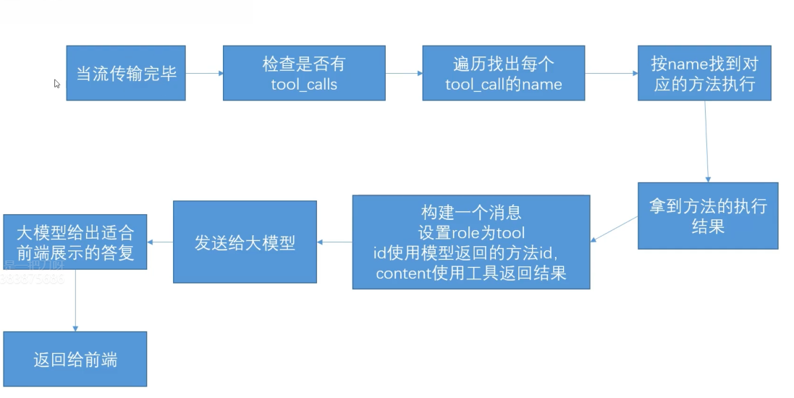

# Function tool

## 是什么

### 问题思考

<word text="LLM" /> 可以回答问题，但无法直接执行具体操作（如订票）。大模型只会回复订票方法说明，不会真正调用订票接口。

### 上下文方案解决

#### 代码

通过上下文方案解决：在提示词中约定，若用户要求订票，则返回 <word text="JSON" /> 数据。代码层检测到该数据后，调用预先编写的订票方法。

::: code-group

````md [context2.md]
# 角色

你是一个个人助手

# 逻辑

1. 用户如果要订票，则返回如下json，json中的target属性，就是用户本次订票的目的地。当你返回json数据时，不要代码md格式，直接返回json数据。

```json
{
  "type": "ticket",
  "arguments": {
    "target": "目的地"
  }
}
```
````

```js [server.js]
app.get('/simple', async (req, res) => {
  const { keyword } = req.query
  const system = fs.readFileSync('./context2.md')
  const systemString = systemString.toString()
  const llmres = await openai.chat.completions.create({
    model: 'qwen-plus',
    messages: [
      {
        role: 'system',
        content: systemString,
      },
      {
        role: 'user',
        content: keyword,
      },
    ],
  })
  const message = llmres.choices[0].message
  const content = JSON.parse(message.content)
  if (content.type === 'ticket') {
    // 调用订票方法。真正做订票这个事情，是通过提前写好的代码来实现的。
    const ticket = await ticket(content.arguments.target)
    res.json(ticket)
  }
  res.json(message)
})
```

:::

#### 缺陷

此方案存在以下问题：

1. 当用户只需普通聊天时，`content` 返回的是普通文本而非 <word text="JSON" /> 字符串，`JSON.parse` 会报错。核心矛盾：无法区分 `content` 究竟是要调用内置方法的 <word text="JSON" />，还是纯文本回复。
2. 并非所有大模型都能稳定理解上下文并返回标准 <word text="JSON" />。部分模型可能在 <word text="JSON" /> 前后附加额外文字，或包裹 <word text="Markdown" /> 代码块语法。

需要一种机制，将"大模型调用方法"与"纯文本回答"明确区分，且所有模型统一遵循。

### function tool 解决

意义：<word text="LLM" /> 只能做语言回答与逻辑推理，无法执行具体操作。通过 function tool 机制，提前声明可用工具，大模型在需要时返回工具调用指令，由代码层执行。

规范：所有大模型接口遵循统一的 function tool 定义与输出规范。告知大模型可用工具时使用同一种格式输入，大模型声明调用哪个工具也使用同一种格式输出。

区分：大模型调用 function tool 时使用独立字段，不与 `content` 混合；将执行结果反馈给大模型时，使用专门的 `role: tool`。

#### 定义 function tool

```js
const response = await openai.chat.completions.create({
  ...message, // model 等属性
  tools: [
    {
      type: 'function', // 固定值
      function: {
        name: 'ticket', // 工具名称
        description: '订票工具', // 工具描述
        // 工具参数，用 JSON Schema 定义
        parameters: {
          type: 'object', // 参数类型
          properties: {
            city: {
              type: 'string', // 参数类型
              description: '出发城市', // 参数描述
            },
          },
          required: ['city'], // 必填参数
        },
      },
    },
  ],
})
```

#### 代码

::: code-group

```js [tools.js]
// [!code ++]
const tools = [
  // [!code ++]
  {
    type: 'function', // [!code ++]
    // [!code ++]
    function: {
      name: 'ticket', // [!code ++]
      description: '当用户需要订票的时候调用此订票工具', // [!code ++]
      // [!code ++]
      parameters: {
        type: 'object', // [!code ++]
        // [!code ++]
        properties: {
          // [!code ++]
          target: {
            type: 'string', // [!code ++]
            description: '用户要去的城市目的地', // [!code ++]
          }, // [!code ++]
        }, // [!code ++]
        required: ['target'], // [!code ++]
      }, // [!code ++]
    }, // [!code ++]
  }, // [!code ++]
]

const toolMap = {
  ticket() {},
}

module.exports = {
  tools,
  toolMap,
}
```

```js [server.js]
const { tools, toolMap } = require('./tools.js') // [!code ++]

app.get('/simple', async (req, res) => {
  const { keyword } = req.query
  const system = fs.readFileSync('./context2.md')
  const systemString = systemString.toString()
  const llmres = await openai.chat.completions.create({
    model: 'qwen-plus',
    messages: [
      {
        role: 'system',
        content: systemString,
      },
      {
        role: 'user',
        content: keyword,
      },
    ],
    tools: tools, // [!code ++]
  })
  const message = llmres.choices[0].message
  res.json(message)
})
```

:::

#### 加上流式

生产环境的接口通常使用流式传输。大模型调用 function tool 时也会分片段返回，但**必须等全部返回后再处理，不可像文本那样边返回边处理**。

```js [server.js]
const { tools, toolMap } = require('./tools.js')

app.get('/simple', async (req, res) => {
  const { keyword } = req.query
  const system = fs.readFileSync('./context2.md')
  const systemString = systemString.toString()
  const llmres = await openai.chat.completions.create({
    model: 'qwen-plus',
    messages: [
      {
        role: 'system',
        content: systemString,
      },
      {
        role: 'user',
        content: keyword,
      },
    ],
    tools: tools,
    stream: true, // [!code ++]
  })
  const chunkList = [] // 单纯用来查看数据用，无实际用处 // [!code ++]
  // [!code ++]
  for await (const chunk of llmres) {
    // [!code ++]
    chunkList.push(chunk)
    // [!code ++]
  }
  fs.writeFileSync('./chunk.json', JSON.stringify(chunkList, null, 2)) // 单纯用来查看数据用，无实际用处 // [!code ++]
  const message = llmres.choices[0].message
  res.json(message)
})
```

查看数据格式，`choices` 中 `delta` 多了 `tool_calls` 字段，即 function tool 的返回结果。返回逻辑如下：

1. 一开始会返回完整的数据对象，包含 `id`、`index`、`type`、`function` 对象，`function` 对象包含 `name` 和 `arguments` 两个属性，`name` 是函数名，`arguments` 是函数参数。
2. 后续的 `arguments` 会拆成片段，一点一点返回出去。但是属性可能会缺失，如 `name` 和 `id`。

```json
[
  {
    // ...
    "choices": [
      {
        // ...
        "delta": {
          "content": "",
          "role": "assistant",
          "tool_calls": [
            {
              "index": 0,
              "id": "tool_0",
              "type": "function",
              "function": {
                "name": "ticket",
                "arguments": ""
              }
            }
          ]
        }
      }
    ]
  },
  {
    // ...
    "choices": [
      {
        "delta": {
          "tool_calls": [
            {
              "function": {
                "arguments": "beijing"
              },
              "index": 0,
              "id": "",
              "type": "function"
            }
          ]
        }
      }
    ]
  }
]
```

掌握数据格式后，实现 `tool_calls` 的处理逻辑。

```js [server.js]
const { tools, toolMap } = require('./tools.js')

app.get('/simple', async (req, res) => {
  const { keyword } = req.query
  const system = fs.readFileSync('./context2.md')
  const systemString = systemString.toString()
  const llmres = await openai.chat.completions.create({
    model: 'qwen-plus',
    messages: [
      {
        role: 'system',
        content: systemString,
      },
      {
        role: 'user',
        content: keyword,
      },
    ],
    tools: tools,
    stream: true,
  })
  // [!code ++]
  let resObj = {
    role: 'assistant', // [!code ++]
    id: '', // [!code ++]
    content: '', // [!code ++]
  } // [!code ++]
  // [!code ++]
  for await (const chunk of llmres) {
    const delta = chunk.choices[0].delta // [!code ++]
    resObj.id = chunk.id // [!code ++]
    resObj.content += delta.content // [!code ++]
    // 判断是否有方法调用 // [!code ++]
    // [!code ++]
    if (delta.tool_calls && delta.tool_calls.length > 0) {
      // 拼接 tool_calls 部分 // [!code ++]
      // [!code ++]
      if (resObj.tool_calls) {
        // 已经是第一个以后的 chunk，直接走拼接 // [!code ++]
        // [!code ++]
        delta.tool_calls.forEach((toolCall) => {
          const toolIndex = toolCall.index // [!code ++]
          // 根据index找到resObj，要拼接的对象
          const targetTool = resObj.tool_calls[toolIndex] // [!code ++]
          // [!code ++]
          if (chunkTool.function?.name) {
            targetTool.function.name += chunkTool.function.name // [!code ++]
          } // [!code ++]
          // [!code ++]
          if (chunkTool.function?.arguments) {
            targetTool.function.arguments += chunkTool.function.arguments // [!code ++]
          } // [!code ++]
        }) // [!code ++]
      } // [!code ++]
      // [!code ++]
      else {
        // 是第一个 chunk，走赋值 // [!code ++]
        resObj.tool_calls = delta.tool_calls
      } // [!code ++]
    } // [!code ++]
  } // [!code ++]
  res.end() // [!code ++]
})
```

## 执行 Function tool

### 流程图



### 代码

```js [server.js]
const { tools, toolMap } = require('./tools.js')

app.get('/simple', async (req, res) => {
  const { keyword } = req.query
  const system = fs.readFileSync('./context2.md')
  const systemString = systemString.toString()
  const llmres = await openai.chat.completions.create({
    model: 'qwen-plus',
    messages: [
      {
        role: 'system',
        content: systemString,
      },
      {
        role: 'user',
        content: keyword,
      },
    ],
    tools: tools,
    stream: true,
  })

  let resObj = {
    role: 'assistant',
    id: '',
    content: '',
  }

  for await (const chunk of llmres) {
    const delta = chunk.choices[0].delta
    resObj.id = chunk.id
    resObj.content += delta.content
    // 判断是否有方法调用

    if (delta.tool_calls && delta.tool_calls.length > 0) {
      // 拼接 tool_calls 部分

      if (resObj.tool_calls) {
        // 已经是第一个以后的 chunk，直接走拼接

        delta.tool_calls.forEach((toolCall) => {
          const toolIndex = toolCall.index
          // 根据index找到resObj，要拼接的对象
          const targetTool = resObj.tool_calls[toolIndex]

          if (chunkTool.function?.name) {
            targetTool.function.name += chunkTool.function.name
          }

          if (chunkTool.function?.arguments) {
            targetTool.function.arguments += chunkTool.function.arguments
          }
        })
      } else {
        // 是第一个 chunk，走赋值
        resObj.tool_calls = delta.tool_calls
      }
    }
  }
  // [!code ++]
  if (resObj.tool_calls && resObj.tool_calls.length > 0) {
    const toolCalls = resObj.tool_calls
    for (let toolIndex = 0; toolIndex < toolCalls.length; toolIndex++) {
      const singleToolCall = toolCalls[toolIndex] // [!code ++]
      const toolName = singleToolCall.function.name // 工具名称 // [!code ++]
      const toolArguments = JSON.parse(singleToolCall.function.arguments) // 工具参数 // [!code ++]
      const result = await toolMap[name](arguments) // 方法执行可能是异步的 // [!code ++]
      const toolQueryObj = {
        role: 'tool',
        content: result,
        id: singleToolCall.id
      }
      const llmres = await openai.chat.completions.create({
        model: 'qwen-plus',
        messages: [
          {
            role: 'system',
            content: systemString,
          },
          ...singleConvertList,
          toolQueryObj
        ],
        tools: toolList,
        stream: true
      })
    }
  }
  res.end()
})
```

### 过滤

调用 function tool 时前端不应展示中间过程。以订票为例，用户发出订票指令后，应直接收到"订票成功"的答复，工具调用与执行结果均不展示。

1. 前端判断 `content` 为空字符串时不展示
2. `role` 为 `tool` 的消息也不展示