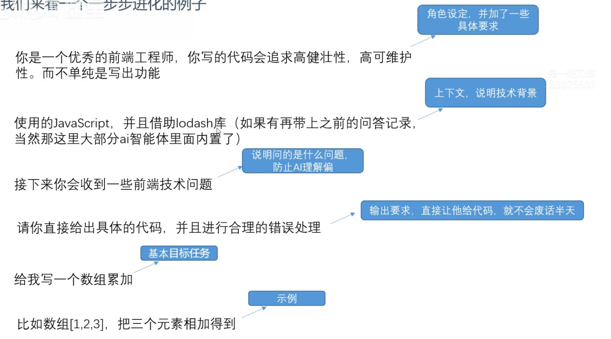

# 提示词工程

## 前言

为了减少 AI 的幻觉，做出更准确的回答，所做的优化提问，就是提示词工程。说白了就是怎么问才能得到更好的回答。

## 基本要素

- **目标任务**：要问的东西
- **上下文**：给出之前的记录，或者现在实际情况的上下文
- **输入描述**：告诉 AI 问的是什么，或者参考资料是什么
- **输出描述**：希望 AI 给出什么样的回答，具体格式有什么要求

## 高级要素

- **角色扮演**：让 AI 模拟一个角色，比如医生、律师、记者、程序员等，让 AI 模拟这个角色的回答
- **举例**：复杂问题可以给出一些具体示范
- **分隔符**：用分隔符隔开提示词各个部分，避免混淆。通常用 `###`、`---` 等
- **思考步骤**：要求 AI 怎么思考，先做什么，后做什么

## 举例



## 思考

现在只是要写一个数组累加问题都要写这么多东西，难道用户每次提问，都要写一大堆东西吗？

很明显用户不可能这么完整的写提示词。

所以开发 AI 应用的任务之一，在 AI 应用内，根据这个 AI 的作用，内置好提示词。事实上作为 AI 应用的开发者，50% 的工作量都是在思考怎么准备一个好的上下文。

## 提示词文档

一般情况上下文、提示词都会记录成 md 格式，目前绝大部分大模型都能理解 md 格式的输入，并且给出的回复其实也是 md 格式的。

::: code-group

```md [context.md]
# 角色

你是一个优秀的前端工程师，你的代码都是高质量代码，追求代码性能

# 技术背景

你所用的技术栈是vue3+elementui，使用html+less+ts开发，你写的项目都是ts代码

# 输入描述

你会接收到一些前端问题，以及一些前端的技术文档

# 输出描述

你要针对问题和要求，给出具体的前端代码，不需要过多的技术描述，直接给代码

# 思考步骤

1. 思考需求的技术方案
2. 选择最合适的技术方案
3. 给出基本的实现代码
4. 按可维护性、可扩展性给出代码
```

```js [server.js]
const express = require('express')
const cors = require('cors')
const OpenAI = require('openai') // 专门用来按标准请求大模型接口的一个sdk库
const app = express()
const fs = require('fs') // [!code ++]
app.use(cors())

// 同步读取 // [!code ++]
const systemContext = fs.readFileSync('./context.md') // [!code ++]
// 转文本，否则是buffer // [!code ++]
const systemString = systemContext.toString() // [!code ++]

// 重写 fetch，让整个项目通过 fetch 发请求时会打印一些东西
const originalFetch = global.fetch

global.fecth = async function (...args) {
  const [url, options = {}] = args
  console.log('fetching', url, options)

  try {
    const response = await originalFetch.apply(this, args) // 调用原始 fetch
    const clonedResponse = response.clone() // 克隆响应以便读取body而不影响原始响应

    for (const [key, value] of Object.entries(options.headers)) {
      console.log(`${key}: ${value}`)
    }
    const result = await clonedResponse.json() // 尝试读取响应体
    return response
  } catch (error) {
    console.error(`Error: ${error}`)
  }
}

// 存储历史消息
const messageList = [
  // [!code ++]
  {
    role: 'system', // [!code ++]
    content: systemString, // [!code ++]
  }, // [!code ++]
]

const openai = new OpenAI({
  apiKey: 'sk-xxxxxx',
  baseURL: 'xxx',
})

app.get('/llm', async (req, res) => {
  const keyword = req.query.keyword

  const queryObj = {
    role: 'user',
    content: keyword,
  }
  messageList.push(queryObj) // 每次提问保存上下文
  const aiRes = await openai.chat.completions.create({
    model: '',
    messages: messageList,
  })
  messageList.push(aiRes.choices[0].message) // 每次回答保存上下文
  res.json(aiRes.choices[0].message.content)
})

app.listen(3000, () => {
  console.log('Server is running on port 3000')
})
```

:::
