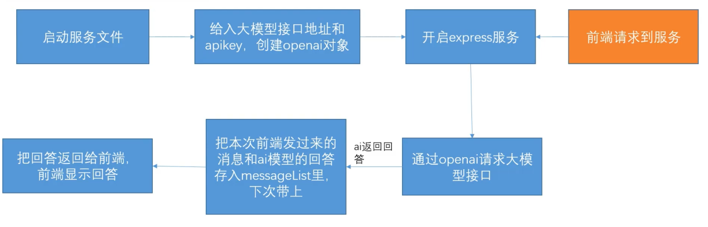

# 搭建服务器

## 前言

前端虽然可以直接请求大模型接口，但是如果直接前端请求会有很多问题：

1. api key 写在前端容易暴露
2. 没法鉴权和拦截一些攻击
3. 后续很多操作如定义工具、`mcp` 等都无法进行

## openai 库

现在基本各大语言都有专门用来调用 AI 接口的库，且基本都遵循一套标准。如 Nodejs 的 [openai](https://github.com/transitive-bullshit/chatgpt-api) 库。

```js [server.js]
const express = require('express')
const cors = require('cors')
const OpenAI = require('openai') // 专门用来按标准请求大模型接口的一个sdk库
const app = express()
app.use(cors())

const openai = new OpenAI({
  apiKey: 'sk-xxxxxx',
  baseURL: 'xxx',
})

app.get('/llm', async (req, res) => {
  const keyword = req.query.keyword
  const aiRes = await openai.chat.completions.create({
    model: '',
    messages: [{ role: 'user', content: keyword }],
  })
  res.json(aiRes.choices[0].message.content)
})

app.listen(3000, () => {
  console.log('Server is running on port 3000')
})
```

## 详解 openai

1. openai 库使用的地址通常和直接 `http` 请求是不一样的
2. openai 库相对于 `http` 请求，提供了规范，更方便用 `function calling` 以及 `mcp` 接入，代码更简洁，优先选择。此外还提供很多其他方法，用来做其他事情，等于一个已经开发好的，专门用来请求大模型接口的库
3. openai库请求接口本质上还是用 `fetch` 发送一个 `http` 请求，可以拦截它发出的 `http` 请求和响应

## 重写 fetch 查看请求和响应

```js [server.js]
const express = require('express')
const cors = require('cors')
const OpenAI = require('openai') // 专门用来按标准请求大模型接口的一个sdk库
const app = express()
app.use(cors())

// 重写 fetch，让整个项目通过 fetch 发请求时会打印一些东西 // [!code ++]
const originalFetch = global.fetch // [!code ++]
// [!code ++]
global.fecth = async function (...args) {
  const [url, options = {}] = args // [!code ++]
  console.log('fetching', url, options) // [!code ++]
  // [!code ++]
  try {
    const response = await originalFetch.apply(this, args) // 调用原始 fetch // [!code ++]
    const clonedResponse = response.clone() // 克隆响应以便读取body而不影响原始响应 // [!code ++]
    // [!code ++]
    for (const [key, value] of Object.entries(options.headers)) {
      console.log(`${key}: ${value}`) // [!code ++]
    } // [!code ++]
    const result = await clonedResponse.json() // 尝试读取响应体 // [!code ++]
    return response // [!code ++]
    // [!code ++]
  } catch (error) {
    console.error(`Error: ${error}`) // [!code ++]
  } // [!code ++]
} // [!code ++]

const openai = new OpenAI({
  apiKey: 'sk-xxxxxx',
  baseURL: 'xxx',
})

app.get('/llm', async (req, res) => {
  const keyword = req.query.keyword
  const aiRes = await openai.chat.completions.create({
    model: '',
    messages: [{ role: 'user', content: keyword }],
  })
  res.json(aiRes.choices[0].message.content)
})

app.listen(3000, () => {
  console.log('Server is running on port 3000')
})
```

## 携带历史

前面提到过接口是无状态的，每次请求携带上下文有助于模型理解用户意图，下面我们来实现一个简单的携带历史的功能。

```js [server.js]
const express = require('express')
const cors = require('cors')
const OpenAI = require('openai') // 专门用来按标准请求大模型接口的一个sdk库
const app = express()
app.use(cors())

// 重写 fetch，让整个项目通过 fetch 发请求时会打印一些东西
const originalFetch = global.fetch

global.fecth = async function (...args) {
  const [url, options = {}] = args
  console.log('fetching', url, options)

  try {
    const response = await originalFetch.apply(this, args) // 调用原始 fetch
    const clonedResponse = response.clone() // 克隆响应以便读取body而不影响原始响应

    for (const [key, value] of Object.entries(options.headers)) {
      console.log(`${key}: ${value}`)
    }
    const result = await clonedResponse.json() // 尝试读取响应体
    return response
  } catch (error) {
    console.error(`Error: ${error}`)
  }
}

const messageList = [] // 存储历史消息 // [!code ++]

const openai = new OpenAI({
  apiKey: 'sk-xxxxxx',
  baseURL: 'xxx',
})

app.get('/llm', async (req, res) => {
  const keyword = req.query.keyword
  // [!code ++]
  const queryObj = {
    role: 'user', // [!code ++]
    content: keyword, // [!code ++]
  } // [!code ++]
  messageList.push(queryObj) // 每次提问保存上下文 // [!code ++]
  const aiRes = await openai.chat.completions.create({
    model: '',
    messages: messageList,
  })
  messageList.push(aiRes.choices[0].message) // 每次回答保存上下文 // [!code ++]
  res.json(aiRes.choices[0].message.content)
})

app.listen(3000, () => {
  console.log('Server is running on port 3000')
})
```

## 总结

