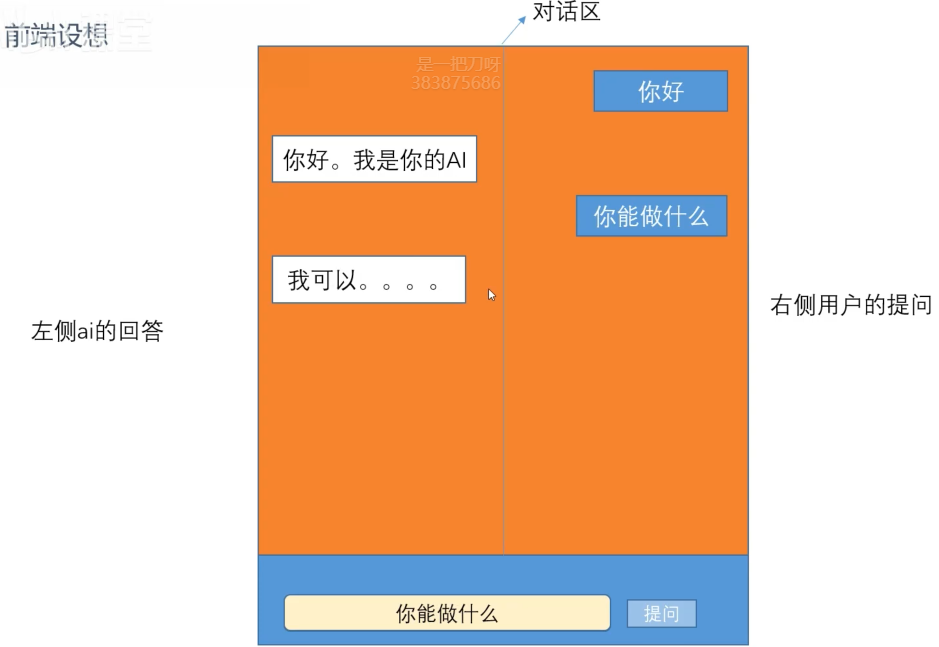
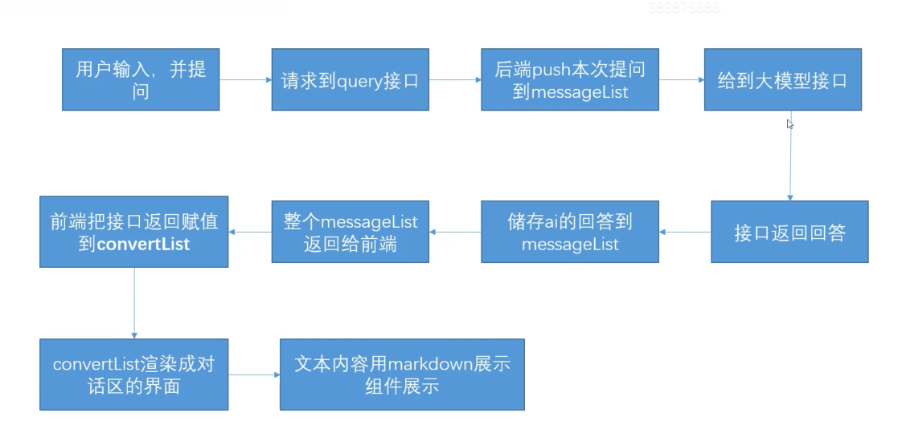
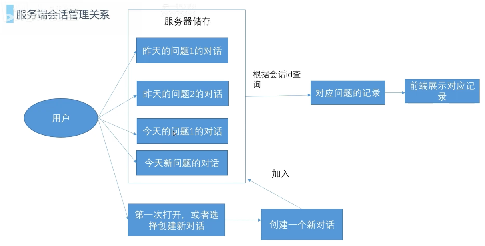
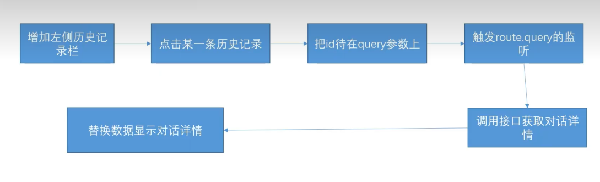

# 前端界面

## 基础界面

### 效果图



### 数据定义

1. 输入框输入的问题：准备一个inputValue变量
2. 对话区的内容：一问一答有很多轮，很明显我们用一个数组去接管这一块的显示。假定变量叫convertlist,数组里每一个元素就是提问或者回答，与此同时我们也要区分是用户提问还是AI回答，从而做到左侧显示AI回答，右侧显示用户提问。

其实我们保持messageList就可以，role刚好可以区分，content就是内容

```js
;[
  {
    role: 'user',
    content: '你好',
  },
  {
    role: 'assistant',
    content: '你好，我是AI',
  },
  {
    role: 'user',
    content: '你叫什么名字',
  },
]
```

### 界面搭建

发起接口时展示思考中，AI 思考完毕后隐藏思考中。

```html [index.vue]
<script setup>
  import { nextTick, ref } from 'vue'
  import MarkDown from './components/MarkDown.vue'
  import { requestLLM } from './api'

  const inputvalue = ref('')
  const convertList = ref([])
  const isThinking = ref(false)
  function sendToLLM() {
    isThinking.value = true
    requestLLM(inputvalue.value).then((res) => {
      isThinking.value = false
      convertList.value = res.data.data
    })
  }
</script>

<template>
  <div class="chat-wrapper">
    <div class="chat-content">
      <div v-for="chatItem in convertList" class="chat-item">
        <div v-if="chatItem.role === 'user'" class="user-content">
          <MarkDown :content="chatItem.content"> </MarkDown>
        </div>
        <div v-if="chatItem.role === 'assistant'" class="assistant-content">
          <MarkDown :content="chatItem.content"> </MarkDown>
        </div>
      </div>
      <div v-if="isThinking" class="chat-item">
        <div class="assistant-content">思考中...</div>
      </div>
    </div>
    <div class="input-content">
      <input type="text" v-model="inputvalue" />
      <button @click="sendToLLM">发送</button>
    </div>
  </div>
</template>

<style scoped>
  .chat-wrapper {
    width: 600px;
    margin: 0 auto;
  }

  .chat-content {
    padding-top: 20px;
    width: 100%;
    height: 500px;
    border: 1px solid black;
    overflow: scroll;
  }

  .input-content {
    width: 100%;
    display: flex;
  }

  .input-content input {
    flex: 1;
  }

  .chat-item {
    width: 100%;
    margin-bottom: 20px;
    display: flex;
    box-sizing: border-box;
    padding: 0 10px;
  }

  .user-content {
    border-radius: 12px;
    padding: 0 8px;
    background-color: rgb(29, 120, 188);
    margin-left: auto;
    max-width: 40%;
  }

  .assistant-content {
    border-radius: 12px;
    padding: 0 8px;
    border: 1px solid grey;
    margin-right: auto;
    max-width: 40%;
  }
</style>
```

### 逻辑



### 交互问题

1. 目前的版本每次都会重复返回内容

   以前的历史会话，接口会一次又一次的返回。这样会话长了，就会特别影响接口速度。毕竟传输的内容多了。

   所以我们应该做一个增量更新，前端自己储存每一次的提问，接口也只返回本次提问的回答，前端把回答push到数组里存着

2. 每次提问，提的问题不会马上出现

   因为前端的界面完全依赖接口返回，用户的提问得接口返回了才会出现

### 优化

```html [index.vue]
<script setup>
  import { nextTick, ref } from 'vue'
  import MarkDown from './components/MarkDown.vue'
  import { requestLLM } from './api'

  const inputvalue = ref('')
  const convertList = ref([])
  const isThinking = ref(false)
  function sendToLLM() {
    const _convertList = [...convertList.value] // 做一个浅拷贝 // [!code ++]
    // 添加用户本次询问 // [!code ++]
    // [!code ++]
    _convertList.push({
      role: 'user', // [!code ++]
      content: inputvalue.value, // [!code ++]
    }) // [!code ++]
    convertList.value = _convertList // 赋值，快速展示用户提问 // [!code ++]
    // 等待用户提问展示出来，再发送请求展示思考中 // [!code ++]
    // [!code ++]
    nextTick(() => {
      isThinking.value = true
    }) // [!code ++]
    requestLLM(inputvalue.value).then((res) => {
      isThinking.value = false
      const _convertList = [...convertList.value] // [!code ++]
      _convertList.push(res.data.data) // 增量替换 // [!code ++]
      convertList.value = _convertList // [!code ++]
    })
  }
</script>

<template>
  <div class="chat-wrapper">
    <div class="chat-content">
      <div v-for="chatItem in convertList" class="chat-item">
        <div v-if="chatItem.role === 'user'" class="user-content">
          <MarkDown :content="chatItem.content"> </MarkDown>
        </div>
        <div v-if="chatItem.role === 'assistant'" class="assistant-content">
          <MarkDown :content="chatItem.content"> </MarkDown>
        </div>
      </div>
      <div v-if="isThinking" class="chat-item">
        <div class="assistant-content">思考中...</div>
      </div>
    </div>
    <div class="input-content">
      <input type="text" v-model="inputvalue" />
      <button @click="sendToLLM">发送</button>
    </div>
  </div>
</template>
```

## 会话管理

### 对话记录问题

1. 对话记录一刷新就丢
2. 前后端各维护一份，会有数据不一致的可能
3. ai应用都是有历史会话记录在的，比如我昨天提的问题，我可以点进去看记录，这个怎么做到?
4. 真正的AI应用，有很多用户，每个用户有自己的一次次提问历史记录，如何区分不同用户
5. 用户要能跳过当前的对话，新建一个全新对话，也能够回到历史对话，继续对话

### 服务端绘画管理关系



- json 储存数据设计

  ```json
  {
    "user1": {
      "昨天对话id": {
        "title": "今天天气怎么样",
        "list": []
      },
      "今天对话id": {
        "title": "今天天气怎么样",
        "list": []
      }
    },
    "user2": {}
  }
  ```

- 数据库

  表1：用户对话记录id表，用户每创建一次对话插入一条记录
  | userid | convertid |
  | ------ | --------- |
  | 001    | 0011      |
  | 001    | 0012      |
  | 002    | 0021      |

  表2：对话id详情表，如果基于历史记录对话，更新该表
  | convertid | list             | title        |
  | --------- | ---------------- | ------------ |
  | 0011      | 用json字符串存储 | 对话总结标题 |
  | 0012      | 用json字符串存储 | 对话总结标题 |
  | 0021      | 用json字符串存储 | 对话总结标题 |

### 接口增加和修改

1. conversation/greate-在某用户id下创建一个新的对话到数据库，id我们用最简单的userld+时间戳。
2. conversation/get-根据会话id获取到某一个对话的历史记录
3. llm接口改造-不在用一个数组储存会话上下文。而是前端调用接口需要时需携带会话id和userid，用id查询数据库得到之前的历史记录。并且接口返回后，把提问和结果新增到本次记录中
4. conversation/list-获取该用户id下所有的历史会话，并且根据有无标题给历史记录加上标题
5. conversation/delete-可以不做，传入对应的会话id，去删除该会话的数据库记录

::: code-group

```json [conversation.json]
{
  "001": {
    "0011": {
      "title": "今天天气怎么样",
      "list": []
    },
    "0012": {
      "title": "今天天气怎么样",
      "list": []
    }
  },
  "002": {}
}
```

```js [utils.js]
const fs = require('fs')

// 读取json文件
async function summaryMessage(openai, summaryList) {
  const llmres = await openai.chat.completions.create({
    model: 'qwen-plus',
    messages: [
      {
        role: 'system',
        content: '帮我总结下面的对话记录，做一个摘要',
      },
      ...summaryList,
    ],
  })

  return llmres.choices[0].message
}

// 根据对话id，获取对话详情
async function summaryTitle(openai, list) {
  const llmres = await openai.chat.completions.create({
    model: 'qwen-plus',
    messages: [
      {
        role: 'system',
        content: '帮我总结下面的对话记录，生成一个小于16个字的标题',
      },
      ...list,
    ],
  })

  return llmres.choices[0].message.content
}

// 读取对话记录
function readConversation() {
  const jsonStr = fs.readFileSync('./conversation.json')
  const jsonObj = JSON.parse(jsonStr)
  return jsonObj
}

// 写入对话记录
function writeConversation(obj) {
  const jsonstr = JSON.stringify(obj)
  fs.writeFileSync('./conversation.json', jsonstr)
}

module.exports = {
  summaryMessage,
  readConversation,
  writeConversation,
  summaryTitle,
}
```

```js [index.js]
// [!code ++]
const {
  summaryMessage, // [!code ++]
  readConversation, // [!code ++]
  writeConversation, // [!code ++]
  summaryTitle, // [!code ++]
} = require('./utils.js') // [!code ++]

// 改造对话接口，查询数据库，并保存提问和结果
app.get('/llm', async (req, res) => {
  const { keyword, userId, convertId } = req.query
  const conversationObj = readConversation()
  const singleConvertList = conversationObj[userId][convertId].list // 用户对话列表 // [!code ++]
  const queryObj = {
    role: 'user',
    content: keyword,
  }
  // [!code ++]
  if (singleConvertList.length > 10) {
    //算出来要截取多少条
    //多截取一些，方便ai接口多给我们总结一下，所以设为6，每次大于10只保留6条。
    const removeNum = singleConvertList.length - 6 // [!code ++]
    const removeList = singleConvertList.splice(1, removeNum) // [!code ++]
    const summaryRes = await summaryMessage(openai, removeList)
    singleConvertList.splice(1, 0, summaryRes) // [!code ++]
  }
  //每次提问，存到singleConvertList，保存上下文 // [!code ++]
  singleConvertList.push(queryObj) // [!code ++]
  console.log(singleConvertList) // [!code ++]
  const llmres = await openai.chat.completions.create({
    model: 'qwen-plus',
    // system手动添加上去，避免丢失 // [!code ++]
    // [!code ++]
    messages: [
      {
        role: 'system', // [!code ++]
        content: systemString, // [!code ++]
      }, // [!code ++]
      ...singleConvertList, // [!code ++]
    ],
  })
  //每次回答，存到singleConvertList，保存上下文 // [!code ++]
  singleConvertList.push(llmres.choices[0].message) // [!code ++]
  writeConversation(conversationObj) // 重新写入 // [!code ++]
  res.json({
    success: true,
    data: llmres.choices[0].message,
  })
})

// 创建会话 // [!code ++]
// [!code ++]
app.get('/conversation/create', async (req, res) => {
  const userId = req.query.userId // [!code ++]
  const conversationObj = readConversation() // [!code ++]
  // 如果当前用户没有会话，则创建一个 // [!code ++]
  // [!code ++]
  if (!conversationObj[userId]) {
    conversationObj[userId] = {} // [!code ++]
  } // [!code ++]
  const userConversatioObj = conversationObj[userId] // [!code ++]
  const convertId = userId + Date.now() // 会话id：当前id 拼接 时间戳 // [!code ++]
  // [!code ++]
  userConversatioObj[convertId] = {
    title: '', // [!code ++]
    list: [], // [!code ++]
  } // [!code ++]
  writeConversation(conversationObj) // 写入到json内 // [!code ++]
  // [!code ++]
  res.json({
    success: true, // [!code ++]
    data: convertId, // [!code ++]
    message: '创建成功', // [!code ++]
  }) // [!code ++]
}) // [!code ++]

// 获取会话 // [!code ++]
// [!code ++]
app.get('/conversation/get', async (req, res) => {
  const userId = req.query.userId // user id // [!code ++]
  const convertId = req.query.convertId // 对话id // [!code ++]
  const conversationObj = readConversation() // [!code ++]
  const userAllConversation = conversationObj[userId] // [!code ++]
  const targetCOnversation = userAllConversation[convertId] // 拿到对话数据 // [!code ++]
  // [!code ++]
  res.json({
    success: true, // [!code ++]
    data: targetCOnversation, // [!code ++]
    message: '查询成功', // [!code ++]
  }) // [!code ++]
}) // [!code ++]

// 查询对话列表，获取id和title列表 // [!code ++]
// [!code ++]
app.get('/conversation/list', async (req, res) => {
  const userId = req.query.userId // [!code ++]
  const conversationObj = readConversation() // [!code ++]
  const userAllConversation = conversationObj[userId] // [!code ++]
  //获取到所有的对话id // [!code ++]
  const convertIdList = Object.keys(userAllConversation) // [!code ++]
  const returnList = [] // [!code ++]
  //[{id:'',title},{id:"",title}] // [!code ++]
  // [!code ++]
  for (let i = 0; i < convertIdList.length; i++) {
    const _id = convertIdList[i] // [!code ++]
    const idsConvert = userAllConversation[_id] // 拿到对话记录 // [!code ++]
    // 判断title是否存在 // [!code ++]
    // [!code ++]
    if (idsConvert.title) {
      // [!code ++]
      returnList.push({
        title: idsConvert.title, // [!code ++]
        convertId: _id, // [!code ++]
      }) // [!code ++]
      // [!code ++]
    } else {
      //检测一下是否已经有对话了，有对话了，在让ai总结，没有就先设个空标题 // [!code ++]
      // [!code ++]
      if (idsConvert.list.length === 0) {
        // [!code ++]
        returnList.push({
          title: '', // [!code ++]
          convertId: _id, // [!code ++]
        }) // [!code ++]
        // [!code ++]
      } else {
        const aititle = await summaryTitle(openai, idsConvert.list) // [!code ++]
        idsConvert.title = aititle // [!code ++]
        writeConversation(conversationObj) // [!code ++]
        // [!code ++]
        returnList.push({
          convertId: _id, // [!code ++]
          title: aititle, // [!code ++]
        }) // [!code ++]
      } // [!code ++]
    } // [!code ++]
  } // [!code ++]
  // [!code ++]
  res.json({
    success: true, // [!code ++]
    data: returnList, // [!code ++]
    message: '查询成功', // [!code ++]
  }) // [!code ++]
}) // [!code ++]
```

:::

### 前端逻辑改造



假设用户已登录，进入页面后调用前面写好的接口获取用户的对话标题列表，然后根据返回的数据渲染页面。

点击对应的标题后，进入对应的对话页面，页面展示对话内容，并且可以继续对话。

::: code-group

```vue [App.vue]
<script setup>
import { RouterView, useRouter } from 'vue-router'
import { listConversation } from './api'
import { onMounted, ref } from 'vue'
//假设已经登录，你的id是001
const historyList = ref([])
const router = useRouter()
onMounted(() => {
  listConversation('001').then((res) => {
    historyList.value = res.data.data
  })
})
function gotoHistory(convertId) {
  router.push('/?convertId=' + convertId)
}
</script>

<template>
  <div class="layout">
    <div class="slidebar">
      <div
        v-for="item in historyList"
        :key="item.convertId"
        @click="gotoHistory(item.convertId)"
      >
        {{ item.title }}
      </div>
    </div>
    <RouterView></RouterView>
  </div>
</template>
```

```vue [home.vue]
<script setup>
import { nextTick, onMounted, ref, watch } from 'vue'
import MarkDown from '../components/MarkDown.vue'
import { createConversation, getConversation, requestLLM } from '../api'
import { useRoute, useRouter } from 'vue-router'
const route = useRoute()
const router = useRouter()

const inputvalue = ref('')
const convertList = ref([])
const isThinking = ref(false)
function sendToLLM() {
  const _convertList = [...convertList.value]
  _convertList.push({
    role: 'user',
    content: inputvalue.value,
  })
  convertList.value = _convertList
  nextTick(() => {
    isThinking.value = true
  })
  requestLLM(inputvalue.value, '001', route.query.convertId).then((res) => {
    isThinking.value = false
    const _convertList = [...convertList.value]
    _convertList.push(res.data.data)
    convertList.value = _convertList
  })
}
function getDetailById(convertId) {
  getConversation('001', convertId).then((res) => {
    convertList.value = res.data.data.list
  })
}
function createNew() {
  createConversation('001').then((res) => {
    router.push('/?convertId=' + res.data.data)
  })
}
onMounted(() => {
  const { convertId } = route.query
  // 路由有id，根据id获取对话详情数据
  if (convertId) {
    getDetailById(convertId)
  }
  // 没有id，则创建新的对话
  else {
    createConversation('001').then((res) => {
      router.push('/?convertId=' + res.data.data)
    })
  }
})
// 监听路由变化，如果路由变化，则重新获取对话详情数据
watch(route, () => {
  getDetailById(route.query.convertId)
})
</script>

<template>
  <div class="chat-wrapper">
    <div class="chat-content">
      <div v-for="chatItem in convertList" class="chat-item">
        <div v-if="chatItem.role === 'user'" class="user-content">
          <MarkDown :content="chatItem.content"> </MarkDown>
        </div>
        <div v-if="chatItem.role === 'assistant'" class="assistant-content">
          <MarkDown :content="chatItem.content"> </MarkDown>
        </div>
      </div>
      <div v-if="isThinking" class="chat-item">
        <div class="assistant-content">思考中...</div>
      </div>
    </div>
    <div class="input-content">
      <input type="text" v-model="inputvalue" />
      <button @click="sendToLLM">发送</button>
      <button @click="createNew">创建新对话</button>
    </div>
  </div>
</template>

<style scoped>
.chat-wrapper {
  width: 900px;
}

.chat-content {
  padding-top: 20px;
  width: 100%;
  height: 500px;
  border: 1px solid black;
  overflow: scroll;
}

.input-content {
  width: 100%;
  display: flex;
}

.input-content input {
  flex: 1;
}

.chat-item {
  width: 100%;
  margin-bottom: 20px;
  display: flex;
  box-sizing: border-box;
  padding: 0 10px;
}

.user-content {
  border-radius: 12px;
  padding: 0 8px;
  background-color: rgb(29, 120, 188);
  margin-left: auto;
  max-width: 40%;
}

.assistant-content {
  border-radius: 12px;
  padding: 0 8px;
  border: 1px solid grey;
  margin-right: auto;
  max-width: 40%;
}
</style>
```

:::
