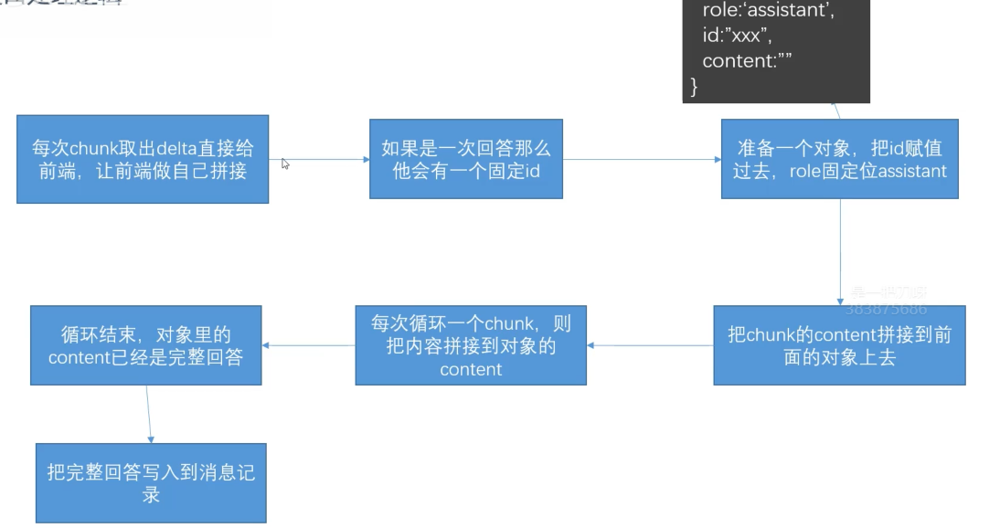

# 流式传输

## 怎么做

- 后端
  
  1. `llm` 改为 `stream` 流式传输
  2. AI 接口修改为 `stream` 返回

- 前端
  
  用<word text="SSE" />方案接收后端数据

## <word text="SSE" /> 技术

<word text="SSE" /> 是一种基于 <word text="HTTP" /> 的传输技术，允许接口持续向前端发送消息，而非传统 <word text="HTTP" /> 的一次性返回后即断开。在 <word text="SSE" /> 方案下，接口仍为 <word text="HTTP" /> 接口，但可将返回内容拆分，逐部分下发。

## 定义 SSE 接口

1. 正常定义一个接口
2. 修改响应头
3. 通过 `res.write` 方法按固定格式一次次的写入响应，而不是一次性给入

::: code-group
```js [server.js]
app.get("/sse", async (req, res) => {
  res.writeHead(200, {
    "Content-Type": "text/event-stream; charset=utf-8", // stream 流式传输；防止中文乱码
    "Cache-Control": "no-cache", // 防止缓存
    "Connection": "keep-alive", // 保持长连接
    "Access-Control-Allow-Origin": "*",
  });
  const arr = ['你好', 'AI', '你', '能', '做什么']
  let i = 0
  const timer = setInterval(() => {
    if (i < arr.length) {
      res.write(`data: ${JSON.stringify(arr[i])}\n\n`) // 两个 /n 表示换行
      i++
    }
    else {
      clearInterval(timer)
      res.write(`data: ${JSON.stringify({ done: true })\n\n}`)
      res.end()
    }
  }, 1000)
})
```
```js [App.js]
const test = ref('')
onMounted(() => {
  const eventSource = new EventSource("http://localhost:3000/sse");
  eventSource.onmessage = (event) => {
    console.log(JSON.parse(event.data));
    const _data = JSON.parse(event.data)
    // 结束了，关闭连接
    if (_data.done) {
      eventSource.close()
    }
    // 更新数据
    else {
      test.value += _data
    }
  };
})
```
:::

但此方式存在明显缺陷：

1. 只能是 `GET` 请求
2. <word text="Token" /> 必须携带在请求头上，不安全
3. 前端处理较繁琐

## 成熟方案

1. 接口侧将调用大模型处添加 `stream: true`，按读取流的方式读取内容
2. 前端使用 `@microsoft/fetch-event-source` 库

此库可解决上述问题，使用简便。

### 接口处理逻辑



### 参数格式

在之前的代码中，消息都是通过 `messages` 参数获取的；修改为流式后，接口字段修改为通过 `delta` 获取。

```js
[
  {
    model: 'qwen-plus',
    id: 'xxx',
    created: 1688426147,
    object: 'chat.completion.chunk',
    usage: null,
    choices: [
      {
        index: 0,
        delta: {
          role: 'assistant',
          content: '你好，我是小Q，有什么可以帮助你的吗？',
        }
      }
    ]
  }
]
```

### 代码修改
::: code-group
```js [server.js]
app.use(express.json()) // 设置解析请求体，这样才能拿到 req.body // [!code ++]
// 请求不再是get请求
app.post('/llm', async (req, res) => {
  // 设置请求头 // [!code ++]
   // [!code ++]
  res.writeHead(200, {
    'Content-Type': 'text/event-stream', // [!code ++]
    'Cache-Control': 'no-cache', // [!code ++]
    'Connection': 'keep-alive', // [!code ++]
  }) // [!code ++]
  const { keyword, userId, convertId } = req.query // [!code --]
  const { keyword, userId, convertId } = req.body // [!code ++]
  const conversationObj = readConversation()
  const singleConvertList = conversationObj[userId][convertId].list // 用户对话列表
  const queryObj = {
    role: 'user',
    content: keyword,
  }
  if (singleConvertList.length > 10) {
    //算出来要截取多少条
    //多截取一些，方便ai接口多给我们总结一下，所以设为6，每次大于10只保留6条。
    const removeNum = singleConvertList.length - 6
    const removeList = singleConvertList.splice(1, removeNum) 
    const summaryRes = await summaryMessage(openai, removeList)
    singleConvertList.splice(1, 0, summaryRes) 
  }
  //每次提问，存到singleConvertList，保存上下文
  singleConvertList.push(queryObj) 
  console.log(singleConvertList) 
  const llmres = await openai.chat.completions.create({
    model: 'qwen-plus',
    // system手动添加上去，避免丢失
    messages: [
      {
        role: 'system', 
        content: systemString, 
      }, 
      ...singleConvertList, 
    ],
    stream: true, // 开启流式返回 // [!code ++]
  })
  let chunkList = [] // 无实际作用，单纯用于打印查看数据格式 // [!code ++]
  // [!code ++]
  let resObj = {
    role: 'assistant', // [!code ++]
    id: '', // [!code ++]
    content: '', // [!code ++]
  } // 后端传给前端的数组对象每一项对象 // [!code ++]
  // for of 循环，依次流式保存 // [!code ++]
  // [!code ++]
  for await (let chunk of llmres) {
    chunkList.push(chunk) // [!code ++]
    const delta = chunk.choices[0].delta // [!code ++]
    resObj.id = chunk.id // [!code ++]
    resObj.content += delta.content // [!code ++]
    res.write(`data: ${JSON.stringify(delta)} \n\n`) // [!code ++]
  } // [!code ++]
  // for of 循环结束，才会执行下一行 // [!code ++]
  fs.writeFileSync('./chunkList.json', JSON.stringify(chunkList)) // 保存到文件内，查看数据格式，无实际用处 // [!code ++]
  //每次回答，存到singleConvertList，保存上下文
  singleConvertList.push(llmres.choices[0].message)  // [!code --]
  singleConvertList.push(resObj)  // [!code ++]
  res.write(`data: ${JSON.stringify({ done: true })} \n\n`) // [!code ++]
  res.end() // [!code ++]
})
```
```js [api.js]
import { fetchEventSource } from '@microsoft/fetch-event-source' // [!code ++]
 // [!code ++]
export function requestLLM (keyword, userId, convertId, callback) {
   // [!code ++]
  fetchEventSource('http://localhost:3000/api/llm', {
    method: 'POST',
    headers: {
      "Content-Type": "application/json", // 请求是json，后端才能解析body // [!code ++]
      auth: 'xxxxx' // [!code ++]
    }, // [!code ++]
    // 注意，axios 内部帮我们包裹了 stringify，这里是原生的，需要手动处理 // [!code ++]
    // [!code ++]
    body: JSON.stringify({
      keyword, userId, convertId // [!code ++]
    }), // [!code ++]
    // 请求成功后会触发 // [!code ++]
    // [!code ++]
    async onmessage (event) {
      console.log(event) // [!code ++]
      callback(event) // [!code ++]
    } // [!code ++]
  }) // [!code ++]
} // [!code ++]
```
```vue [home.vue]
<script setup>
function sendToLLM() {
  isThinking.value = true // [!code ++]
  const _convertList = [...convertList.value]
  
  _convertList.push({
    role: 'user',
    content: inputvalue.value,
  })
  convertList.value = _convertList
  // [!code --]
  nextTick(() => {
    isThinking.value = true // [!code --]
  }) // [!code --]
  requestLLM(inputvalue.value, '001', route.query.convertId).then((res) => {
    const assistant = JSON.parse(event.data) // [!code ++]
    // 第一次返回虽然是空字符串，但是已经有 id 了，找到同 id 的对象替换 // [!code ++]
    const _convertList = [...convertList.value] // [!code ++]
    const converIndex = _convertList.findIndex((item) => item.id === assistant.id) // [!code ++]
     // [!code ++]
    if (converIndex !== -1) {
      isThinking.value = false // 一旦下发立刻去掉 // [!code ++]
      _convertList[converIndex] = assistant // [!code ++]
       // [!code ++]
    } else {
      _convertList.push(assistant) // [!code ++]
    } // [!code ++]
  })
}
</script>
```
:::