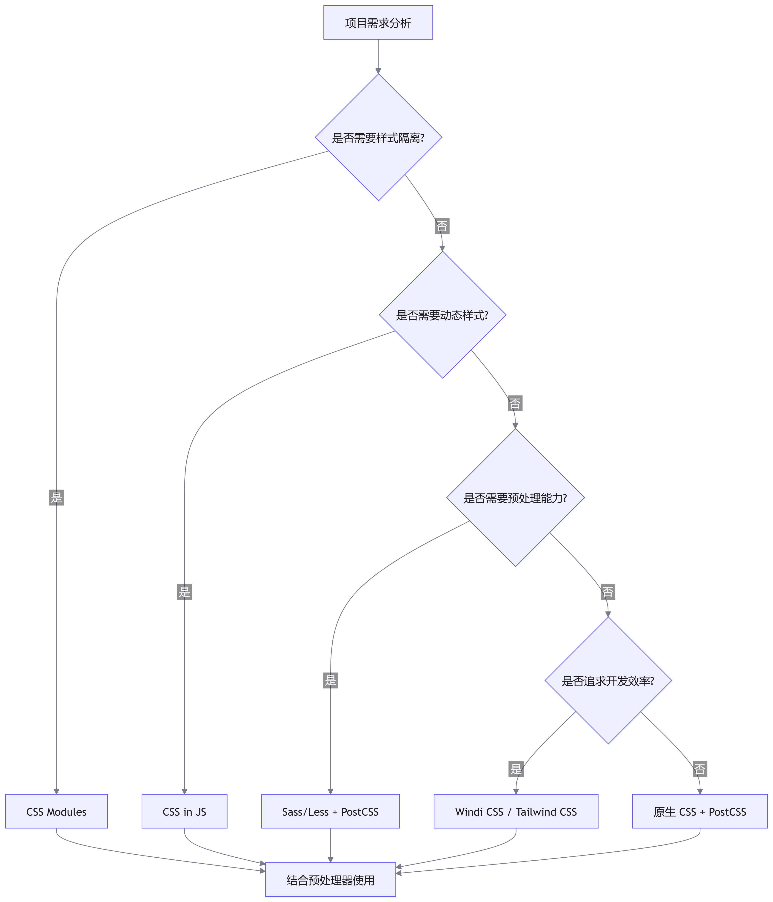

# 样式方案：在 Vite 中接入现代化的 CSS 工程化方案

## 核心主旨

样式工程化是现代前端项目不可或缺的一环。原生 <word text="CSS"/> 存在开发体验欠佳、样式污染、浏览器兼容性差、产物体积过大等四大痛点。本文系统梳理了社区主流的 5 类 <word text="CSS"/> 工程化方案（<word text="CSS"/> 预处理器、<word text="CSS Modules"/>、<word text="PostCSS"/>、<word text="CSS in JS"/>、<word text="CSS"/> 原子化框架），并通过实战演示如何在 <word text="Vite"/> 中零配置或自定义接入这些方案，帮助你根据项目痛点选择合适的样式策略。

## 原生 CSS 的四大痛点与解决方案矩阵

### 原生 CSS 的核心问题

```css
/* 问题1：开发体验欠佳 - 选择器无法嵌套，代码冗余 */
.container .header .nav .title .text {
  color: blue;
}
.container .header .nav .box {
  color: blue;
  border: 1px solid grey;
}
/* 问题2：样式污染 - 全局类名冲突 */
/* a.css */
.container {
  color: red;
}
/* b.css */
.container {
  color: blue;
} /* 可能覆盖 a.css！*/
/* 问题3：浏览器兼容 - 需手动添加前缀 */
.element {
  -webkit-transition: all 0.3s;
  -moz-transition: all 0.3s;
  -o-transition: all 0.3s;
  transition: all 0.3s;
}
/* 问题4：产物体积 - 未使用的样式也被打包 */
```

### 五大解决方案对比矩阵

| 方案类型                    | 代表工具                                                      | 核心优势                                     | 解决的问题              | 适用场景                            |
| --------------------------- | ------------------------------------------------------------- | -------------------------------------------- | ----------------------- | ----------------------------------- |
| <word text="CSS"/> 预处理器 | <word text="Sass"/>/<word text="Less"/>/<word text="Stylus"/> | 变量、嵌套、逻辑控制                         | 开发体验、代码复用      | 传统项目、需要样式复用              |
| <word text="CSS Modules"/>  | 内置支持                                                      | 类名哈希化                                   | 样式污染、命名冲突      | 组件化开发、隔离样式                |
| <word text="PostCSS"/>      | <word text="autoprefixer"/>/<word text="pxtorem"/>            | <word text="AST"/> 解析与转换                | 浏览器兼容、单位转换    | 跨浏览器适配、移动端                |
| <word text="CSS in JS"/>    | <word text="styled-components"/>/<word text="emotion"/>       | <word text="JavaScript"/> 中写样式、动态样式 | 开发体验、样式隔离、DCE | <word text="React"/> 项目、动态主题 |
| <word text="CSS"/> 原子化   | <word text="Tailwind CSS"/>/<word text="Windi CSS"/>          | 原子类名、按需生成                           | 开发效率、产物体积      | 快速原型、设计系统                  |

## CSS 预处理器实战：Sass/Less/Stylus

### Vite 的零配置支持

<word text="Vite"/> 内置对 <word text="CSS"/> 预处理器的支持，只需安装对应库即可使用：

```bash
# 安装 Sass（以 Sass 为例）
pnpm i sass -D
```

### 基础使用示例

```tsx
// src/components/Header/index.tsx
import './index.scss';

export function Header() {
  return <p className="header">This is Header</p>
}

// src/components/Header/index.scss
.header {
  color: red; // 支持嵌套语法
  &:hover {
    color: blue;
  }
}
```

### 全局变量注入配置 🔑

痛点：每次使用全局变量都需手动 `@import`，代码冗余。

解决方案：通过 `vite.config.ts` 的 `css.preprocessorOptions` 自动注入。

::: code-group

```typescript [vite.config.ts]
// vite.config.ts
import { defineConfig, normalizePath } from 'vite'
import path from 'path'
import react from '@vitejs/plugin-react'

// 全局 scss 文件路径（使用 normalizePath 解决 Windows 路径问题）
const variablePath = normalizePath(path.resolve('./src/variable.scss'))

export default defineConfig({
  plugins: [react()],
  css: {
    preprocessorOptions: {
      scss: {
        // additionalData 的内容会在每个 scss 文件开头自动注入
        additionalData: `@import "${variablePath}";`,
      },
    },
  },
})
```

```scss [使用效果.scss]
// src/variable.scss
$theme-color: red;
$font-size-base: 16px;

// 任意 .scss 文件中可直接使用，无需手动 import
.header {
  color: $theme-color;
  font-size: $font-size-base;
}
```

:::

### 预处理器配置项参考

| 预处理器 | 配置文档                                                                                                        | 常用配置项                        |
| -------- | --------------------------------------------------------------------------------------------------------------- | --------------------------------- |
| Sass     | [官方文档](https://sass-lang.com/documentation/js-api/modules/?spm=a2ty_o01.29997173.0.0.277455fbWapgGs#render) | additionalData, implementation    |
| Less     | [官方文档](https://lesscss.org/usage/?spm=a2ty_o01.29997173.0.0.277455fbWapgGs#less-options)                    | additionalData, javascriptEnabled |
| Stylus   | [官方文档](https://stylus-lang.com/docs/js.html?spm=a2ty_o01.29997173.0.0.277455fbWapgGs)                       | additionalData, define            |

## CSS Modules：样式隔离的利器

### 开箱即用的使用方式

Vite 对后缀带有 `.module` 的样式文件自动应用 CSS Modules：
::: code-group

```tsx
// src/components/Header/index.tsx
import styles from './index.module.scss'; // 注意：文件名包含 .module

export function Header() {
  return <p className={styles.header}>This is Header</p>
}

// src/components/Header/index.module.scss
.header {
  color: red;
}
```

:::

浏览器渲染结果：

```html
<!-- 类名被处理成哈希值，避免全局冲突 -->
<p class="_header_kcvt0_1">This is Header</p>
```

### 自定义类名生成策略

通过 `css.modules.generateScopedName` 配置开发时的类名格式，提升调试体验：

```typescript
// vite.config.ts
export default defineConfig({
  css: {
    modules: {
      // 自定义类名生成规则
      // [name] - 文件名, [local] - 原始类名, [hash:base64:5] - 5位哈希
      generateScopedName: '[name]__[local]___[hash:base64:5]',
    },
  },
})
```

效果对比：

| 配置   | 生成类名示例           | 适用场景               |
| ------ | ---------------------- | ---------------------- |
| 默认   | `_header_kcvt0_1`      | 生产环境               |
| 自定义 | `index__header__kcvt0` | 开发调试（可读性更强） |

### CSS Modules 配置项参考

完整配置项可查阅 postcss-modules 文档：
generateScopedName: 类名生成规则
hashPrefix: 哈希前缀
localsConvention: 类名转换规则（camelCase 等）

## PostCSS：CSS 的后处理器引擎

### 核心能力与插件生态

<word text="PostCSS"/> 通过 <word text="AST"/>（抽象语法树）解析 <word text="CSS"/>，可实现：

- 自动添加浏览器前缀（<word text="autoprefixer"/>）
- <word text="px"/> 转 <word text="rem"/>（<word text="postcss-pxtorem"/>）
- 支持最新 <word text="CSS"/> 语法（<word text="postcss-preset-env"/>）
- 代码压缩优化（<word text="cssnano"/>）

### Autoprefixer 实战配置

::: code-group

```bash [安装]
pnpm i autoprefixer -D
```

```typescript [使用]
// vite.config.ts
import autoprefixer from 'autoprefixer'

export default defineConfig({
  css: {
    postcss: {
      plugins: [
        autoprefixer({
          // 指定目标浏览器范围
          overrideBrowserslist: ['Chrome > 40', 'ff > 31', 'ie 11'],
        }),
      ],
    },
  },
})
```

:::

编译效果：

```css
/* 源码 */
.header {
  text-decoration: dashed;
}

/* 打包产物（自动添加前缀）*/
._header_kcvt0_1 {
  -webkit-text-decoration: dashed;
  -moz-text-decoration: dashed;
  text-decoration: dashed;
}
```

### 主流 PostCSS 插件矩阵

| 插件名称                          | 功能                                    | 适用场景     | 配置示例               |
| --------------------------------- | --------------------------------------- | ------------ | ---------------------- |
| <word text="autoprefixer"/>       | 自动添加浏览器前缀                      | 跨浏览器兼容 | `overrideBrowserslist` |
| <word text="postcss-pxtorem"/>    | <word text="px"/> 转 <word text="rem"/> | 移动端适配   | `rootValue: 16`        |
| <word text="postcss-preset-env"/> | 支持最新 <word text="CSS"/> 语法        | 未来语法兼容 | `stage: 3`             |
| <word text="cssnano"/>            | 智能压缩 <word text="CSS"/>             | 生产环境优化 | `preset: 'default'`    |

插件资源：探索更多插件请访问 [链接](https://www.postcss.parts/)

### CSS in JS：在 JavaScript 中写样式

### 主流方案对比

| 方案                             | <word text="Babel"/> 插件                     | 特点           | 适用框架                                |
| -------------------------------- | --------------------------------------------- | -------------- | --------------------------------------- | -------------------- |
| <word text="styled-components"/> | <word text="babel-plugin-styled-components"/> | 标签模板语法   |                                         | <word text="React"/> |
| <word text="emotion"/>           | <word text="@emotion/babel-plugin"/>          | 更轻量、性能优 | <word text="React"/>/<word text="Vue"/> |

### Vite 集成配置

```typescript
// vite.config.ts
import { defineConfig } from 'vite'
import react from '@vitejs/plugin-react'

export default defineConfig({
  plugins: [
    react({
      babel: {
        plugins: [
          // 适配 styled-components
          'babel-plugin-styled-components',
          // 适配 emotion
          '@emotion/babel-plugin',
        ],
      },
      // emotion 专属配置：支持特殊 jsx 语法
      jsxImportSource: '@emotion/react',
    }),
  ],
})
```

### 使用示例

```tsx
// styled-components 示例
import styled from 'styled-components'

const Button = styled.button`
  background: blue;
  color: white;
  padding: 10px 20px;

  &:hover {
    background: darkblue;
  }
`

// emotion 示例
/** @jsxImportSource @emotion/react */
import { css } from '@emotion/react'

const buttonStyle = css`
  background: blue;
  color: white;
  padding: 10px 20px;
`

function App() {
  return <button css={buttonStyle}>Click me</button>
}
```

### <word text="CSS in JS"/> 构建侧考量

| 考量维度                 | 解决方案                                   |
| ------------------------ | ------------------------------------------ |
| 选择器命名               | <word text="Babel"/> 插件自动生成哈希类名  |
| DCE（死代码消除）        | <word text="Babel"/> 插件标记未使用样式    |
| 代码压缩                 | 生产环境通过 <word text="Babel"/> 插件优化 |
| <word text="SourceMap"/> | 插件支持生成源码映射                       |
| <word text="SSR"/> 支持  | 框架提供服务端渲染 API                     |

## CSS 原子化框架：Tailwind CSS vs Windi CSS

### 方案对比

| 特性     | <word text="Tailwind CSS"/> v2 | <word text="Windi CSS"/> | <word text="Tailwind CSS"/> v3 |
| -------- | ------------------------------ | ------------------------ | ------------------------------ |
| 编译速度 | 慢                             | 快 20-100 倍             | 快（引入 <word text="JIT"/>）  |
| 按需生成 | 全量打包                       | 按需编译                 | <word text="JIT"/> 模式        |
| 高级功能 | 基础原子类                     | Attributify/Shortcuts    | 基础原子类                     |
| 配置方式 | `tailwind.config.js`           | `windi.config.ts`        | `tailwind.config.js`           |

### Windi CSS 接入实战

::: code-group

```bash [安装与配置]
pnpm i windicss vite-plugin-windicss -D
```

```typescript
// vite.config.ts
import windi from 'vite-plugin-windicss'

export default defineConfig({
  plugins: [
    windi(), // 启用 Windi CSS 插件
  ],
})
```

```tsx
// src/main.tsx - 必须引入虚拟 CSS 文件
import 'virtual:windi.css'
```

:::

使用示例：

```tsx
// src/components/Header/index.tsx
export function Header() {
  return (
    <div className="p-20px text-center">
      <h1 className="font-bold text-2xl mb-2">Vite + Windi CSS</h1>
    </div>
  )
}
```

### Windi CSS 高级功能

#### Attributify（属性化模式）

```typescript
// windi.config.ts
import { defineConfig } from 'vite-plugin-windicss'

export default defineConfig({
  attributify: true, // 开启属性化模式
})
```

使用效果：

```tsx
<!-- 传统写法 -->
<button className="bg-blue-400 hover:bg-blue-500 text-sm text-white font-mono p-y-2 p-x-4">
  Button
</button>

<!-- Attributify 写法（更语义化）-->
<button
  bg="blue-400 hover:blue-500"
  text="sm white"
  font="mono light"
  p="y-2 x-4"
  border="2 rounded blue-200"
>
  Button
</button>
```

类型声明（避免 TS 报错）：

```typescript
// types/shim.d.ts
import { AttributifyAttributes } from 'windicss/types/jsx'

declare module 'react' {
  type HTMLAttributes<T> = AttributifyAttributes
}
```

#### Shortcuts（快捷方式）

::: code-group

```typescript
// windi.config.ts
export default defineConfig({
  shortcuts: {
    // 封装常用类名组合
    'flex-c': 'flex justify-center items-center',
    'btn-primary': 'bg-blue-500 text-white px-4 py-2 rounded',
  },
})
```

```tsx
// 使用 shortcuts
<div className="flex-c">Centered content</div>
<button className="btn-primary">Primary Button</button>
```

:::

### Tailwind CSS 接入流程

::: code-group

```bash [安装依赖]
pnpm install -D tailwindcss postcss autoprefixer
```

```javascript [配置文件]
// tailwind.config.js
module.exports = {
  content: [
    './index.html',
    './src/**/*.{vue,js,ts,jsx,tsx}', // 扫描这些文件中的类名
  ],
  theme: {
    extend: {},
  },
  plugins: [],
}

// postcss.config.js
module.exports = {
  plugins: {
    tailwindcss: {},
    autoprefixer: {},
  },
}
```

:::

入口文件引入：

```css
/* src/index.css */
@tailwind base;
@tailwind components;
@tailwind utilities;
```

使用示例：

```tsx
function App() {
  return (
    <div>
      
      <p className="bg-red-400">Hello Vite + Tailwind!</p>
    </div>
  )
}
```

### 原子化框架选型建议

| 项目特征                                 | 推荐方案                 | 理由                                 |
| ---------------------------------------- | ------------------------ | ------------------------------------ |
| 追求极致开发速度                         | Windi CSS                | 编译快、Attributify 提升效率         |
| 需要稳定生态                             | Tailwind CSS v3          | 社区庞大、文档完善                   |
| 已有 <word text="Tailwind CSS"/> v2 项目 | 升级到 v3                | 引入 <word text="JIT"/> 解决性能问题 |
| 需要高级定制                             | <word text="Windi CSS"/> | Shortcuts/Attributify 更灵活         |

## 样式方案选型决策树


