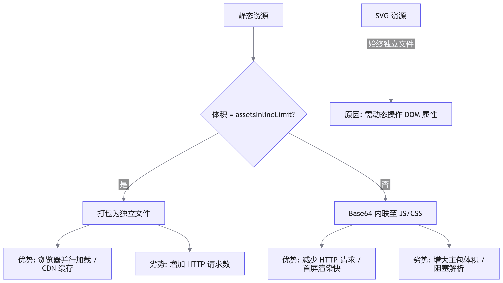

# 静态资源：在 Vite 中处理各种静态资源？

## 核心主旨

静态资源（图片、<word text="JSON" />、<word text="Web Worker" />、<word text="WASM" /> 等）并非标准<word text="JavaScript" />模块，但现代前端工程必须将其无缝集成至构建流程。本文聚焦<word text="Vite" />如何将静态资源解析为 <word text="ESM"/> 模块，系统拆解开发期的零配置加载方案与生产环境的产物优化策略（<word text="CDN"/> 域名替换、体积控制、内联阈值、图片压缩、<word text="SVG"/> 雪碧图等），帮助开发者建立"开发便捷、生产高效"的静态资源工程化思维。

## 静态资源处理的两大核心挑战

- 加载与模块兼容：静态资源需被转换为浏览器可识别的 <word text="ESM"/> 格式，解决路径寻址、格式解析与依赖引入问题。
- 生产环境部署与性能：需统筹 <word text="CDN"/> 域名映射、文件体积控制（内联 vs 独立文件）、网络请求优化（HTTP/1.1 vs HTTP/2）及自动化压缩。

## 开发期加载实战：五大资源类型与 <word text="Vite"/> 零配置支持

### 图片加载与别名配置

::: code-group

```typescript [vite.config.ts]
import path from 'path';
export default defineConfig({
  resolve: {
    // 别名配置在 JS import、CSS url()、@import 中均自动生效
    alias: { '@assets': path.join(__dirname, 'src/assets') }
  }
});
```

```tsx
// JSX/TS 动态引入与使用
import logoSrc from '@assets/imgs/vite.png';
// 方式1：直接绑定 src

// 方式2：JS 动态赋值
useEffect(() => { document.getElementById('img').src = logoSrc; }, []);
```

:::

机制解析：<word text="Vite"/> Dev Server 拦截图片请求，读取文件后返回 `/assets/xxx-xxx.png` 路径。<word text="CSS"/> 中的 `url('@assets/...')` 与 <word text="JS"/> import 享受同一套路径解析与热更新逻辑。

### <word text="SVG"/> 组件化加载 (<word text="vite-plugin-svgr"/>)

::: code-group
```typescript [vite.config.ts]
import svgr from 'vite-plugin-svgr';
export default defineConfig({ plugins: [svgr()] });
```
```json [tsconfig.json]
//  补充类型声明，避免 TS 报错
{ "compilerOptions": { "types": ["vite-plugin-svgr/client"] } }
```
```tsx
// 组件使用：将 SVG 转为 React 组件，支持 Props 动态修改样式
import { ReactComponent as Logo } from '@assets/icons/logo.svg';
<Logo className="icon" fill="red" />
```
:::

机制解析：插件将 <word text="SVG"/> 解析为函数式组件，支持通过 props 覆盖 fill、color 等属性。比传统 `` 标签更灵活，且可被 <word text="CSS"/> 直接控制，符合现代组件化规范。

### JSON / Web Worker / WASM 开箱即用
| 资源类型                   | 加载方式                                   | 核心机制与配置                                                                                                                                                                     |
| -------------------------- | ------------------------------------------ | ---------------------------------------------------------------------------------------------------------------------------------------------------------------------------------- |
| JSON                       | `import { version } from './package.json'` | 底层通过 `@rollup/pluginutils` 的 `dataToEsm` 转为具名导出模块。配置 `json: { stringify: true }` 可转为 `export default JSON.parse("...")`，牺牲按名导出能力，换取大文件解析性能。 |
| Web Worker                 | `import MyWorker from './task.js?worker'`  | `?worker` 后缀告知 Vite 将其编译为独立 Worker 脚本，自动返回构造函数。主线程通过 `new MyWorker()` 实例化并监听 message 事件通信。                                                  |
| <word text="WebAssembly"/> | `import init from './fib.wasm'`            | <word text="Vite"/> 封装默认导出为 init 函数，返回 Promise。`.then(exports => { exports.fib(10) })` 调用 <word text="WASM"/> 导出方法，实现高性能计算。                            |

### 自定义资源后缀与 Query 修饰符 🔑

::: code-group
```typescript [vite.config.ts]
//  - 支持自定义格式
export default { assetsInclude: ['.gltf', '.fbx'] }; // 将非标准格式注册为模块
```
```javascript
// 特殊 Query 后缀：同一资源的多态导出
import imgUrl from './logo.png?url';      // 仅返回资源 URL 路径（用于动态 src 赋值）
import rawStr from './config.txt?raw';    // 返回文件原始字符串内容（用于代码高亮/模板注入）
import inlined from './small.png?inline'; // 强制 Base64 内联（无视全局阈值配置）
```
:::

> 机制解析：<word text="Vite"/> 利用 URL Query 实现资源按需转译，无需编写自定义插件即可满足路径获取、文本读取、强制内联等细分场景。

## 生产环境优化：从部署到体积控制的完整链路 🔑

### <word text="CDN"/> 域名替换与环境变量注入

::: code-group
```typescript [vite.config.ts]
const isProd = process.env.NODE_ENV === 'production';
export default {
  // 生产环境自动为所有静态资源（含 HTML 中的 JS/CSS 引用）添加 CDN 前缀
  base: isProd ? 'https://cdn.example.com' : '/'
};
```
```env [.env]
# .env.production (优先级高于 .env)
VITE_IMG_BASE_URL=https://my-cdn.com
```
```typescript [src/vite-env.d.ts]
//  TS 类型声明（必须以 VITE_ 开头才可在客户端访问）
interface ImportMetaEnv { readonly VITE_IMG_BASE_URL: string; }
```
```tsx
// 动态拼接 CDN 路径

```
:::

> 机制解析：base 控制全局静态资源前缀；以 `VITE_` 开头的环境变量在构建期会被静态替换为真实字符串，安全暴露给客户端。优先级：`.env.[mode]` > `.env`。

### 内联 vs 独立文件：体积与网络请求的博弈

```typescript [vite.config.ts]
export default {
  build: {
    assetsInlineLimit: 8 * 1024 // 默认 4KB。 < 阈值内联为 Base64，>= 阈值提取为独立文件
  }
};
```

优化决策流：



### 图片自动化压缩 (vite-plugin-imagemin)

```typescript
import viteImagemin from 'vite-plugin-imagemin';
export default {
  plugins: [
    viteImagemin({
      optipng: { optimizationLevel: 7 },       // 无损压缩（质量不变）
      pngquant: { quality: [0.8, 0.9] },       // 有损压缩（平衡质量与体积）
      svgo: { plugins: [{ name: 'removeViewBox' }] } // SVG 元数据清理
    })
  ]
};
```

> 机制解析：构建期自动调用 <word text="imagemin"/> 底层引擎对 `dist` 产物进行压缩。推荐在生产环境集成，可显著降低静态资源总体积（通常缩减 30%~60%）。

### <word text="SVG"/> 雪碧图优化：解决海量图标请求瓶颈 🔑

背景：`HTTP/1.1` 环境下大量 <word text="SVG"/> 请求会导致网络阻塞；虽 `HTTP/2` 缓解了该问题，但 `Dev Server` 仍受限于单连接，生产环境仍需优化。

::: code-group
```typescript
// 1. 安装与配置
import { createSvgIconsPlugin } from 'vite-plugin-svg-icons';
export default {
  plugins: [createSvgIconsPlugin({ iconDirs: [path.resolve('src/assets/icons')] })]
};
// 2. 入口注册（main.tsx）
import 'virtual:svg-icons-register';
```
```tsx
// 3. 封装通用 SvgIcon 组件
export default function SvgIcon({ name, prefix = 'icon', color = '#333', ...props }) {
  // 通过 <use> 引用雪碧图中的 symbol
  return <svg {...props} aria-hidden="true"><use href={`#${prefix}-${name}`} fill={color} /></svg>;
}
```
:::

> 机制解析：插件在构建时将指定目录下的所有 <word text="SVG"/> 合并为一个内联<word text="Sprite" />文件，通过 `<use href="#icon-name">` 引用。网络请求从 N 次降为 1 次，彻底消除图标加载耗时，同时支持按需渲染。

## 静态资源工程化速查与决策矩阵
| 场景/需求     | Vite 内置方案                    | 社区插件方案            | 关键配置/API                                  |
| ------------- | -------------------------------- | ----------------------- | --------------------------------------------- |
| 路径别名      | `resolve.alias`                  | -                       | `@assets: path.resolve('src/assets')`         |
| 小图内联阈值  | `build.assetsInlineLimit`        | -                       | 默认 4096 (bytes)                             |
| JSON 导入优化 | `import data from 'x.json'`      | -                       | `json: { stringify: true }`                   |
| Worker 脚本   | `?worker` 后缀                   | -                       | `import W from './w.js?worker'`               |
| SVG 组件化    | -                                | `vite-plugin-svgr`      | `types: ["vite-plugin-svgr/client"]`          |
| 图片产物压缩  | -                                | `vite-plugin-imagemin`  | `optipng, pngquant, svgo`                     |
| SVG 雪碧图    | -                                | `vite-plugin-svg-icons` | `iconDirs, virtual:svg-icons-register`        |
| 批量导入管理  | `import.meta.glob` / `globEager` | -                       | 同步加载用 `globEager`，异步按需加载用 `glob` |

## 小结与最佳实践

本节完整覆盖了 <word text="Vite"/> 静态资源从开发加载到生产优化的全链路。核心要点如下：
- 开发期零配置：图片、<word text="JSON"/>、Worker、<word text="WASM"/> 均可直接 `import`，配合 `?url`/`?raw`/`?inline` 满足多态需求，别名配置贯穿 <word text="JS"/>/<word text="CSS"/>。
- 生产环境自动化：通过 base 与环境变量实现 <word text="CDN"/> 域名无缝替换；合理设置 `assetsInlineLimit` 平衡产物体积与 HTTP 请求数。
- 性能优化组合拳：引入 <word text="imagemin"/> 压缩图片产物，利用 <word text="vite-plugin-svg-icons"/> 插件生成雪碧图，配合 `import.meta.globEager` 批量管理图标模块。
- 工程化思维：静态资源不是"孤立文件"，而是构建流水线中的一环。理解 <word text="Vite"/> 的解析、转换、打包逻辑，才能在复杂业务中做出正确的架构选型。