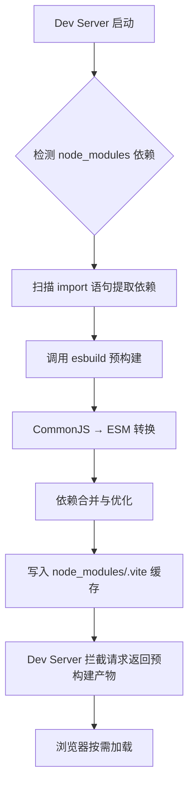
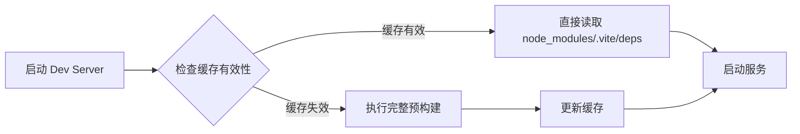
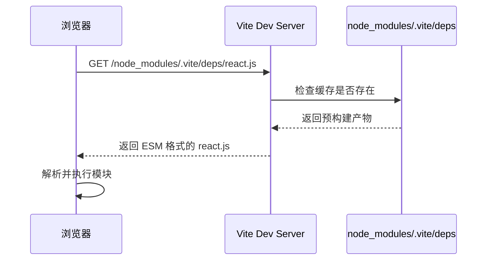
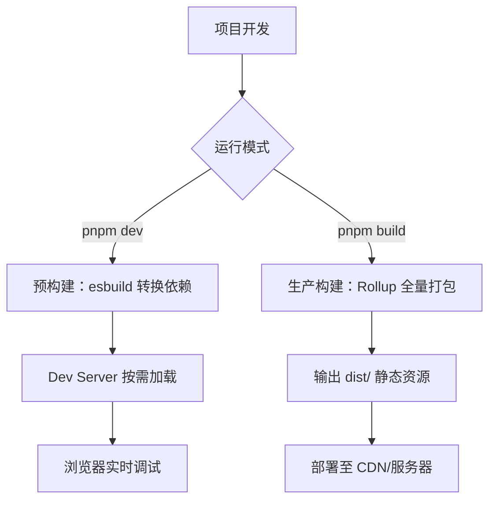

# 预构建：如何玩转秒级依赖预构建的能力？

## 核心主旨

本节深入剖析 <word text="Vite"/> 的依赖预构建（Dependency Pre-Bundling）机制，完整拆解其设计动机、底层原理与工程实践。重点阐释 <word text="CommonJS"/> 转 <word text="ESM"/>、<word text="esbuild"/> 高性能编译、依赖缓存策略及预构建配置调优，帮助开发者彻底理解 <word text="Vite"/> 为何能在开发阶段实现秒级启动。

## 为什么需要依赖预构建

<word text="Vite"/> 在开发阶段采用原生 <word text="ESM"/> 按需加载模式，但直接将 node_modules 中的依赖交给浏览器处理会面临两大核心问题：

### 问题一：CommonJS 与 ESM 的兼容鸿沟

大量第三方库（尤其是 <word text="npm"/> 生态中的老牌包）仍采用 <word text="CommonJS"/> 或 <word text="UMD"/> 格式导出，而浏览器原生仅支持 <word text="ESM"/>。若不做转换，直接 import 会触发运行时错误。

```javascript
// node_modules/lodash-es/index.js（ESM 格式，浏览器可直接处理）
export { default as debounce } from './debounce.js'

// node_modules/lodash/lodash.js（CommonJS 格式，浏览器无法识别）
module.exports = {
  debounce: function () {
    /* ... */
  },
}
```

浏览器遇到 `require()` 或 `module.exports` 会直接报错，因为这两个标识符在浏览器环境中未定义。

### 问题二：性能损耗与网络风暴

现代前端项目往往依赖数百个 node_modules 包。以 <word text="React"/> 为例：

```txt
react
├── react-dom
│   ├── scheduler
│   └── object-assign
└── loose-envify
    └── js-tokens
```

若每个依赖都触发独立的 HTTP 请求与编译流程，将导致：

- 数百次串行/并行网络请求，显著拖慢首屏加载；
- 重复的语法转换开销，浪费 CPU 资源；
- 依赖嵌套引发的级联请求，形成性能瓶颈。

### 预构建的解决方案

<word text="Vite"/> 在启动 Dev Server 前，会先执行一轮依赖预构建，核心目标：

1. **格式转换**：将 <word text="CommonJS"/>/<word text="UMD"/>/<word text="AMD"/> 统一转为 <word text="ESM"/>，使浏览器可直接加载；
2. **依赖合并**：将多个内部模块打包为单一文件，减少 HTTP 请求数量；
3. **性能优化**：利用 <word text="esbuild"/> 的 Go 语言底层能力，实现比传统打包器快 10-100 倍的编译速度。



## 预构建的触发时机与流程

### 首次启动：完整预构建

项目首次运行 `pnpm dev` 时，<word text="Vite"/> 会执行完整的预构建流程：

```txt
[vite] Optimizable dependencies detected:
react, react-dom, lodash

  Pre-bundling dependencies: react, react-dom, lodash
  (this will be run only when your dependencies or config have changed)
```

完整流程拆解：

1. **依赖扫描**：<word text="Vite"/> 使用 <word text="esbuild"/> 快速扫描源码中的所有 `import` 语句，提取 node_modules 中的外部依赖；
2. **依赖解析**：根据 package.json 的 `exports`、`main`、`module` 字段确定每个依赖的入口文件；
3. **预构建执行**：调用 <word text="esbuild"/> 的 `build()` API，将每个依赖独立打包为 <word text="ESM"/> 格式；
4. **缓存写入**：产物写入 `node_modules/.vite/deps/` 目录，并生成 `_metadata.json` 记录依赖哈希；
5. **服务启动**：预构建完成后，Dev Server 正式启动，拦截对预构建依赖的请求并返回缓存产物。

### 二次启动：缓存命中

当依赖未发生变化时，<word text="Vite"/> 直接读取缓存，跳过预构建步骤：

```txt
[vite] Optimized dependencies unchanged. Restart the server to force re-optimization.
```

缓存失效条件（满足任一即触发重新预构建）：

- `package.json` 中的 `dependencies` 或 `devDependencies` 发生变化；
- `vite.config.ts` 中与预构建相关的配置（`optimizeDeps`）被修改；
- 包管理器锁文件（`pnpm-lock.yaml`/`package-lock.json`/`yarn.lock`）内容变更；
- 手动删除 `node_modules/.vite` 目录。



## esbuild 为何如此之快

<word text="esbuild"/> 是 <word text="Vite"/> 预构建的核心引擎，其性能优势来源于以下设计：

### 底层语言与架构优势

| 对比维度 | <word text="esbuild"/>          | <word text="Webpack"/>/<word text="Rollup"/> |
| -------- | ------------------------------- | -------------------------------------------- |
| 实现语言 | Go（编译型语言）                | JavaScript（解释型语言）                     |
| 并发模型 | 原生多线程 + 内存共享           | 单线程事件循环                               |
| 解析器   | 手写 Go 解析器，零 AST 转换开销 | 基于 JavaScript AST 库                       |
| 编译速度 | 比传统打包器快 10-100 倍        | 基准线                                       |

### 预构建中的 esbuild 配置

<word text="Vite"/> 内部调用 <word text="esbuild"/> 时的核心配置：

```typescript
// Vite 内部伪代码示意
import { build } from 'esbuild'

await build({
  entryPoints: ['node_modules/react/index.js'], // 依赖入口
  bundle: true, // 启用打包
  format: 'esm', // 输出 ESM 格式
  outfile: 'node_modules/.vite/deps/react.js', // 输出路径
  platform: 'browser', // 目标平台
  sourcemap: true, // 生成 Source Map
  // 自动处理 CommonJS → ESM 转换
})
```

关键机制：

- `bundle: true`：将依赖及其子依赖打包为单一文件，减少 HTTP 请求；
- `format: 'esm'`：强制输出 <word text="ESM"/> 格式，浏览器可直接加载；
- `platform: 'browser'`：自动处理 Node.js 专属模块（如 `fs`、`path`）的兼容问题。

## 预构建产物的存放与加载

### 产物目录结构

```txt
node_modules/
└── .vite/
    ├── deps/
    │   ├── _metadata.json          # 缓存元数据（依赖哈希、时间戳）
    │   ├── chunk-ABC123.js         # 共享代码块（多依赖共用部分）
    │   ├── react.js                # react 预构建产物
    │   ├── react-dom.js            # react-dom 预构建产物
    │   ├── lodash.js               # lodash 预构建产物
    │   └── package.json            # 空文件，阻止 Vite 解析此目录
    └── deps_temp/                  # 预构建过程中的临时目录
```

### \_metadata.json 结构

```json
{
  "hash": "a1b2c3d4",
  "configHash": "e5f6g7h8",
  "lockfileHash": "i9j0k1l2",
  "browserHash": "m3n4o5p6",
  "optimized": {
    "react": {
      "src": "../../react/index.js",
      "file": "react.js",
      "fileHash": "q7r8s9t0",
      "needsInterop": true
    },
    "react-dom": {
      "src": "../../react-dom/index.js",
      "file": "react-dom.js",
      "fileHash": "u1v2w3x4",
      "needsInterop": true
    }
  }
}
```

字段说明：

- `hash`：当前预构建产物的唯一标识；
- `configHash`：`vite.config.ts` 内容的哈希，配置变更即失效；
- `lockfileHash`：锁文件哈希，依赖变更即失效；
- `optimized`：每个依赖的映射关系，`needsInterop` 标记是否需要 <word text="CommonJS"/> 互操作处理。

### 浏览器加载流程



## optimizeDeps 配置详解

<word text="Vite"/> 提供 `optimizeDeps` 配置项，允许开发者精细控制预构建行为：

### 完整配置结构

```typescript
// vite.config.ts
import { defineConfig } from 'vite'

export default defineConfig({
  optimizeDeps: {
    // 强制预构建的依赖（即使未被源码 import）
    include: ['lodash-es'],

    // 排除预构建的依赖（保持原始形态）
    exclude: ['special-lib'],

    // 依赖解析时的别名映射
    alias: {
      'old-lib': 'new-lib',
    },

    // esbuild 额外配置
    esbuildOptions: {
      // 自定义插件
      plugins: [
        // 处理特殊格式的依赖
      ],
      // 目标浏览器版本
      target: 'es2020',
    },

    // 强制重新预构建
    force: false,
  },
})
```

### include：强制预构建

某些依赖不会被自动扫描到（如动态导入、延迟加载的模块），需手动加入：

```typescript
export default defineConfig({
  optimizeDeps: {
    include: [
      'lodash-es', // 未被源码直接 import，但运行时依赖
      'react-router-dom', // 懒加载路由组件，扫描阶段未命中
      '@some/lib > dep', // 强制预构建嵌套依赖
    ],
  },
})
```

典型场景：

- 通过 `window.xxx` 全局变量引用的库；
- 条件加载的依赖（`if (condition) import('xxx')`）；
- 第三方插件内部动态 require 的包。

### exclude：排除预构建

某些场景下需要跳过预构建：

```typescript
export default defineConfig({
  optimizeDeps: {
    exclude: [
      'my-local-package', // 本地开发的包，需实时生效
      'debug-lib', // 调试工具，无需优化
    ],
  },
})
```

注意事项：

- 排除的依赖必须本身已是 <word text="ESM"/> 格式，否则浏览器无法加载；
- 排除后，该依赖将走 <word text="Vite"/> 的按需编译管线（而非预构建管线）。

### force：强制重新预构建

开发过程中若缓存出现异常，可强制刷新：

```bash
# 方式一：命令行参数
pnpm dev --force

# 方式二：配置项
export default defineConfig({
  optimizeDeps: {
    force: true  // 每次启动都重新预构建
  }
})

# 方式三：手动删除缓存
rm -rf node_modules/.vite  # 需使用文件管理器或编辑器删除，禁止终端命令
```

## 常见问题与排查指南

### 问题一：依赖未被预构建

**现象**：启动后浏览器报错 `Uncaught SyntaxError: Cannot use import statement outside a module` 或 `require is not defined`。

**原因**：该依赖未被 <word text="Vite"/> 的扫描器识别。

**解决方案**：

```typescript
// vite.config.ts
export default defineConfig({
  optimizeDeps: {
    include: ['problematic-lib'],
  },
})
```

### 问题二：预构建产物不生效

**现象**：修改了依赖代码，但浏览器仍加载旧版本。

**原因**：缓存未失效，<word text="Vite"/> 认为依赖未变化。

**解决方案**：

- 执行 `pnpm dev --force` 强制刷新缓存；
- 确认 `package.json` 或锁文件已更新；
- 检查 `node_modules/.vite` 目录权限是否正常。

### 问题三：预构建速度异常缓慢

**现象**：首次启动耗时超过 10 秒。

**排查方向**：

- 检查是否包含大型依赖（如 `lodash` 全量引入）；
- 确认 `include` 列表是否过度膨胀；
- 查看终端日志，确认是否有依赖解析死循环。

**优化建议**：

```typescript
export default defineConfig({
  optimizeDeps: {
    // 精准指定入口，避免全量打包
    include: ['lodash-es/debounce', 'lodash-es/throttle'],
    // 排除无需优化的包
    exclude: ['heavy-lib'],
  },
})
```

### 问题四：CommonJS 依赖导出异常

**现象**：预构建后，依赖的导出对象结构不符合预期。

**原因**：<word text="CommonJS"/> 转 <word text="ESM"/> 时，<word text="esbuild"/> 的互操作逻辑与依赖的实际导出方式不匹配。

**解决方案**：

```typescript
export default defineConfig({
  optimizeDeps: {
    esbuildOptions: {
      // 自定义插件处理特殊导出格式
      plugins: [
        {
          name: 'fix-cjs-export',
          setup(build) {
            build.onLoad({ filter: /problematic-lib/ }, (args) => {
              // 手动修正导出语句
              return { contents: 'export default module.exports' }
            })
          },
        },
      ],
    },
  },
})
```

## 预构建与生产构建的差异

理解开发期预构建与生产期构建的差异，有助于避免认知混淆：

| 对比维度   | 开发期预构建                           | 生产期构建                                  |
| ---------- | -------------------------------------- | ------------------------------------------- |
| 执行引擎   | <word text="esbuild"/>                 | <word text="Rollup"/>                       |
| 核心目标   | 快速转换格式，减少请求数               | 代码分割、压缩、<word text="Tree Shaking"/> |
| 输出格式   | <word text="ESM"/>（供浏览器直接加载） | 优化后的静态资源（JS/CSS/HTML）             |
| 缓存策略   | `node_modules/.vite/deps/`             | 无缓存，每次全量构建                        |
| Source Map | 默认生成                               | 可通过 `build.sourcemap` 控制               |
| 执行时机   | Dev Server 启动前                      | `vite build` 命令触发                       |



## 高级实践：Monorepo 中的预构建策略

在 <word text="Monorepo"/> 架构下，依赖预构建面临更复杂的场景：

### 本地包的处理

<word text="Monorepo"/> 中的本地包（如 `packages/shared`）不应被预构建，因为它们会频繁修改：

```typescript
// vite.config.ts
export default defineConfig({
  optimizeDeps: {
    exclude: [
      '@my-org/shared', // 本地包，排除预构建
      '@my-org/utils',
    ],
  },
  resolve: {
    alias: {
      // 确保本地包走源码引用而非预构建产物
      '@my-org/shared': path.resolve(__dirname, '../packages/shared/src'),
    },
  },
})
```

### 依赖去重与提升

<word text="pnpm"/> 的严格依赖隔离可能导致同一依赖在多个子项目中重复预构建：

```txt
monorepo/
├── apps/
│   ├── web/
│   │   └── node_modules/.vite/deps/  # web 的预构建缓存
│   └── admin/
│       └── node_modules/.vite/deps/  # admin 的预构建缓存
└── packages/
    └── shared/
```

优化建议：

- 使用 `pnpm` 的 `shared-workspace-lock` 机制，确保依赖版本一致；
- 各子项目独立缓存，避免相互干扰；
- 若需共享缓存，可通过软链接指向同一目录。

## 小结与进阶指引

本节完整拆解了 <word text="Vite"/> 依赖预构建的核心机制。核心收获在于：

- 理解预构建的设计动机：解决 <word text="CommonJS"/> 兼容性与网络风暴问题；
- 掌握预构建的触发时机与缓存失效条件；
- 明确 <word text="esbuild"/> 的性能优势来源；
- 熟练运用 `optimizeDeps` 配置项调优预构建行为；
- 厘清开发期预构建与生产期 <word text="Rollup"/> 打包的边界差异。

掌握预构建机制后，后续需深入 <word text="Vite"/> 插件开发、<word text="HMR"/> 原理、<word text="SSR"/> 预渲染及底层源码阅读，以应对复杂工程场景与性能调优需求。
