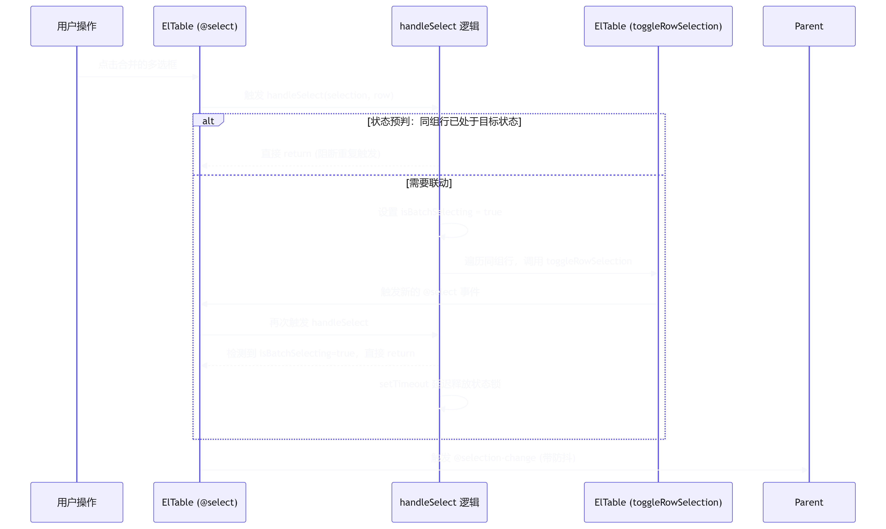

# Vue3 + Element Plus 企业级动态表格组件 (DynamicTable) 设计与实践

## 概述

在企业级后台管理系统中，数据表格是承载复杂业务逻辑的核心载体。随着业务场景的深化，原生的 UI 组件库（如 Element Plus）在应对动态列渲染、复杂单元格合并、多选联动以及实时数据刷新等需求时，往往需要编写大量重复的模板代码与状态管理逻辑。

本文档旨在阐述基于 Vue 3 (Composition API) 与 TypeScript 封装的 DynamicTable 组件的设计思路、核心实现机制及工程化实践。该组件通过配置化驱动与泛型支持，在保障类型安全的前提下，实现了业务逻辑与视图渲染的解耦，提升了复杂表格场景的开发效率与可维护性。

## 核心架构与封装特性
`DynamicTable` 并非对 `el-table` 的简单包裹，而是针对企业级业务场景进行了系统性重构。其核心特性如下：

| 特性分类 | 功能描述                                      | 工程价值                                                 |
| -------- | --------------------------------------------- | -------------------------------------------------------- |
| 类型安全 | 支持 Vue 3.3+ `generic` 泛型约束              | 实现列配置、行数据及插槽的完整类型推导，降低运行时错误率 |
| 配置驱动 | 基于 JSON Schema 动态渲染列，支持插槽与格式化 | 适应多变的列表需求，支持配置化开发模式                   |
| 状态管理 | 内置分页状态、Loading 控制与请求方法注入      | 减少父组件约 80% 的模板代码，实现数据请求与视图解耦      |
| 高阶合并 | 支持基于字段值的自动单元格合并及多选框联动    | 解决合并单元格后，多选框操作逻辑与 UI 不一致的问题       |
| 实时刷新 | 内置定时轮询机制，兼容 `keep-alive` 路由缓存  | 适用于监控大屏、实时状态更新场景，防止定时器内存泄漏     |

## 高阶特性实现原理
1. 动态单元格合并算法

    传统的单元格合并通常需要开发者手动计算 `rowspan` 与 `colspan`。本组件通过配置 `merge: true`，在内部通过计算属性自动推导合并规则。
    
    算法逻辑：

    遍历当前页数据，识别连续相同字段值的行。记录起始行的合并行数（`rowspan`），并将后续被合并行的 `rowspan` 设为 0（在<word text="Element Plus" />中代表隐藏该单元格）。

    ```typescript
    const mergeInfoMap = computed(() => {
      const map = new Map<string, number[]>()
      const data = tableData.value
      if (!data.length) return map

      visibleColumns.value.forEach((col) => {
        if (!col.merge || !col.prop) return
        const mergeRows: number[] = new Array(data.length).fill(1)
        let i = 0
        while (i < data.length) {
          let j = i + 1
          while (j < data.length && data[j][col.prop!] === data[i][col.prop!]) {
            j++
          }
          mergeRows[i] = j - i
          for (let k = i + 1; k < j; k++) mergeRows[k] = 0
          i = j
        }
        map.set(col.prop, mergeRows)
      })
      return map
    })
    ```

2. 多选框合并与联动防死循环机制

    当业务要求“按任务名称合并单元格，且多选框跟随合并，点击多选框选中整个任务”时，会引发两个技术挑战：
    
    - UI 割裂：原生 `selection` 列无法自动跟随业务列合并。
    - 事件死循环：在 `@select` 事件中调用 `toggleRowSelection` 会再次触发 `@select`，导致逻辑死循环或父组件接收到的 `selection-change` 数据错乱。

    解决方案：

    - UI 合并：在 `handleSpanMethod` 中拦截 `selection` 列，复用首个配置了 merge: true 的业务列的合并行数。
    - 防死循环与数据一致性：引入状态锁 (`isBatchSelecting`) 与状态预判机制，并结合防抖策略 (`debounce`) 确保父组件仅接收最终准确的选中数据。

    

    ```typescript
    const handleSelect = (selection: T[], row: T) => {
      if (!props.mergeSelection || isBatchSelecting.value) return

      const groupCol = visibleColumns.value.find((c) => c.merge && c.prop)
      if (!groupCol || !groupCol.prop) return

      const groupValue = row[groupCol.prop]
      const groupRows = tableData.value.filter((r) => r[groupCol.prop!] === groupValue)
      const isSelected = selection.includes(row)

      // 状态预判：若同组数据已处于目标状态，说明为联动触发，直接中断
      if (isSelected && groupRows.every((r) => selection.includes(r))) return
      if (!isSelected && groupRows.every((r) => !selection.includes(r))) return

      isBatchSelecting.value = true
      groupRows.forEach((r) => {
        if (r !== row) tableRef.value?.toggleRowSelection(r, isSelected)
      })

      setTimeout(() => { isBatchSelecting.value = false }, 100)
    }
    ```

3. 兼容 Keep-Alive 的轮询机制

    对于需要实时刷新的监控类页面，组件内置了 `pollingInterval` 属性。为避免路由切换或组件缓存导致的定时器泄漏，组件通过监听<word text="Vue" />的生命周期钩子进行精确控制。

    ```typescript
    // 监听组件激活/失活状态，解决 keep-alive 缓存导致的定时器泄漏
    onDeactivated(() => { isComponentAlive = false; stopPolling() })
    onActivated(() => { 
      isComponentAlive = true
      if (props.pollingInterval > 0) startPolling() 
    })
    ```

## API 参考

### Props

| 参数              | 说明                                         | 类型                                              | 默认值  |
| ----------------- | -------------------------------------------- | ------------------------------------------------- | ------- |
| `requestMethod`   | 数据请求方法，接收分页参数                   | `(params: Pagination) => Promise<ApiResponse<T>>` | -       |
| `columns`         | 列配置数组                                   | `TableColumn<T>[]`                                | -       |
| `rowKey`          | 行数据的唯一标识，用于优化渲染与多选联动     | `string`                                          | 'id'    |
| `showSelection`   | 是否显示多选框列                             | `boolean`                                         | `false` |
| `mergeSelection`  | 是否合并多选框列（需配合列的 `merge: true`） | `boolean`                                         | `false` |
| `pollingInterval` | 轮询间隔（毫秒），大于 0 时开启定时刷新      | `number`                                          | 0       |
| `treeProps`       | 树形表格配置项                               | `{ children?: string; hasChildren?: string }`     | -       |

### Events

|       事件名       |                    说明                    |               回调参数                |
| :----------------: | :----------------------------------------: | :-----------------------------------: |
| `selection-change` | 多选框选中项发生变化时触发（已做防抖处理） |          `(selection: T[])`           |
|    `row-click`     |                 行点击事件                 | `(row: T, column: any, event: Event)` |
|   `size-change`    |                分页大小改变                |      `(pagination: Pagination)`       |
|  `current-change`  |                当前页码改变                |      `(pagination: Pagination)`       |

### Expose Methods (通过 ref 调用)

| 方法名               | 说明                     | 参数                           |
| -------------------- | ------------------------ | ------------------------------ |
| `initTableData`      | 手动刷新表格数据         | -                              |
| `clearSelection`     | 清空多选框选中状态       | -                              |
| `toggleRowSelection` | 手动切换指定行的选中状态 | `(row: T, selected?: boolean)  |
| `setPagination`      | 手动设置分页参数         | `(params: Partial<Pagination>) |

## 使用实例

### 基础用法

通过注入请求方法与列配置，即可快速渲染标准分页表格。

```vue
<template>
  <DynamicTable
    :request-method="fetchUserList"
    :columns="columns"
    row-key="id"
    @selection-change="handleSelectionChange"
  />
</template>

<script setup lang="ts">
import type { TableColumn } from '@/components/DynamicTable/index.vue'

interface User { id: number; name: string; role: string }

const columns: TableColumn<User>[] = [
  { label: '姓名', prop: 'name', minWidth: 120 },
  { label: '角色', prop: 'role', width: 150, align: 'center' }
]

const fetchUserList = (params: any) => {
  return api.getUsers(params)
}
</script>
```

### 进阶用法：合并单元格与多选联动

实现“按任务名称合并单元格，多选框跟随合并，且点击多选框联动选中同组数据”的业务需求。

```vue
<template>
  <DynamicTable
    ref="tableRef"
    :request-method="reviewApi.getReviewList"
    :columns="columns"
    row-key="inventoryCheckId"
    show-selection
    :merge-selection="true" 
    @selection-change="handleSelectionChange"
  />
</template>

<script setup lang="ts">
// 在需要合并的列配置中添加 merge: true
const columns: TableColumn<ReviewItem>[] = [
  { label: '任务名称', prop: 'taskName', minWidth: 180, merge: true }, 
  { label: '任务编码', prop: 'taskCode', width: 180 },
  { label: '物资名称', prop: 'goodsName', width: 150 }
]
</script>
```

### 可扩展性设计
`DynamicTable` 在设计之初预留了多个扩展点，以应对未来更复杂的业务场景：

1. 列设置（Column Setting）：

    通过 `TableColumn` 接口中的 `hidden` 属性，可轻松结合外部弹窗组件，实现表格列的动态显示与隐藏，并支持将配置持久化至本地存储或后端。

2. 自定义表头与单元格：

    支持通过 `slotName` 或默认的 `cell-{prop}` 命名约定，在父组件中通过具名插槽深度定制单元格的渲染逻辑（如嵌入复杂表单、图表或操作按钮）。

3. 多列联合合并：

    当前的 `mergeInfoMap` 算法支持多列独立计算。若需实现“仅当 A 列和 B 列同时相同时才合并”，可通过扩展 `merge` 属性为数组或对象，并在计算属性中调整比对逻辑来实现。

4. 虚拟滚动（Virtual Scroll）：

    若面临万级数据渲染性能瓶颈，可基于现有的 `tableData` 计算属性，无缝替换为 Element Plus 的虚拟表格组件 (`el-table-v2`)，而无需修改父组件的业务逻辑。


## 完整代码

```vue
<script setup lang="ts" generic="T extends Record<string, any> = any">
import type { ElTable } from 'element-plus'
import type { ApiResponse } from '@/service'

// ================= 类型定义 (Types) =================

/** 表格列配置 */
export interface TableColumn<T = any> {
  prop?: string
  label: string
  width?: number | string
  minWidth?: number | string
  fixed?: boolean | 'left' | 'right' | string
  align?: 'left' | 'center' | 'right' | string
  slotName?: string
  type?: 'selection' | 'index' | 'expand' | string
  formatter?: (row: T, column: TableColumn<T>, index: number) => any
  hidden?: boolean
  /** 是否合并该列，当值为 true 时，会根据 prop 字段自动合并相同值的行 */
  merge?: boolean
  /** 自定义合并方法 */
  spanMethod?: (
    row: T,
    column: TableColumn<T>,
    rowIndex: number,
    columnIndex: number,
  ) => [number, number] | [0, 0]
  [key: string]: any
}

/** 分页参数 */
interface Pagination {
  pageNum: number
  pageSize: number
}

/** 组件 Props */
interface Props<T = any> {
  requestMethod?: (params: Pagination) => Promise<ApiResponse<T>>
  columns: TableColumn<T>[]
  showSelection?: boolean
  border?: boolean
  stripe?: boolean
  rowKey?: string
  headerCellStyle?: Record<string, any>
  cellStyle?: Record<string, any>
  tableStyle?: Record<string, any>
  showPagination?: boolean
  treeProps?: { children?: string; hasChildren?: string }
  loading?: boolean
  spanMethod?: (data: {
    row: T
    column: any
    rowIndex: number
    columnIndex: number
  }) => { rowspan: number; colspan: number } | [number, number] | undefined
  /** 新增：是否合并多选框列（需配合列的 merge: true 使用） */
  mergeSelection?: boolean
  /** 【新增】轮询间隔时间（毫秒），传入大于 0 的值则开启定时刷新，不传或传 0 则不开启 */
  pollingInterval?: number
}

// ================= 组件定义 (Props/Emits/Slots) =================

const props = withDefaults(defineProps<Props<T>>(), {
  showSelection: false,
  border: true,
  stripe: true,
  rowKey: 'id',
  headerCellStyle: () => ({
    background: '#f0f9ff',
    color: 'var(--el-color-primary-dark-2)',
    fontWeight: 'bold',
    fontSize: '1rem',
  }),
  cellStyle: () => ({ fontSize: '0.875rem' }),
  tableStyle: () => ({ width: '100%' }),
  showPagination: true,
  treeProps: undefined,
  loading: false,
  mergeSelection: false,
  pollingInterval: 0,
})

const emit = defineEmits<{
  'selection-change': [selection: T[]]
  'row-click': [row: T, column: any, event: Event]
  'size-change': [pagination: Pagination]
  'current-change': [pagination: Pagination]
}>()

defineSlots<{
  [key: string]: (scope: { row: T; $index: number; column: any }) => any
}>()

// ================= 状态管理 (State) =================

const tableRef = shallowRef<InstanceType<typeof ElTable>>()
const requestData = ref<ApiResponse<T> | null>(null)
const internalLoading = ref(false)
const isBatchSelecting = ref(false)

const loading = computed(() => props.loading || internalLoading.value)

const pagination = reactive<Pagination>({
  pageNum: 1,
  pageSize: 10,
})

// ================= 计算属性 (Computed) =================

const visibleColumns = computed(() => props.columns.filter((c) => !c.hidden))

const tableData = computed<T[]>(() => {
  const rows = requestData.value?.rows
  const data = requestData.value?.data
  if (Array.isArray(rows)) return rows as T[]
  if (Array.isArray(data)) return data as T[]
  return []
})

const tableTotal = computed(() => requestData.value?.total || tableData.value.length || 0)

const isTreeTable = computed(() => {
  if (!props.treeProps) return false
  const childrenKey = props.treeProps.children || 'children'
  return tableData.value.some((row) => Array.isArray(row[childrenKey]))
})

// ================= 行合并逻辑 (核心修复) =================

const mergeInfoMap = computed(() => {
  const map = new Map<string, number[]>()
  const data = tableData.value
  if (!data.length) return map

  visibleColumns.value.forEach((col) => {
    if (!col.merge || !col.prop) return
    const mergeRows: number[] = new Array(data.length).fill(1)
    let i = 0
    while (i < data.length) {
      let j = i + 1
      while (j < data.length && data[j][col.prop!] === data[i][col.prop!]) {
        j++
      }
      const span = j - i
      mergeRows[i] = span
      for (let k = i + 1; k < j; k++) {
        mergeRows[k] = 0
      }
      i = j
    }
    map.set(col.prop, mergeRows)
  })
  return map
})

const handleSpanMethod = (data: { row: T; column: any; rowIndex: number; columnIndex: number }) => {
  if (props.spanMethod) return props.spanMethod(data)
  const { rowIndex, column } = data

  if (column.type === 'selection') {
    const groupCol = visibleColumns.value.find((c) => c.merge && c.prop)
    if (groupCol && groupCol.prop) {
      const mergeRows = mergeInfoMap.value.get(groupCol.prop)
      if (mergeRows) {
        const rowspan = mergeRows[rowIndex]
        if (rowspan === 0) return { rowspan: 0, colspan: 0 }
        return { rowspan, colspan: 1 }
      }
    }
    return { rowspan: 1, colspan: 1 }
  }

  const colConfig = visibleColumns.value.find((c) => c.prop === column.property)
  if (!colConfig) return { rowspan: 1, colspan: 1 }

  if (colConfig.spanMethod) {
    const result = colConfig.spanMethod(data.row, colConfig, rowIndex, data.columnIndex)
    if (result) return { rowspan: result[0], colspan: result[1] }
  }

  if (colConfig.merge && colConfig.prop) {
    const mergeRows = mergeInfoMap.value.get(colConfig.prop)
    if (mergeRows) {
      const rowspan = mergeRows[rowIndex]
      if (rowspan === 0) return { rowspan: 0, colspan: 0 }
      return { rowspan, colspan: 1 }
    }
  }
  return { rowspan: 1, colspan: 1 }
}

// ================= 多选联动逻辑 =================

const selectionChangeTimer = ref<any>(null)
const handleSelect = (selection: T[], row: T) => {
  if (!props.mergeSelection) return
  if (isBatchSelecting.value) return

  const groupCol = visibleColumns.value.find((c) => c.merge && c.prop)
  if (!groupCol || !groupCol.prop) return

  const groupValue = row[groupCol.prop]
  if (groupValue === undefined || groupValue === null) return

  const groupRows = tableData.value.filter((r) => r[groupCol.prop!] === groupValue)
  const isSelected = selection.includes(row)

  if (isSelected) {
    if (groupRows.every((r) => selection.includes(r))) return
  } else {
    if (groupRows.every((r) => !selection.includes(r))) return
  }

  isBatchSelecting.value = true
  groupRows.forEach((r) => {
    if (r !== row) tableRef.value?.toggleRowSelection(r, isSelected)
  })

  setTimeout(() => {
    isBatchSelecting.value = false
  }, 100)
}

// ================= 方法逻辑 (Methods) =================

const initTableData = async () => {
  try {
    internalLoading.value = true
    if (props.requestMethod) {
      requestData.value = await props.requestMethod(pagination)
    }
  } catch (error) {
    console.error('[DynamicTable] Data fetch failed:', error)
  } finally {
    internalLoading.value = false
  }
}

const getColumnAttrs = (col: TableColumn<T>) => {
  const { slotName, formatter, hidden, merge, spanMethod, ...rest } = col
  return rest
}

const getRowLevel = (row: T, data: T[], level = 0): number => {
  for (const item of data) {
    if (item[props.rowKey] === row[props.rowKey]) return level
    const childrenKey = props.treeProps?.children || 'children'
    if (item[childrenKey]) {
      const found = getRowLevel(row, item[childrenKey], level + 1)
      if (found !== -1) return found
    }
  }
  return -1
}

const rowClassName = ({ row }: { row: T }) => {
  if (!isTreeTable.value) return ''
  const level = getRowLevel(row, tableData.value)
  return `tree-level-${level}`
}

const handleSelectionChange = (selection: T[]) => {
  if (selectionChangeTimer.value) clearTimeout(selectionChangeTimer.value)
  selectionChangeTimer.value = setTimeout(() => {
    const finalSelection = tableRef.value?.getSelectionRows?.() || selection
    emit('selection-change', finalSelection)
  }, 150)
}

const handleRowClick = (row: T, column: any, event: Event) => emit('row-click', row, column, event)

const handleSizeChange = (val: number) => {
  pagination.pageSize = val
  const maxPage = Math.ceil(tableTotal.value / val) || 1
  pagination.pageNum = Math.min(pagination.pageNum, maxPage)
  initTableData()
  emit('size-change', pagination)
}

const handleCurrentChange = (val: number) => {
  pagination.pageNum = val
  initTableData()
  emit('current-change', pagination)
}

// ================= 【修复版】轮询逻辑 (Polling) =================

let pollingTimer: ReturnType<typeof setTimeout> | null = null
let isPollingActive = false // 标记轮询功能是否开启
let isComponentAlive = true // 标记组件是否处于激活/存活状态（解决 keep-alive 和异步竞态）

const startPolling = () => {
  stopPolling()
  isComponentAlive = true
  if (props.pollingInterval && props.pollingInterval > 0) {
    isPollingActive = true
    const tick = async () => {
      // 1. 执行前校验：如果已停止或组件已失活，直接中断
      if (!isPollingActive || !isComponentAlive) return

      await initTableData()

      // 2. 执行后校验：防止在 await 请求期间组件被销毁/路由切换，导致产生幽灵定时器
      if (!isPollingActive || !isComponentAlive) return

      pollingTimer = setTimeout(tick, props.pollingInterval)
    }
    pollingTimer = setTimeout(tick, props.pollingInterval)
  }
}

const stopPolling = () => {
  isPollingActive = false
  if (pollingTimer) {
    clearTimeout(pollingTimer)
    pollingTimer = null
  }
}

// 监听 pollingInterval 变化，动态开启/关闭轮询
watch(
  () => props.pollingInterval,
  (val) => {
    if (val && val > 0) {
      startPolling()
    } else {
      stopPolling()
    }
  },
  { immediate: true },
)

// ================= 生命周期 & Expose =================

onMounted(() => {
  initTableData()
})

// 1. 组件彻底销毁时清理（解决普通路由切换）
onUnmounted(() => {
  isComponentAlive = false
  stopPolling()
})

// 2. 组件被 keep-alive 缓存时暂停（解决缓存路由切换）
onDeactivated(() => {
  isComponentAlive = false
  stopPolling()
})

// 3. 组件从 keep-alive 缓存中恢复时重启
onActivated(() => {
  isComponentAlive = true
  if (props.pollingInterval && props.pollingInterval > 0) {
    startPolling()
  }
})

defineExpose({
  total: tableTotal,
  initTableData,
  setPagination: (params: Partial<Pagination>) => Object.assign(pagination, params),
  getTableRef: () => tableRef.value,
  clearSelection: () => tableRef.value?.clearSelection(),
  toggleRowSelection: (row: T, selected?: boolean) =>
    tableRef.value?.toggleRowSelection(row, selected),
})
</script>

<template>
  <div class="flex flex-col justify-between min-h-0">
    <el-table
      ref="tableRef"
      v-loading="loading"
      :data="tableData"
      :style="tableStyle"
      :border="border"
      :stripe="stripe"
      :row-key="rowKey"
      :header-cell-style="headerCellStyle"
      :cell-style="cellStyle"
      :row-class-name="rowClassName"
      :tree-props="treeProps"
      :span-method="handleSpanMethod"
      @select="handleSelect"
      @selection-change="handleSelectionChange"
      @row-click="handleRowClick"
      v-bind="$attrs"
    >
      <!-- 选择列 -->
      <el-table-column
        v-if="showSelection"
        type="selection"
        width="55"
        align="center"
        fixed="left"
      />
      <!-- 动态列渲染 -->
      <template
        v-for="col in visibleColumns.filter((c) => !c.type || c.type === 'index')"
        :key="col.slotName || col.prop || col.label"
      >
        <el-table-column v-bind="getColumnAttrs(col)">
          <template v-if="!col.type" #default="scope">
            <slot :name="col.slotName || `cell-${col.prop || col.label}`" v-bind="scope">
              <template v-if="col.formatter">
                {{ col.formatter(scope.row, col, scope.$index) }}
              </template>
              <template v-else-if="col.prop">
                {{ scope.row[col.prop] }}
              </template>
            </slot>
          </template>
        </el-table-column>
      </template>
    </el-table>
    <!-- 分页区域 -->
    <div
      v-if="showPagination"
      class="pr-3 flex justify-end items-center border-t border-[var(--color-blue-9)] py-2"
    >
      <el-pagination
        v-model:current-page="pagination.pageNum"
        v-model:page-size="pagination.pageSize"
        :page-sizes="[10, 20, 50, 100]"
        layout="total, sizes, prev, pager, next, jumper"
        :total="tableTotal"
        background
        @size-change="handleSizeChange"
        @current-change="handleCurrentChange"
      />
    </div>
  </div>
</template>

<style lang="less" scoped>
:deep(.el-table) {
  font-size: 14px;
  th {
    font-weight: 600;
  }
  .el-table__row:hover {
    background-color: #f5f7fa !important;
  }
}

:deep(.el-tooltip) {
  display: flex;
  align-items: center;
  gap: 0.5rem;
}

:deep(.tree-level-0) .el-table__cell:first-child {
  padding-left: 1rem !important;
}
:deep(.tree-level-1) .el-table__cell:first-child {
  padding-left: 1.85rem !important;
}
:deep(.tree-level-2) .el-table__cell:first-child {
  padding-left: 2.7rem !important;
}
:deep(.tree-level-3) .el-table__cell:first-child {
  padding-left: 3.55rem !important;
}

:deep(.el-pagination) {
  padding: 0;
}
</style>
```