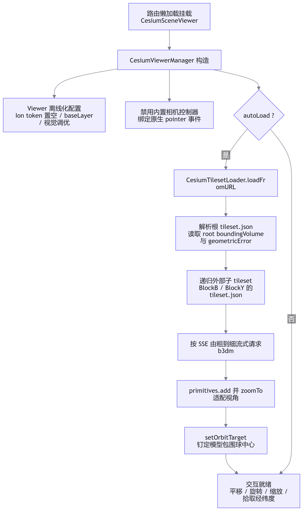
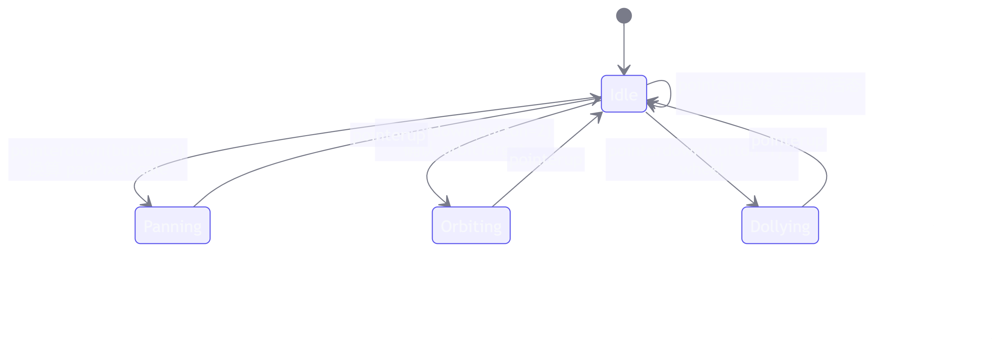

# Cesium 3D Tiles（b3dm）室外实景模型渲染设计与实践

## 概述

### 背景

项目前期已具备三条可视化链路：Leaflet 承载的室内点云 2D 地图与室外卫星地图、Three.js 承载的 PCD 点云三维查看器、WebRTC 承载的无人机实时直播流。本期产品侧交付了一份倾斜摄影成果包——根目录 `tileset.json`，分块目录 `BlockB/`、`BlockY/`，内含数百个 `.b3dm` 瓦片文件——要求将其作为室外实景三维底图接入后台，与直播流位置、设备经纬度等业务数据同场景叠加。

该数据与既有 PCD 点云存在本质差异：点云为无地理参考的局部坐标扫描数据，而 b3dm 瓦片自带 ECEF 地理参考，消费方需要一个具备地球坐标框架的渲染引擎。经评估确定双引擎分工：**Cesium 承接地理参考场景（实景三维、离线底图、经纬度业务），Three.js 保留局部坐标场景（点云、标注、画框）**，二者按路由隔离、互不挂载。本文记录格式解析、工程接入、Hook 封装、相机控制重写与全流程踩坑。

### 核心特性

| 特性分类         | 功能描述                                                                  | 工程价值                            |
| ---------------- | ------------------------------------------------------------------------- | ----------------------------------- |
| LOD 流式加载     | 屏幕空间误差（SSE）驱动瓦片由粗到细按需请求                               | 数百 MB 模型首秒出图，显存可控      |
| 完全离线化       | Ion token 置空、静态资源自托管、离线瓦片底图                              | 内网部署零外网依赖                  |
| 地理参考自适配   | 解析 root boundingVolume 判定 ECEF/局部坐标，局部坐标提供 reposition 贴地 | 交付数据换坐标系零改码              |
| 自定义相机控制器 | 原生 pointer 事件 + 固定轨道中心 + ENU 帧球面旋转                         | 与点云组件鼠标习惯完全对齐          |
| 拾取 NaN 防御    | 全部拾取结果有限性校验，非法回退椭球面                                    | 杜绝 NaN 污染轨道中心导致的连片崩溃 |
| 配置化数据源     | `config` Prop 注入 sourceUrl / imageryUrl / reposition                    | 换模型、换底图零改动                |

## 整体架构

| 层级       | 模块                                     | 职责                                                                     |
| ---------- | ---------------------------------------- | ------------------------------------------------------------------------ |
| 静态资源层 | `public/cesium`、`public/terra_b3dms`    | Cesium 运行时资源（Workers/Assets/Widgets/ThirdParty）与 3D Tiles 数据集 |
| 数据加载层 | `composables/cesium/useCesiumTileset.ts` | tileset 加载、SSE/缓存配置、视角适配、重定位                             |
| 核心 Hook  | `composables/cesium/useCesiumViewer.ts`  | Viewer 生命周期、离线化配置、自定义相机控制、拾取与事件                  |
| 公共组件   | `components/CesiumSceneViewer.vue`       | Props/Events/Expose 封装，加载遮罩与状态文案                             |
| 业务页面   | 实景查看页 / 后续控制台实景页            | config 组装、点击经纬度消费                                              |

数据流总览：



## 格式解析：3D Tiles 与 b3dm

### 1. 瓦片树与地理参考判定

根 `tileset.json` 是整棵瓦片树的唯一入口，本数据集的实际内容如下（节选）：

```json
{
  "asset": { "gltfUpAxis": "Z", "version": "0.0" },
  "geometricError": 1653.6392822265625,
  "root": {
    "boundingVolume": {
      "box": [
        -2315054.5, 5365012.0, 2548456.25, 499.625, 0, 0, 0, 429.25, 0, 0, 0,
        499.75
      ]
    },
    "geometricError": 1653.6392822265625,
    "refine": "REPLACE",
    "children": [
      {
        "boundingVolume": {
          "box": [-2315058.75, 5365129.0, 2548205.5 /* ... */]
        },
        "geometricError": 1095.471923828125,
        "refine": "REPLACE",
        "content": { "uri": "BlockY/tileset.json" }
      },
      {
        "boundingVolume": {
          "box": [-2315042.0, 5364897.0, 2548690.5 /* ... */]
        },
        "geometricError": 1094.0228271484375,
        "refine": "REPLACE",
        "content": { "uri": "BlockB/tileset.json" }
      }
    ]
  }
}
```

两个关键判读：

- **box 中心 `(-2315054.5, 5365012.0, 2548456.25)` 模长约 6371 km**，为标准 ECEF 地心坐标，即模型自带地理参考。Cesium 会将其自动落位到对应经纬度（反算约东经 113.34°、北纬 23.70°，与页面点击拾取回显一致），**无需任何重定位处理**；
- root 的 children 指向两个**外部 tileset**（`BlockB/tileset.json`、`BlockY/tileset.json`），分块内部再按 L13→L17 组织瓦片层级。加载链路必须保证这两级 json 可访问，缺任意一级都会表现为 JSON 解析异常。

```txt
root (geometricError 1653.6, ECEF box)
├── BlockY/tileset.json (1095.5)
│     └── L13 → L14 → L15 → L16 → L17   b3dm 瓦片，误差逐级递减
└── BlockB/tileset.json (1094.0)
      └── L13 → L14 → L15 → L16 → L17
```

### 2. b3dm 二进制布局

b3dm（Batched 3D Model）是 3D Tiles 1.0 定义的瓦片内容格式之一，本质是"批次元信息 + 内嵌 glTF 二进制"的容器：

| 偏移（字节） | 长度 | 字段                         | 说明                           |
| ------------ | ---- | ---------------------------- | ------------------------------ |
| 0            | 4    | magic                        | 固定 `b3dm`                    |
| 4            | 4    | version                      | 规范版本，当前为 1             |
| 8            | 4    | byteLength                   | 整瓦片字节数                   |
| 12           | 4    | featureTableJSONByteLength   | 批次长度、RTC_CENTER 等        |
| 16           | 4    | featureTableBinaryByteLength | 特征表二进制段                 |
| 20           | 4    | batchTableJSONByteLength     | 逐特征属性（单体化查询的基础） |
| 24           | 4    | batchTableBinaryByteLength   | 批次表二进制段                 |
| 28           | 变长 | glTF Binary（GLB）           | 三角网几何 + 内嵌纹理          |

由此可得两条工程结论：其一，b3dm 不可双击预览，需经 3D Tiles 运行时或抽取内嵌 GLB 后交由 glTF viewer；其二，瓦片内几何通常携带 RTC_CENTER（相对中心偏移），顶点以瓦片中心为原点存储以规避浮点精度问题，这也是渲染端无需关心 ECEF 大坐标的原因。

### 3. LOD 调度：屏幕空间误差

瓦片细化由屏幕空间误差（SSE）驱动，而非距离阈值：

```js
SSE = (geometricError × screenHeight) / (2 × distance × tan(fovy / 2))
```

当某瓦片的 SSE 大于 `maximumScreenSpaceError`（默认 16）时请求其子瓦片替换渲染。这解释了两个现象：**拉远模糊不是缺陷**——模型占屏像素少，粗瓦片即满足误差要求；**拉近自动变清晰**——误差超限触发细化。质量与开销的调节旋钮集中在加载选项：

```ts
const tileset = await Cesium.Cesium3DTileset.fromUrl(url, {
  // 屏幕空间误差，默认 16；越小越精细，2~8 是实景浏览常用区间
  maximumScreenSpaceError: 4,
  // 瓦片缓存加大：拉远不丢细瓦片，拉回瞬间清晰
  cacheBytes: 1024 * 1024 * 1024,
  maximumCacheOverflowBytes: 2 * 1024 * 1024 * 1024,
})
```

需注意边界：SSE 调到 2 仍糊时，瓶颈在数据源粗层纹理分辨率（GSD），属生产侧问题，渲染端无解。

## 工程接入：vite 8 下的 Cesium 自托管

Cesium 的 Workers、Assets、Widgets、ThirdParty 为运行时按需请求的静态资源， bundler 不会自动处理，必须显式部署并声明基地址。项目最终采用 public 目录真实拷贝（而非符号链接或拷贝插件），原因见踩坑记录：

```cmd
cd <项目根目录>
xcopy node_modules\cesium\Build\Cesium\Workers    public\cesium\Workers    /E /I /Y
xcopy node_modules\cesium\Build\Cesium\Assets     public\cesium\Assets     /E /I /Y
xcopy node_modules\cesium\Build\Cesium\Widgets    public\cesium\Widgets    /E /I /Y
xcopy node_modules\cesium\Build\Cesium\ThirdParty public\cesium\ThirdParty /E /I /Y
```

基地址必须在首次 Workers 请求前生效：

```ts
import * as Cesium from 'cesium'
import 'cesium/Build/Cesium/Widgets/widgets.css'
;(window as any).CESIUM_BASE_URL = (window as any).CESIUM_BASE_URL || '/cesium'
```

离线化三件事：Ion token 置空杜绝隐式外网请求；无底图需求时 `baseLayer: false`，有离线瓦片服务时以 `UrlTemplateImageryProvider` 接入；关闭全部在线 widget（geocoder、terrain picker 等）。

```ts
Cesium.Ion.defaultAccessToken = ''

const baseLayer = options.imageryUrl
  ? new Cesium.ImageryLayer(
      new Cesium.UrlTemplateImageryProvider({
        url: options.imageryUrl,
        maximumLevel: 18,
      }),
    )
  : false
```

离线瓦片服务跨域时不在前端直连 IP，dev 走 vite 代理、生产走 nginx 同源：

```ts
// vite.config.ts
server: {
  proxy: {
    '/api': { target: 'http://192.168.118.190:8080', changeOrigin: true },
  },
}
```

包体治理上，承载 Cesium 的路由保持懒加载，cesium 进入独立异步 chunk，点云页面首屏不受影响。

## 核心 Hook 实现原理

### 职责划分

`CesiumViewerManager` 只管 Viewer 与交互，`CesiumTilesetLoader` 只管加载与重定位，与点云模块 `PointCloudRenderer / PointCloudLoader` 的切分方式一致，组件壳不写引擎逻辑。

### 三套坐标系

| 坐标系                     | 作用                           | 转换入口                                                |
| -------------------------- | ------------------------------ | ------------------------------------------------------- |
| ECEF 地心系                | 瓦片包围盒、模型落位           | 数据自带，渲染端不直接操作                              |
| 大地坐标（lon/lat/height） | 点击回显、业务对接、reposition | `Cartographic.fromCartesian` / `Cartesian3.fromDegrees` |
| 目标点局部 ENU 系          | 相机轨道旋转的球面参数空间     | `Transforms.eastNorthUpToFixedFrame`                    |

点击拾取链路为：屏幕坐标 → `scene.pickPosition`（模型表面）→ 未命中回退 `camera.pickEllipsoid`（椭球面）→ `Cartographic` 转度抛出。

### 内置相机控制器的三个缺陷

交互需求为左键平移、右键绕固定中心旋转、中键与滚轮缩放，与点云组件 OrbitControls 习惯对齐。内置 `ScreenSpaceCameraController` 无法满足：

| 缺陷                          | 表现                                             |
| ----------------------------- | ------------------------------------------------ |
| `translate` 仅 2D 模式生效    | 3D 下配置 `translateEventTypes` 后左键无任何响应 |
| rotate 枢轴为按下时临时拾取点 | 拾空落至椭球面，枢轴漂移，视角"乱飞"             |
| rotate 与 tilt 分置           | 清空 tilt 后右键仅水平转向，观感近似平移         |

结论：`enableInputs = false` 整体禁用，交互改为原生 pointer 事件自写，参数形状完全可控。

### 轨道旋转：ENU 帧球面参数化

旋转不直接操作四元数，而是把相机偏移转入轨道中心的 ENU 局部系，以 heading/pitch 两个球面角参数化，重算后转回世界系。up 向量恒取 ENU 上方向，从数学上排除翻滚与万向退化：

```ts
/** 右键旋转：绕固定轨道中心转，up 恒为目标点 ENU 上方向，不翻滚不飞 */
private applyOrbit(dx: number, dy: number) {
  const target = this.orbitTarget
  if (!target || !CesiumViewerManager.isValid(target)) return
  const camera = this.viewer.camera
  const s = (2 * Math.PI) / (this.viewer.scene.canvas.clientHeight || 1)

  // 当前相机偏移转到目标点局部 ENU 系
  const enu = Cesium.Transforms.eastNorthUpToFixedFrame(target)
  const inv = Cesium.Matrix4.inverseTransformation(enu, new Cesium.Matrix4())
  const offset = Cesium.Cartesian3.subtract(camera.position, target, new Cesium.Cartesian3())
  const local = Cesium.Matrix4.multiplyByPointAsVector(inv, offset, new Cesium.Cartesian3())

  const radius = Cesium.Cartesian3.magnitude(local)
  if (!Number.isFinite(radius) || radius <= 0) return
  let heading = Math.atan2(local.x, local.y)
  let pitch = Math.asin(Cesium.Math.clamp(local.z / radius, -1, 1))

  // 与 three OrbitControls 同方向：拖右场景右转、拖下视角抬高
  heading -= dx * s
  pitch = Cesium.Math.clamp(pitch + dy * s, -1.45, 1.45)

  const cosP = Math.cos(pitch)
  local.x = radius * cosP * Math.sin(heading)
  local.y = radius * cosP * Math.cos(heading)
  local.z = radius * Math.sin(pitch)

  const worldOffset = Cesium.Matrix4.multiplyByPointAsVector(enu, local, new Cesium.Cartesian3())
  const destination = Cesium.Cartesian3.add(target, worldOffset, new Cesium.Cartesian3())
  if (!CesiumViewerManager.isValid(destination)) return
  const up = Cesium.Matrix4.multiplyByPointAsVector(enu, new Cesium.Cartesian3(0, 0, 1), new Cesium.Cartesian3())
  const direction = Cesium.Cartesian3.normalize(
    Cesium.Cartesian3.subtract(target, destination, new Cesium.Cartesian3()),
    new Cesium.Cartesian3(),
  )
  camera.setView({ destination, orientation: { direction, up } })
}
```

轨道中心在 tileset 加载完成后由组件钉定为模型包围球中心（`setOrbitTarget(tileset.boundingSphere.center)`），右键拖拽期间恒定不变，旋转手感与 OrbitControls 等价。

### 平移：像素世界尺寸换算

平移跟手感取决于"每屏幕像素对应多少世界尺寸"，按下时按相机到命中点距离一次性换算：

```js
pixelScale = (2 × d × tan(fovy / 2)) / clientHeight
```

```ts
const right = camera.right.clone()
const up = camera.up.clone()
camera.moveRight(-dx * this.panPixelScale)
camera.moveUp(dy * this.panPixelScale)
// 轨道中心同步平移，保证后续旋转仍绕视觉中心
Cesium.Cartesian3.add(this.orbitTarget, delta, this.orbitTarget)
```

### 拾取 NaN 防御

`scene.pickPosition` 在拾取天空或模型轮廓外时可能返回含 NaN 的坐标（Cesium 已知行为）。NaN 一旦进入轨道中心，后续每帧 `eastNorthUpToFixedFrame` 都会抛出 `DeveloperError: origin has a NaN component`，并连带全部交互失效。防御策略为统一校验、非法回退：

```ts
/** 坐标合法性校验：pickPosition 拾取天空时可能返回 NaN，必须拦截 */
private static isValid(v: Cesium.Cartesian3 | null | undefined): v is Cesium.Cartesian3 {
  return !!v && Number.isFinite(v.x) && Number.isFinite(v.y) && Number.isFinite(v.z)
}

private pickWorld(clientX: number, clientY: number): Cesium.Cartesian3 | null {
  const scene = this.viewer.scene
  const rect = (scene.canvas as HTMLCanvasElement).getBoundingClientRect()
  const winPos = new Cesium.Cartesian2(clientX - rect.left, clientY - rect.top)
  if (scene.pickPositionSupported) {
    const picked = scene.pickPosition(winPos)
    if (CesiumViewerManager.isValid(picked)) return picked
  }
  const onEllipsoid = this.viewer.camera.pickEllipsoid(winPos, Cesium.Ellipsoid.WGS84)
  return CesiumViewerManager.isValid(onEllipsoid) ? onEllipsoid : null
}
```

### 指针事件状态机

交互以原生 pointer 事件驱动，空移早退、拖拽与点击以 5px 阈值区分，平移结束后抑制一次 click 以免误抛坐标：



## 公共组件 API 参考

### Props

| 参数                | 说明                   | 类型                               | 默认值                        |
| ------------------- | ---------------------- | ---------------------------------- | ----------------------------- |
| `config.sourceUrl`  | tileset.json 地址      | `string`                           | `'/terra_b3dms/tileset.json'` |
| `config.autoLoad`   | mounted 后自动加载     | `boolean`                          | `true`                        |
| `config.imageryUrl` | 离线影像瓦片模板       | `string`                           | -（不加载底图）               |
| `config.reposition` | 局部坐标模型贴地经纬度 | `{ longitude, latitude, height? }` | -（ECEF 数据无需）            |

### Events

| 事件名        | 说明                         | 回调参数                          |
| ------------- | ---------------------------- | --------------------------------- |
| `scene-click` | 左键单击场景（拖拽后不触发） | `{ longitude, latitude, height }` |

### Expose

| 方法                | 说明                  |
| ------------------- | --------------------- |
| `loadTileset(url?)` | 手动加载/重载 tileset |

### 使用实例

```vue
<template>
  <div class="h-full w-full">
    <CesiumSceneViewer :config="cesiumConfig" @scene-click="onSceneClick" />
  </div>
</template>

<script setup lang="ts">
import CesiumSceneViewer from '@/components/CesiumSceneViewer.vue'

const cesiumConfig = {
  sourceUrl: '/terra_b3dms/tileset.json',
  // 复用现有离线瓦片服务做底图；没有就去掉这行（纯模型查看）
  imageryUrl: '/api/profile/map/tiles/{z}/{x}/{y}/tile.png',
  // 若模型是局部坐标且产品给了部署经纬度，再打开：
  // reposition: { longitude: 113.34, latitude: 23.7, height: 0 },
}

const onSceneClick = (p: {
  longitude: number
  latitude: number
  height: number
}) => {
  console.log('点击经纬度:', p)
}
</script>
```

组件内部在加载完成后执行一次 `manager.setOrbitTarget(currentTileset.boundingSphere.center)`，将旋转枢轴钉定到模型中心，这是"绕固定视角旋转"的前提。

## 重定位：局部坐标数据的贴地约定

并非所有交付数据都带地理参考。判定方法为检查 root 的 `boundingVolume`：`region` 或百万量级 `box` 中心为地理参考，小数值 `box` 为局部/工程坐标。后者需以模型矩阵将局部原点贴到指定经纬度：

```ts
static reposition(
  tileset: Cesium.Cesium3DTileset,
  longitude: number,
  latitude: number,
  height = 0,
): void {
  const position = Cesium.Cartesian3.fromDegrees(longitude, latitude, height)
  const modelMatrix = Cesium.Transforms.headingPitchRollToFixedFrame(
    position,
    new Cesium.HeadingPitchRoll(0, 0, 0),
    Cesium.Ellipsoid.WGS84,
    Cesium.Transforms.localFrameToFixedFrameGenerator('east', 'north'),
  )
  tileset.modelMatrix = modelMatrix
}
```

该约定要求数据生产方随包交付坐标系说明与部署经纬度，否则前端无从配准——已写入与算法侧的协同约定。

## 边界场景与踩坑记录

| 问题                                                | 原因                                                           | 处理                                                        |
| --------------------------------------------------- | -------------------------------------------------------------- | ----------------------------------------------------------- |
| 网络面板 b3dm 仅 127 B 且 304，模型黑屏             | 静态目录缺失，vite SPA fallback 返回 index.html 并被浏览器缓存 | 补全目录后勾选禁用缓存强刷                                  |
| 控制台 `Unexpected token '<', "<!DOCTYPE"`          | tileset.json 请求落空回退为 HTML                               | 地址栏直连 URL 验证返回内容                                 |
| `Workers/*.js` 报 MIME `text/html`                  | `/cesium` 未部署，模块脚本拿到 index.html                      | xcopy 四目录至 `public/cesium`                              |
| 直连 Workers js 白屏 + `Vue Router warn: No match`  | SPA fallback 指纹：缺失路径被当作路由匹配                      | 以此现象快速定位静态资源缺失                                |
| xcopy 报"找不到文件"、复制 0 个                     | 在 `public` 目录内执行，相对源路径错位                         | 回到项目根目录执行                                          |
| `mklink /D` 后目录仍不存在                          | Windows 符号链接需权限，失败静默                               | 放弃符号链接，改真实拷贝                                    |
| 离线瓦片 CORS 拦截 + Level 19 全 404                | 跨域无 ACAO 头；服务最大层级不足                               | vite 代理同源；`maximumLevel` 设为服务实际最大层            |
| 左键拖拽无反应                                      | 内置 translate 仅 2D 模式生效                                  | 自写屏幕面平移                                              |
| 右键旋转视角乱飞                                    | 内置 rotate 枢轴为按下时临时拾取点，拾空落椭球面               | 禁用内置控制器，固定轨道中心自写旋转                        |
| 右键只能水平转、观感似平移                          | tilt 事件被清空，俯仰轴失效                                    | rotate 与 tilt 同挂右键（最终由自写控制器统一）             |
| `DeveloperError: origin has a NaN component` 连片   | pickPosition 拾空返回 NaN，污染轨道中心                        | 全量拾取结果有限性校验，非法回退椭球面                      |
| `Cannot read properties of undefined (reading 'x')` | ScreenSpaceEventHandler 各事件 movement 形状不一               | 改原生 pointer 事件，空移早退                               |
| 拉远模糊、拉近才清晰                                | SSE 驱动 LOD，粗瓦片满足误差要求                               | SSE 调至 2~8，扩大 cacheBytes，resolutionScale 取设备像素比 |

## 双引擎共存约定

| 维度     | Cesium                             | Three.js                              |
| -------- | ---------------------------------- | ------------------------------------- |
| 数据     | b3dm / 3D Tiles（地理参考）        | PCD（局部坐标）                       |
| 场景     | 室外实景、离线底图、经纬度业务叠加 | 室内点云、标注、画框                  |
| 坐标消费 | ECEF ↔ 大地坐标 ↔ 局部 ENU         | 图框系 / 机巢相对系 / ENU 系          |
| 交互     | 自写 pointer 控制器                | OrbitControls（左平移/中缩放/右旋转） |

约束两条：承载 Cesium 的路由必须懒加载以保证 chunk 隔离；同一页面不双引擎同挂，避免显存双份开销。若后续出现"点云叠加实景"需求，正路是服务端将 PCD 转为 pnts 格式 3D Tiles 统一进 Cesium，而非搬运渲染代码。

以下章节直接插入「双引擎共存约定」与「总结与展望」之间即可，正文其余部分不动。代码为全文踩坑修复后的最终版本，与正文描述一一对应。

## 完整代码汇总

::: code-group

```ts [vite.config.ts]
// vite.config.ts：离线瓦片服务跨域代理
server: {
  proxy: {
    '/api': { target: 'http://192.168.118.190:8080', changeOrigin: true },
  },
}
```

```ts [composables/cesium/useCesiumViewer.ts]
import * as Cesium from 'cesium'
import 'cesium/Build/Cesium/Widgets/widgets.css'

// Cesium 静态资源基地址，必须在首次请求 Workers 前设置
;(window as any).CESIUM_BASE_URL = (window as any).CESIUM_BASE_URL || '/cesium'

export interface CesiumSceneConfig {
  /** tileset.json 地址 */
  sourceUrl?: string
  /** mounted 后自动加载 */
  autoLoad?: boolean
  /** 离线影像瓦片模板，如 '/offline-tiles/{z}/{x}/{y}.png' */
  imageryUrl?: string
  /** 模型重定位（仅局部坐标 tileset 需要） */
  reposition?: { longitude: number; latitude: number; height?: number }
}

export interface CesiumSceneEvents {
  /** 左键点击场景（经纬度/高程） */
  onSceneClick?: (position: {
    longitude: number
    latitude: number
    height: number
  }) => void
}

export interface CesiumViewerOptions {
  imageryUrl?: string
}

/**
 * Cesium 视图管理器 - 负责 viewer 创建、离线化配置、自定义相机控制、事件绑定、生命周期管理
 * 职责单一：只管 viewer，不处理 tileset 加载（见 CesiumTilesetLoader）
 * 鼠标习惯与点云组件对齐：左键平移 / 中键+滚轮缩放 / 右键绕固定中心旋转
 */
export class CesiumViewerManager {
  private viewer: Cesium.Viewer
  private events: CesiumSceneEvents

  /** 轨道中心（右键旋转的固定枢轴） */
  private orbitTarget: Cesium.Cartesian3 | null = null
  /** 左键平移进行中 */
  private panActive = false
  /** 右键旋转进行中 */
  private orbitActive = false
  /** 中键缩放进行中 */
  private middleActive = false
  /** 上一次指针位置 */
  private lastPos = { x: 0, y: 0 }
  /** 本次按下累计位移（区分点击与拖拽） */
  private moved = 0
  /** 拖拽起始处每屏幕像素对应的世界尺寸（决定平移跟手感） */
  private panPixelScale = 0

  constructor(
    container: HTMLElement,
    options: CesiumViewerOptions = {},
    events: CesiumSceneEvents = {},
  ) {
    if (!container) throw new Error('container 不能为空')
    this.events = events

    // 不依赖 Cesium ion 在线服务，保证内网/离线可用
    Cesium.Ion.defaultAccessToken = ''

    // 离线影像：复用现有离线瓦片服务；未提供时不加载底图，避免 ion 请求
    const baseLayer = options.imageryUrl
      ? new Cesium.ImageryLayer(
          new Cesium.UrlTemplateImageryProvider({
            url: options.imageryUrl,
            maximumLevel: 18,
          }),
        )
      : false

    this.viewer = new Cesium.Viewer(container, {
      baseLayer,
      baseLayerPicker: false,
      geocoder: false,
      homeButton: false,
      sceneModePicker: false,
      navigationHelpButton: false,
      animation: false,
      timeline: false,
      fullscreenButton: false,
      infoBox: false,
      selectionIndicator: false,
    })

    // 视觉调优：与点云组件一致的深色风格
    const scene = this.viewer.scene
    scene.skyBox!.show = false
    scene.sun!.show = false
    scene.moon!.show = false
    scene.backgroundColor = Cesium.Color.fromCssColorString('#0d1117')
    scene.pickPositionEnabled = true // 允许拾取 3D Tiles 模型表面坐标
    scene.resolutionScale = Math.min(window.devicePixelRatio || 1, 2)

    // 完全禁用内置相机控制器（其旋转枢轴漂移、3D 下无平移，全部自写）
    scene.screenSpaceCameraController.enableInputs = false

    // ============ 原生指针事件（与点云组件同一套路，参数形状可控） ============
    const canvas = scene.canvas as HTMLCanvasElement
    canvas.addEventListener('pointerdown', this.onPointerDown)
    canvas.addEventListener('click', this.onClick)
    canvas.addEventListener('wheel', this.onWheel, { passive: false })
    window.addEventListener('pointermove', this.onPointerMove)
    window.addEventListener('pointerup', this.onPointerUp)
  }

  /** 设置轨道中心（tileset 加载完成后用 boundingSphere.center 调用） */
  setOrbitTarget(cartesian: Cesium.Cartesian3): void {
    if (CesiumViewerManager.isValid(cartesian))
      this.orbitTarget = cartesian.clone()
  }

  // ================= 指针事件 =================

  private onPointerDown = (event: PointerEvent) => {
    this.lastPos = { x: event.clientX, y: event.clientY }
    this.moved = 0

    if (event.button === 0) {
      // 左键：平移。按下时按"相机到命中点距离"计算像素世界尺寸，保证跟手
      this.panActive = true
      const world = this.pickWorld(event.clientX, event.clientY)
      const d = world
        ? Cesium.Cartesian3.distance(this.viewer.camera.position, world)
        : 1000
      const fovy =
        (this.viewer.camera.frustum as Cesium.PerspectiveFrustum).fovy ??
        Cesium.Math.toRadians(60)
      const canvas = this.viewer.scene.canvas
      this.panPixelScale =
        (2 * d * Math.tan(fovy / 2)) / (canvas.clientHeight || 1)
    } else if (event.button === 2) {
      // 右键：绕固定中心旋转；中心未设置时用按下点兜底（校验 NaN）
      if (!this.orbitTarget) {
        const world = this.pickWorld(event.clientX, event.clientY)
        if (world) this.orbitTarget = world
      }
      this.orbitActive = CesiumViewerManager.isValid(this.orbitTarget)
    } else if (event.button === 1) {
      // 中键：缩放，阻止浏览器自动滚动
      event.preventDefault()
      this.middleActive = true
    }
  }

  private onPointerMove = (event: PointerEvent) => {
    if (!this.panActive && !this.orbitActive && !this.middleActive) return
    const dx = event.clientX - this.lastPos.x
    const dy = event.clientY - this.lastPos.y
    this.lastPos = { x: event.clientX, y: event.clientY }
    this.moved += Math.abs(dx) + Math.abs(dy)

    if (this.panActive) this.applyPan(dx, dy)
    else if (this.orbitActive) this.applyOrbit(dx, dy)
    else if (this.middleActive) this.dolly(1 + dy * 0.005)
  }

  private onPointerUp = (event: PointerEvent) => {
    if (event.button === 0) this.panActive = false
    else if (event.button === 2) this.orbitActive = false
    else if (event.button === 1) this.middleActive = false
  }

  /** 左键单击（未拖拽）：拾取经纬度抛出 */
  private onClick = (event: MouseEvent) => {
    if (this.moved > 5) return
    if (!this.events.onSceneClick) return
    const position = this.pickCartographic(event.clientX, event.clientY)
    if (position) this.events.onSceneClick(position)
  }

  /** 滚轮：朝轨道中心推进/拉远 */
  private onWheel = (event: WheelEvent) => {
    event.preventDefault()
    if (!this.orbitTarget) {
      const world = this.pickWorld(event.clientX, event.clientY)
      if (world) this.orbitTarget = world
    }
    this.dolly(Math.exp(event.deltaY * 0.001))
  }

  // ================= 相机控制 =================

  /** 左键平移：相机与轨道中心同步移动，"抓住场景"手感 */
  private applyPan(dx: number, dy: number) {
    const camera = this.viewer.camera
    const right = camera.right.clone()
    const up = camera.up.clone()
    camera.moveRight(-dx * this.panPixelScale)
    camera.moveUp(dy * this.panPixelScale)
    if (this.orbitTarget && CesiumViewerManager.isValid(this.orbitTarget)) {
      const delta = new Cesium.Cartesian3()
      Cesium.Cartesian3.multiplyByScalar(right, -dx * this.panPixelScale, delta)
      const tmp = new Cesium.Cartesian3()
      Cesium.Cartesian3.multiplyByScalar(up, dy * this.panPixelScale, tmp)
      Cesium.Cartesian3.add(delta, tmp, delta)
      Cesium.Cartesian3.add(this.orbitTarget, delta, this.orbitTarget)
    }
  }

  /** 右键旋转：绕固定轨道中心转，up 恒为目标点 ENU 上方向，不翻滚不飞 */
  private applyOrbit(dx: number, dy: number) {
    const target = this.orbitTarget
    if (!target || !CesiumViewerManager.isValid(target)) return
    const camera = this.viewer.camera
    const s = (2 * Math.PI) / (this.viewer.scene.canvas.clientHeight || 1)

    // 当前相机偏移转到目标点局部 ENU 系
    const enu = Cesium.Transforms.eastNorthUpToFixedFrame(target)
    const inv = Cesium.Matrix4.inverseTransformation(enu, new Cesium.Matrix4())
    const offset = Cesium.Cartesian3.subtract(
      camera.position,
      target,
      new Cesium.Cartesian3(),
    )
    const local = Cesium.Matrix4.multiplyByPointAsVector(
      inv,
      offset,
      new Cesium.Cartesian3(),
    )

    const radius = Cesium.Cartesian3.magnitude(local)
    if (!Number.isFinite(radius) || radius <= 0) return
    let heading = Math.atan2(local.x, local.y)
    let pitch = Math.asin(Cesium.Math.clamp(local.z / radius, -1, 1))

    // 与 three OrbitControls 同方向：拖右场景右转、拖下视角抬高
    heading -= dx * s
    pitch = Cesium.Math.clamp(pitch + dy * s, -1.45, 1.45)

    const cosP = Math.cos(pitch)
    local.x = radius * cosP * Math.sin(heading)
    local.y = radius * cosP * Math.cos(heading)
    local.z = radius * Math.sin(pitch)

    const worldOffset = Cesium.Matrix4.multiplyByPointAsVector(
      enu,
      local,
      new Cesium.Cartesian3(),
    )
    const destination = Cesium.Cartesian3.add(
      target,
      worldOffset,
      new Cesium.Cartesian3(),
    )
    if (!CesiumViewerManager.isValid(destination)) return
    const up = Cesium.Matrix4.multiplyByPointAsVector(
      enu,
      new Cesium.Cartesian3(0, 0, 1),
      new Cesium.Cartesian3(),
    )
    const direction = Cesium.Cartesian3.normalize(
      Cesium.Cartesian3.subtract(target, destination, new Cesium.Cartesian3()),
      new Cesium.Cartesian3(),
    )
    camera.setView({ destination, orientation: { direction, up } })
  }

  /** 缩放：沿视线向轨道中心推进/拉远 */
  private dolly(factor: number) {
    const target = this.orbitTarget
    if (!target || !CesiumViewerManager.isValid(target)) return
    const camera = this.viewer.camera
    const offset = Cesium.Cartesian3.subtract(
      camera.position,
      target,
      new Cesium.Cartesian3(),
    )
    const radius = Cesium.Cartesian3.magnitude(offset)
    if (!Number.isFinite(radius) || radius <= 0) return
    const newRadius = Cesium.Math.clamp(radius * factor, 2, 20000)
    Cesium.Cartesian3.multiplyByScalar(
      Cesium.Cartesian3.normalize(offset, offset),
      newRadius,
      offset,
    )
    const destination = Cesium.Cartesian3.add(
      target,
      offset,
      new Cesium.Cartesian3(),
    )
    if (!CesiumViewerManager.isValid(destination)) return
    camera.setView({
      destination,
      orientation: { direction: camera.direction, up: camera.up },
    })
  }

  // ================= 拾取 =================

  /** 坐标合法性校验：pickPosition 拾取天空时可能返回 NaN，必须拦截 */
  private static isValid(
    v: Cesium.Cartesian3 | null | undefined,
  ): v is Cesium.Cartesian3 {
    return (
      !!v &&
      Number.isFinite(v.x) &&
      Number.isFinite(v.y) &&
      Number.isFinite(v.z)
    )
  }

  /** 客户端坐标转窗口坐标后拾取模型表面，未命中/非法回退椭球面 */
  private pickWorld(
    clientX: number,
    clientY: number,
  ): Cesium.Cartesian3 | null {
    const scene = this.viewer.scene
    const rect = (scene.canvas as HTMLCanvasElement).getBoundingClientRect()
    const winPos = new Cesium.Cartesian2(
      clientX - rect.left,
      clientY - rect.top,
    )
    if (scene.pickPositionSupported) {
      const picked = scene.pickPosition(winPos)
      if (CesiumViewerManager.isValid(picked)) return picked
    }
    const onEllipsoid = this.viewer.camera.pickEllipsoid(
      winPos,
      Cesium.Ellipsoid.WGS84,
    )
    return CesiumViewerManager.isValid(onEllipsoid) ? onEllipsoid : null
  }

  /** 拾取结果转经纬度 */
  private pickCartographic(clientX: number, clientY: number) {
    const cartesian = this.pickWorld(clientX, clientY)
    if (!cartesian) return null
    const carto = Cesium.Cartographic.fromCartesian(cartesian)
    return {
      longitude: Cesium.Math.toDegrees(carto.longitude),
      latitude: Cesium.Math.toDegrees(carto.latitude),
      height: carto.height,
    }
  }

  getViewer(): Cesium.Viewer {
    return this.viewer
  }

  getScene(): Cesium.Scene {
    return this.viewer.scene
  }

  getCamera(): Cesium.Camera {
    return this.viewer.camera
  }

  /** 销毁 */
  dispose(): void {
    const canvas = this.viewer?.scene?.canvas as HTMLCanvasElement | undefined
    if (canvas) {
      canvas.removeEventListener('pointerdown', this.onPointerDown)
      canvas.removeEventListener('click', this.onClick)
      canvas.removeEventListener('wheel', this.onWheel)
    }
    window.removeEventListener('pointermove', this.onPointerMove)
    window.removeEventListener('pointerup', this.onPointerUp)
    if (this.viewer && !this.viewer.isDestroyed()) this.viewer.destroy()
  }
}
```

```ts [composables/cesium/useCesiumTileset.ts]
import * as Cesium from 'cesium'

/**
 * Cesium 3D Tiles 加载器 - 负责 tileset 加载、视角适配、重定位
 * 职责单一：只处理加载，不管理 viewer（见 CesiumViewerManager）
 */
export class CesiumTilesetLoader {
  /**
   * 从 URL 加载 3D Tiles（b3dm 实景模型）并适配视角
   * @param viewer Cesium viewer 实例
   * @param url tileset.json 地址
   */
  static async loadFromURL(
    viewer: Cesium.Viewer,
    url: string,
  ): Promise<Cesium.Cesium3DTileset> {
    const tileset = await Cesium.Cesium3DTileset.fromUrl(url, {
      // 屏幕空间误差，默认 16；越小越精细，2~8 是实景浏览常用区间
      maximumScreenSpaceError: 4,
      // 瓦片缓存加大：拉远不丢细瓦片，拉回瞬间清晰
      cacheBytes: 1024 * 1024 * 1024,
      maximumCacheOverflowBytes: 2 * 1024 * 1024 * 1024,
    })
    viewer.scene.primitives.add(tileset)
    // 视角对准模型
    await viewer.zoomTo(tileset)
    return tileset
  }

  /**
   * 重定位：把局部坐标 tileset 的原点贴到指定经纬度
   * 若 tileset 自带地理坐标（boundingVolume 为 region）则无需调用
   */
  static reposition(
    tileset: Cesium.Cesium3DTileset,
    longitude: number,
    latitude: number,
    height = 0,
  ): void {
    const position = Cesium.Cartesian3.fromDegrees(longitude, latitude, height)
    const modelMatrix = Cesium.Transforms.headingPitchRollToFixedFrame(
      position,
      new Cesium.HeadingPitchRoll(0, 0, 0),
      Cesium.Ellipsoid.WGS84,
      Cesium.Transforms.localFrameToFixedFrameGenerator('east', 'north'),
    )
    tileset.modelMatrix = modelMatrix
  }

  /** 从场景移除 tileset */
  static remove(viewer: Cesium.Viewer, tileset: Cesium.Cesium3DTileset): void {
    viewer.scene.primitives.remove(tileset)
  }
}
```

```vue [components/map/CesiumSceneViewer.vue]
<script setup lang="ts">
import { ElMessage } from 'element-plus'
import {
  CesiumViewerManager,
  type CesiumSceneConfig,
} from '@/composables/cesium/useCesiumViewer'
import { CesiumTilesetLoader } from '@/composables/cesium/useCesiumTileset'

const props = withDefaults(
  defineProps<{
    /** Cesium 场景配置 */
    config?: Partial<CesiumSceneConfig>
  }>(),
  {
    config: () => ({
      sourceUrl: '/terra_b3dms/tileset.json',
      autoLoad: true,
    }),
  },
)

const emit = defineEmits<{
  /** 左键点击场景（经纬度/高程） */
  'scene-click': [
    position: { longitude: number; latitude: number; height: number },
  ]
}>()

/** 渲染容器 DOM */
const containerRef = ref<HTMLDivElement>()
/** 加载遮罩开关 */
const loading = ref(false)
/** 加载阶段提示文案 */
const loadingStatus = ref('准备加载...')
/** 加载中标志，防止重复触发 */
const isLoading = ref(false)
/** 点击坐标（右上角显示） */
const clickPosition = ref<{
  longitude: number
  latitude: number
  height: number
} | null>(null)

/** 视图管理器实例 */
let manager: CesiumViewerManager | null = null
/** 当前 tileset 实例 */
let currentTileset: any = null

/** 合并后的最终配置（props.config 优先） */
const config: CesiumSceneConfig = {
  sourceUrl: '/terra_b3dms/tileset.json',
  autoLoad: true,
  ...props.config,
}

/**
 * 更新加载提示文案并等待一帧，确保 UI 刷新
 * @param status 提示文案
 */
const updateStatus = (status: string) => {
  loadingStatus.value = status
  return new Promise<void>((resolve) => {
    setTimeout(() => {
      requestAnimationFrame(() => resolve())
    }, 16)
  })
}

/** 加载 tileset */
const loadTileset = async (url?: string) => {
  if (!manager || isLoading.value) return
  isLoading.value = true
  loading.value = true

  try {
    await updateStatus('正在加载实景模型...')
    const sourceUrl = url || config.sourceUrl
    if (!sourceUrl) throw new Error('未配置 sourceUrl')

    currentTileset = await CesiumTilesetLoader.loadFromURL(
      manager.getViewer(),
      sourceUrl,
    )
    // 右键旋转固定绕模型中心，不再漂移
    manager.setOrbitTarget(currentTileset.boundingSphere.center)

    // 局部坐标 tileset 才需要重定位贴到经纬度
    if (config.reposition) {
      CesiumTilesetLoader.reposition(
        currentTileset,
        config.reposition.longitude,
        config.reposition.latitude,
        config.reposition.height,
      )
    }

    await updateStatus('加载完成！')
    ElMessage.success('实景模型加载成功')
    setTimeout(() => {
      loading.value = false
    }, 500)
  } catch (error) {
    console.error('加载失败:', error)
    loadingStatus.value = '加载失败'
    ElMessage.error('实景模型加载失败')
    setTimeout(() => {
      loading.value = false
    }, 1000)
  } finally {
    isLoading.value = false
  }
}

/** 初始化视图管理器及事件绑定 */
const init = () => {
  if (!containerRef.value) return
  manager = new CesiumViewerManager(
    containerRef.value,
    { imageryUrl: config.imageryUrl },
    {
      onSceneClick: (p) => {
        clickPosition.value = p
        emit('scene-click', p)
      },
    },
  )
  if (config.autoLoad) loadTileset()
}

onMounted(() => init())
onUnmounted(() => {
  if (manager && currentTileset) {
    CesiumTilesetLoader.remove(manager.getViewer(), currentTileset)
    currentTileset = null
  }
  manager?.dispose()
})

defineExpose({ loadTileset })
</script>

<template>
  <div class="w-full h-full relative">
    <div ref="containerRef" class="w-full h-full" @contextmenu.prevent></div>
    <!-- 加载遮罩 -->
    <div
      v-if="loading"
      class="absolute top-1/2 left-1/2 -translate-x-1/2 -translate-y-1/2 bg-black/80 text-white px-8 py-6 rounded-xl shadow-2xl backdrop-blur-sm z-50"
    >
      <div class="text-center space-y-3">
        <div class="text-lg font-semibold">{{ loadingStatus }}</div>
      </div>
    </div>
    <!-- 点击坐标显示 -->
    <div
      v-if="clickPosition"
      class="absolute top-4 right-4 bg-black/70 text-white px-3 py-1.5 rounded text-sm pointer-events-none z-40"
    >
      {{ clickPosition.longitude.toFixed(6) }},
      {{ clickPosition.latitude.toFixed(6) }}
    </div>
  </div>
</template>
```

```vue [index.vue]
<template>
  <div class="h-full w-full">
    <CesiumSceneViewer :config="cesiumConfig" @scene-click="onSceneClick" />
  </div>
</template>

<script setup lang="ts">
import CesiumSceneViewer from '@/components/map/CesiumSceneViewer.vue'

const cesiumConfig = {
  sourceUrl: '/terra_b3dms/tileset.json',
  // 复用现有离线瓦片服务做底图；没有就去掉这行（纯模型查看）
  imageryUrl: '/api/profile/map/tiles/{z}/{x}/{y}/tile.png',
  // 若模型是局部坐标且产品给了部署经纬度，再打开：
  // reposition: { longitude: 113.34, latitude: 23.7, height: 0 },
}

const onSceneClick = (p: {
  longitude: number
  latitude: number
  height: number
}) => {
  console.log('点击经纬度:', p)
}
</script>
```

:::

四点使用说明：

1. `useCesiumViewer.ts` 顶部的 `CESIUM_BASE_URL` 赋值必须先于任何 Viewer 创建执行，模块级语句即可满足
2. `setOrbitTarget` 必须在 `loadFromURL` 返回后调用，此前 `boundingSphere` 尚未就绪
3. 承载页面路由保持懒加载，保证 cesium 进入独立 chunk
4. `maximumLevel` 需按离线瓦片服务实际最大层级调整，超出即刷 404。

## 总结与展望

模块以"一份 tileset.json + 数百个 b3dm"落地了室外实景三维：格式层认清瓦片树与 SSE 调度，工程层解决 vite 8 自托管与全离线化，交互层以自写控制器补齐 Cesium 与既有操作习惯的鸿沟，防御层以拾取校验堵住 NaN 污染。三层封装（加载 / Hook / 组件）使业务页接入成本收敛为一个 config 对象。

后续可扩展方向：

- **点云融合**：PCD 服务端转 pnts，实景与点云同场景配准；
- **单体化与属性查询**：消费 b3dm batch table，支持建筑单体拾取与属性面板；
- **量测与分析**：基于拾取坐标实现距离、面积、高度量测与通视分析；
- **地形接入**：内网部署本地 terrain provider，替换椭球面地表；
- **多 tileset 调度**：分块按业务可见性动态加减 primitives，控制显存峰值。
