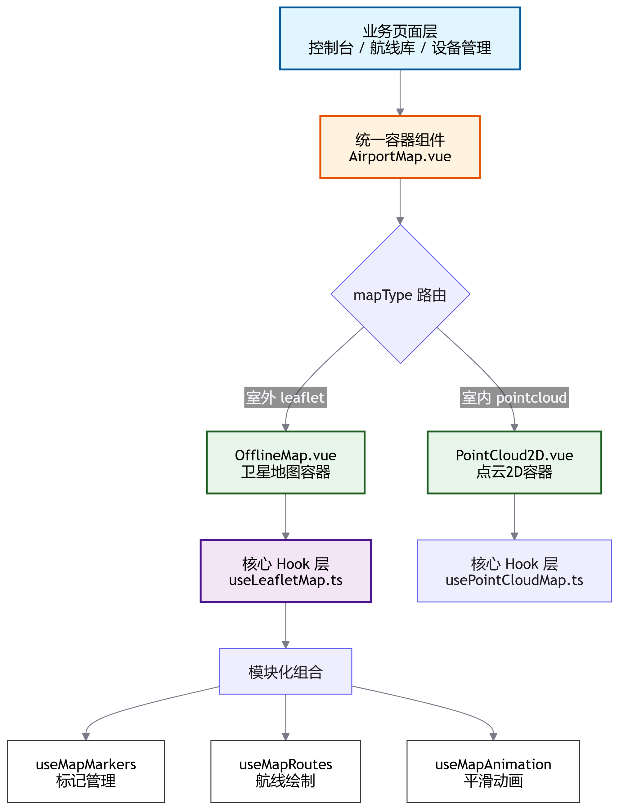
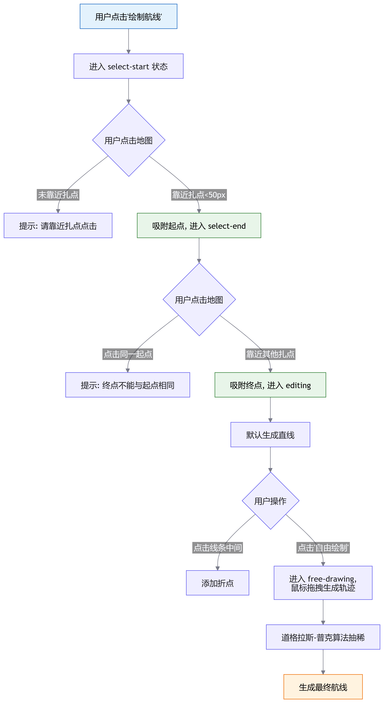

# Leaflet 地图的深度封装与室内外一体化实践

## 业务背景与核心痛点

### 业务场景

在无人机室内/室外一体化巡检与数字孪生项目中，地图模块是承载**航线规划、设备实时监控、机巢管理**的核心载体。业务要求系统能够同时支持：

- **室外场景**：基于卫星地图（WGS84/GCJ02 坐标系）展示无人机真实地理位置与飞行轨迹。
- **室内场景**：基于点云投影生成的 2D 俯视图（PNG + 局部直角坐标系）展示室内无人机位置与航线。

### 核心痛点

在早期的开发中，我们面临以下严峻挑战：

| 痛点               | 具体表现                                                                         | 业务影响                                 |
| :----------------- | :------------------------------------------------------------------------------- | :--------------------------------------- |
| **坐标系混乱**     | 后端存储 WGS84，国内地图需 GCJ02，室内需局部坐标系，前端计算极易出错。           | 航线偏移、设备位置不准，导致“炸机”风险。 |
| **交互体验割裂**   | 室外用高德/百度，室内用 Canvas 自绘，两套代码，交互（拖拽、缩放、标点）不一致。  | 研发成本翻倍，用户学习成本高。           |
| **复杂交互实现难** | 航线绘制需支持“扎点吸附”、“自由绘制”、“折点编辑”，原生 API 难以直接满足。        | 航线规划效率低下，操作反人类。           |
| **性能与内存泄漏** | 在 Vue `keep-alive` 缓存下，地图实例、定时器、事件监听未正确清理，导致页面卡顿。 | 长时间运行控制台后浏览器崩溃。           |

---

## 技术选型与架构设计

### 为什么选择 Leaflet？

| 候选方案          | 优势                                                                    | 劣势                                                       | 最终决策 |
| :---------------- | :---------------------------------------------------------------------- | :--------------------------------------------------------- | :------- |
| **高德/百度地图** | 国内数据准，API 丰富                                                    | 强依赖网络，不支持自定义 CRS（室内局部坐标系），离线困难。 | 放弃     |
| **Cesium 2D**     | 与 3D 引擎同源                                                          | 过于笨重，2D 交互体验不如专业 2D 地图库，性能开销大。      | 放弃     |
| **Leaflet**       | **极轻量 (40KB)**，**支持自定义 CRS**，插件生态丰富，离线瓦片支持完美。 | 需自行处理国内坐标系偏移（GCJ02）。                        | **采用** |

### 整体架构设计

为了实现“室内外一体化”且“高内聚低耦合”，我们采用了 **Hook 模块化 + 容器组件隔离** 的分层架构：



**架构优势**：

1. **单一事实来源**：业务层只需关心 `mapType`，由 `AirportMap.vue` 决定渲染哪个容器。
2. **职责单一**：`useLeafletMap` 作为总控，将 Marker、Route、Animation 拆分为独立 Hook，避免单文件代码超过 1000 行。
3. **坐标系隔离**：转换逻辑（WGS84 <-> GCJ02）收敛在 Hook 层，业务层（`AirportMap.vue`）只传递纯坐标数组。

---

## 核心封装机制 (Hook 化设计)

### 坐标系大一统：WGS84 / GCJ02 / CRS.Simple

国内地图必须使用 GCJ02（火星坐标系），而后端存储和 GPS 硬件输出均为 WGS84。我们在 `useLeafletMap.ts` 中收敛了转换逻辑：

```typescript
// useLeafletMap.ts
import { wgs84togcj02, gcj02towgs84 } from '@/utils/coordTransform'

// 后端 WGS84 -> 展示 GCJ02 -> Leaflet [lat, lng]
const wgs84ToLeaflet = (pos: [number, number]) => {
  const [gcjLng, gcjLat] = wgs84togcj02(pos[0], pos[1])
  return [gcjLat, gcjLng] as [number, number]
}

// Leaflet [lng, lat] -> 展示 GCJ02 -> 后端 WGS84
const leafletToWgs84 = (pos: L.LatLng) => {
  const [wgsLng, wgsLat] = gcj02towgs84(pos.lng, pos.lat)
  return { lng: wgsLng, lat: wgsLat }
}
```

**室内特殊处理**：对于室内点云地图，采用 Leaflet 的 `CRS.Simple`（平面坐标系），约定 `lat = Y`, `lng = X`，彻底抛弃经纬度概念，前端只做简单的加减法。

### 模块化组合：Markers / Routes / Animation

`useLeafletMap` 并不直接实现所有逻辑，而是作为“组合器”：

```typescript
export function useLeafletMap(containerRef, emit) {
  // 1. 初始化基础地图实例
  const mapInstance = shallowRef<L.Map | null>(null)

  // 2. 组合 Markers 模块 (传入坐标转换函数)
  const markersModule = useMapMarkers(mapInstance, emit, wgs84ToLeaflet, leafletToWgs84)

  // 3. 组合 Routes 模块 (传入 Markers 的吸附能力)
  const routesModule = useMapRoutes(mapInstance, routesLayer, emit, markersModule.getSnappedPoint, ...)

  // 4. 组合 Animation 模块
  const animationModule = useMapAnimation(mapInstance)

  return {
    ...markersModule,
    ...routesModule,
    ...animationModule,
    initMap, destroyMap, setMapCenter
  }
}
```

---

## 复杂交互与算法实现

### 航线绘制与智能吸附算法

在航线库中，用户需要基于已有的“扎点”（机巢、摄像头等）绘制航线。我们实现了**智能吸附**与**自由绘制**双模式。

**交互流程图：**



**核心吸附代码 (`useMapMarkers.ts`)：**

```typescript
const getSnappedPoint = (
  latlng: L.LatLng,
  snapPoints: MapMarker[],
): MapMarker | null => {
  const clickPoint = mapInstance.value.latLngToContainerPoint(latlng)
  let minDistance = Infinity
  let nearest: MapMarker | null = null

  snapPoints.forEach((marker) => {
    const gcjPos = wgs84ToLeaflet(marker.position)
    const markerPoint = mapInstance.value!.latLngToContainerPoint(
      L.latLng(gcjPos[0], gcjPos[1]),
    )
    const distance = clickPoint.distanceTo(markerPoint) // 像素级距离
    if (distance < minDistance) {
      minDistance = distance
      nearest = marker
    }
  })
  // 50像素阈值内视为吸附成功
  return minDistance < 50 ? nearest : null
}
```

### 基于物理距离的平滑动画与自动旋转

在控制台实时监控中，无人机图标需要沿着航线平滑移动，且**机头必须朝向飞行方向**。传统的基于时间比例的插值会导致“匀速但视觉上变速”（因为经纬度在不同纬度代表的实际距离不同）。

我们采用**基于物理距离的累计插值算法** (`useMapAnimation.ts`)：

```typescript
// 1. 预计算路径总长度与分段累计距离
let cumulative = 0
const cumulativeDistances: number[] = [0]
for (let i = 0; i < path.length - 1; i++) {
  const dist = path[i].distanceTo(path[i + 1]) // Leaflet 自动计算实际米数
  cumulative += dist
  cumulativeDistances.push(cumulative)
}

// 2. 动画主循环 (rAF)
const updateMarkerPosition = (task, progress) => {
  const targetDistance = task.totalDistance * progress

  // 二分/线性查找当前所在的线段
  // ... 计算 localProgress

  // 3. 坐标插值
  const currentLat =
    startPoint.lat + (endPoint.lat - startPoint.lat) * localProgress
  const currentLng =
    startPoint.lng + (endPoint.lng - startPoint.lng) * localProgress
  task.marker.setLatLng(L.latLng(currentLat, currentLng))

  // 4. 计算方位角并旋转图标 (CSS Transform)
  if (task.autoRotate) {
    const bearing = getBearing(startPoint, endPoint)
    rotateMarker(task.marker, bearing)
  }
}

// 5. 方位角计算 (Bearing)
const getBearing = (start, end) => {
  const dLon = ((end.lng - start.lng) * Math.PI) / 180
  // ... 球面三角学公式
  return (brng + 360) % 360
}
```

**视觉优化**：使用 CSS `divIcon` 替代默认图片 Marker，通过 `transform: rotate(${angle}deg)` 实现 60fps 的平滑旋转，避免 Canvas 重绘开销。

---

## 业务场景实战：控制台与航线库

### 统一容器：AirportMap.vue

`AirportMap.vue` 是业务层的核心，它通过 `mapType` 属性实现室内外地图的无缝切换，对上层业务完全透明。

```vue
<!-- AirportMap.vue -->
<template>
  <!-- 室外：Leaflet 卫星地图 -->
  <OfflineMap
    v-if="props.mapType === 'leaflet'"
    ref="offlineMap"
    :config="config"
    :markers="markers"
    :routes="[props.mapRoutes]"
    @map-click="mapClick"
  />

  <!-- 室内：点云 png 2D 地图 (参数与航线库完全一致) -->
  <PointCloud2D
    v-else
    :source="props.mapSource"
    :markers="markers"
    :routes="[props.mapRoutes]"
    :origin="props.dockOrigin"
  />
</template>
```

### 控制台实时轨迹监控

在控制台页面，WebSocket 实时下发无人机位置。我们利用 Vue 的响应式特性，将位置数据直接绑定到 `markers` 的 `position` 属性：

```typescript
// 控制台页面逻辑
const markers = computed<MapMarker[]>(() => [
  {
    id: 1,
    // 室外传 WGS84 [lng, lat]；室内传本地坐标 [x, y]
    position: props.markerPosition,
    title: props.currentDevice.deviceCallsign,
    draggable: false,
  },
])

// WebSocket 消息处理
function onMessage(data) {
  if (isIndoor) {
    // 室内：相对坐标转绝对坐标
    markerPosition.value = [
      data.localX + dockOrigin.value.x,
      data.localY + dockOrigin.value.y,
    ]
  } else {
    // 室外：直接使用 WGS84
    markerPosition.value = [data.lng, data.lat]
  }
}
```

`OfflineMap` 组件内部通过 `watch` 深度监听 `markers`，自动调用 `renderMarkers` 重绘，实现丝滑的实时位置更新。

---

## 踩坑记录与性能优化

| 问题场景                | 原因分析                                                                   | 解决方案                                                                                                   |
| :---------------------- | :------------------------------------------------------------------------- | :--------------------------------------------------------------------------------------------------------- |
| **Keep-alive 内存泄漏** | 路由切换时，地图实例、定时器、事件监听未销毁，导致 CPU 飙升。              | 在 `onBeforeUnmount` 和 `onDeactivated` 中强制调用 `destroyMap()`，清理所有 Layer 和 rAF。                 |
| **图标旋转锚点偏移**    | 默认 Marker 的 `iconAnchor` 在底部，旋转时绕底部转，不符合“机头朝向”直觉。 | 使用 `L.divIcon`，将 `iconAnchor` 设为 `[size/2, size/2]`（正中心），CSS 设置 `transform-origin: center`。 |
| **室内外切换白屏**      | Leaflet 的 CRS 在实例化时固定，无法动态从 EPSG3857 切换到 CRS.Simple。     | 采用 `v-if/v-else` 彻底销毁并重建 `OfflineMap` / `PointCloud2D` 组件实例。                                 |
| **双击地图误缩放**      | 绘制航线时，双击结束绘制会触发地图默认的双击放大。                         | 初始化地图时配置 `doubleClickZoom: false`，将双击事件完全交由业务逻辑接管。                                |
| **动画卡顿**            | 高频更新 Marker 位置导致 DOM 频繁重排。                                    | 禁用 CSS `transition`，完全由 `requestAnimationFrame` 接管动画，确保 60fps。                               |

---

## 总结

通过 **“坐标系收敛 + Hook 模块化拆分 + 容器组件隔离”** 的设计模式，我们成功在 Leaflet 之上构建了一套适应无人机复杂业务场景的地图引擎。

**核心价值**：

1. **研发提效**：配置化与模块化设计，使新业务页面（如机巢管理）接入地图的时间从 3 天缩短至 0.5 天。
2. **体验统一**：彻底抹平了室内 2D 点云与室外卫星地图的交互差异，用户无需重新学习。
3. **性能可控**：精细化的生命周期管理与 rAF 动画机制，保障了监控大屏 7x24 小时的稳定运行。

**未来展望**：

- **3D 航线预览**：结合 Cesium 实现 2D 规划、3D 预览的双屏联动。
- **电子围栏**：引入 Leaflet-Geoman 插件，实现多边形围栏的绘制与越界报警计算。
- **离线包管理**：完善离线瓦片下载与本地缓存机制，支持完全无网环境下的室内巡检。
