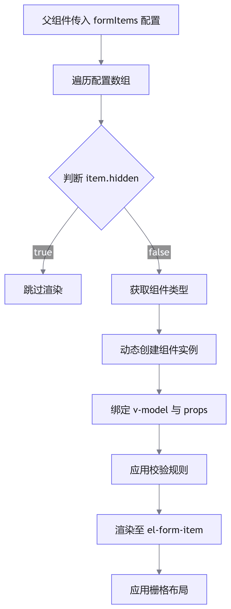
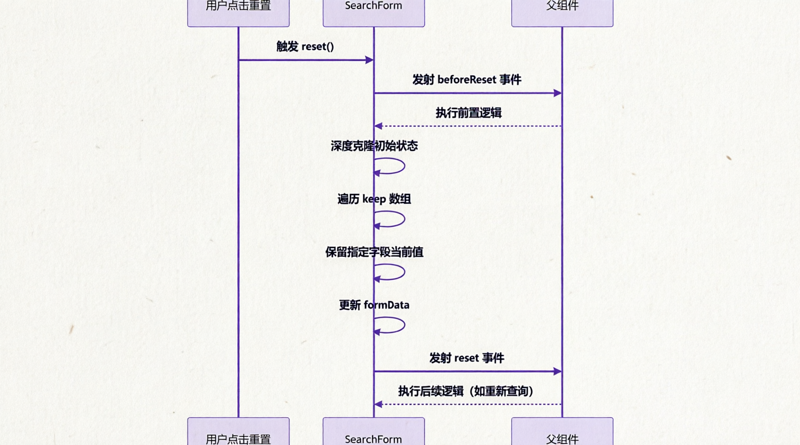

# Vue3 + Element Plus 通用搜索表单组件 (SearchForm) 设计与实践

## 概述

在企业级后台管理系统中，搜索表单是数据列表页面的标准配置。随着业务复杂度的提升，传统的手写表单方式存在代码冗余、维护成本高、类型安全性差等问题。本文介绍基于 <word text="Vue" /> 3 <word text="Composition API" /> 与 <word text="Element Plus" /> 封装的通用搜索表单组件 SearchForm，通过配置化驱动实现表单的快速构建与灵活扩展。

## 核心特性

| 特性分类   | 功能描述                                             | 技术价值                              |
| ---------- | ---------------------------------------------------- | ------------------------------------- |
| 配置化渲染 | 基于 JSON 配置动态生成表单，支持多种输入类型         | 减少 70% 以上的模板代码，提升开发效率 |
| 类型安全   | 完整的 <word text="TypeScript" /> 类型定义与泛型支持 | 提供 IDE 智能提示，降低运行时错误率   |
| 响应式布局 | 内置栅格系统，自适应不同屏幕尺寸                     | 支持 PC 端与移动端适配                |
| 表单校验   | 集成 Element Plus 异步校验机制                       | 支持自定义校验规则与即时反馈          |
| 智能重置   | 支持保留特定字段的重置策略                           | 满足复杂业务场景下的状态管理需求      |
| 插槽扩展   | 提供表单项与按钮区域的双向插槽                       | 支持高度定制化渲染                    |

## 架构设计

### 类型定义体系

组件采用分层类型设计，确保配置项的完整性与扩展性：

```typescript
export interface FormItem {
  label: string // 表单项标签
  labelWidth?: string | number // 标签宽度
  type?: string | any // 表单类型（input/select/datePicker 等）
  key: string // 字段唯一标识
  props?: any // 传递给表单组件的属性
  rules?: any[] // 校验规则
  hidden?: boolean // 是否隐藏
  placeholder?: string // 占位符
  span?: number // 栅格占位（1-24）
  onChange?: (value: any) => void // 值变化回调
}
```

### 组件渲染流程



## 核心实现机制

### 动态组件注册与渲染

组件采用策略模式，通过组件字典实现类型到组件的映射：

```typescript
const formItemDict: Record<string, any> = {
  input: ElInput,
  number: ElInputNumber,
  select: ElSelect,
  datePicker: ElDatePicker,
  checkboxGroup: ElCheckboxGroup,
  switch: ElSwitch,
}

const getComponent = (item: FormItem) => {
  const { type } = item
  // 支持直接传入组件对象
  if (type && typeof type !== 'string') {
    return type
  }
  return formItemDict[type || 'input']
}
```

设计优势：

- 支持字符串类型与组件对象两种配置方式
- 便于第三方组件的集成与扩展
- 运行时动态解析，降低编译依赖

### 属性白名单机制

为避免属性冲突，组件采用白名单过滤机制：

```typescript
const rootProps = ['type', 'key', 'label', 'labelWidth', 'rules', 'span']

const getProps = (item: any) => {
  if (item.props) return item.props
  let bindProps: any = {}
  for (let key in item) {
    if (rootProps.includes(key)) continue
    bindProps[key] = item[key]
  }
  return bindProps
}
```

该机制确保：

- 组件内部配置项（如 type、key）不会透传至表单组件
- 支持 props 对象直接传入，优先级高于扁平属性
- 保持配置的灵活性与简洁性

### 智能重置策略

重置功能是搜索表单的核心需求之一。组件实现了基于深度克隆与字段保留的重置机制：

```typescript
const reset = () => {
  emits('beforeReset')
  setTimeout(() => {
    // 从初始值克隆一份全新的对象
    const newState = cloneDeep(oldFormData)

    // 对于 keep 中指定的属性，保留当前值（不重置）
    props.keep?.forEach((key) => {
      if (key in formData.value) {
        newState[key] = formData.value[key]
      }
    })

    // 更新状态
    formData.value = newState
    emits('reset')
  }, 0)
}
```

执行流程：



应用场景：

- 保留时间范围，仅重置搜索关键字
- 保留用户选择的高级筛选项
- 保留分页参数，避免重置后跳回第一页

### 响应式布局系统

组件基于 Element Plus 栅格系统实现自适应布局：

```vue
<el-row :gutter="20" class="gap-4">
  <el-col 
    v-for="item in form" 
    :key="item.key" 
    :span="item.span || 24"
  >
    <el-form-item :label="item.label" :prop="item.key">
      <component 
        :is="getComponent(item)"
        v-model="formData[item.key]"
        v-bind="getProps(item)"
      />
    </el-form-item>
  </el-col>
  <el-col class="flex! items-center" :span="btnSpan">
    <slot name="searchButton">
      <el-button :icon="Refresh" @click="reset">重置</el-button>
      <el-button type="primary" :icon="Search" @click="search">查询</el-button>
    </slot>
    <slot name="handleButton"></slot>
  </el-col>
</el-row>
```

布局策略：

- 默认单列布局（span: 24）
- 支持自定义每列占位（span: 8 表示一行三列）
- 按钮区域独立占位，右对齐或居中显示
- 通过 `gutter` 控制列间距

## API 参考

### Props

| 参数            | 说明                  | 类型                  | 默认值  |
| --------------- | --------------------- | --------------------- | ------- | ------- | --------- |
| `modelValue`    | 表单数据双向绑定      | `Record<string, any>` | `{}`    |
| `formItems`     | 表单项配置数组        | `FormItem[]`          | `[]`    |
| `btnSpan`       | 按钮区域栅格占位      | `number`              | 5       |
| `size`          | 表单组件尺寸          | 'default'             | 'small' | 'large' | 'default' |
| `showSearchBtn` | 是否显示搜索/重置按钮 | `boolean`             | `true`  |
| `keep`          | 重置时保留的字段数组  | `string[]`            | -       |

### Events

| 事件名        | 说明                     | 回调参数 |
| ------------- | ------------------------ | -------- |
| `search`      | 点击查询按钮时触发       | -        |
| `reset`       | 重置完成后触发           | -        |
| `beforeReset` | 重置前触发，可获取当前值 | -        |

### Slots

|插槽名|说明|作用域参数|
|`searchButton`|自定义搜索/重置按钮区域|-|
|`handleButton`|自定义操作按钮区域（右侧）|-|
|`[key]`|自定义表单项内容（按字段 key 命名）|-|

### Expose Methods

组件暴露 ElForm 实例方法，支持父组件调用：

```typescript
const formRef = ref<ComponentInstance<typeof ElForm>>()

// 父组件可调用
formRef.value?.validate() // 表单校验
formRef.value?.clearValidate() // 清空校验结果
formRef.value?.resetFields() // 重置字段
```

## 使用实例

### 基础用法

实现包含任务名称、执行时间、入库单号的搜索表单：

```vue
<script setup lang="ts">
import dayjs from 'dayjs'
import type { FormItem } from '@/components/SearchForm/type'

const searchForm = ref({
  taskName: '',
  beginTime: '',
  endTime: '',
  inboundOrderNo: '',
})

const formItems: FormItem[] = [
  {
    label: '任务名称',
    key: 'taskName',
    span: 7,
    props: {
      placeholder: '请输入任务名称',
      clearable: true,
    },
  },
  {
    type: 'datePicker',
    label: '执行时间',
    key: 'dateRange',
    span: 9,
    props: {
      type: 'daterange',
      rangeSeparator: '至',
      startPlaceholder: '开始日期',
      endPlaceholder: '结束日期',
      onChange: (e: any[]) => {
        searchForm.value.beginTime = e ? dayjs(e[0]).format('YYYY-MM-DD') : ''
        searchForm.value.endTime = e ? dayjs(e[1]).format('YYYY-MM-DD') : ''
      },
    },
  },
  {
    label: '入库单号',
    key: 'inboundOrderNo',
    span: 7,
    props: {
      placeholder: '请输入入库单号',
      clearable: true,
    },
  },
]

const handleSearch = () => {
  console.log('搜索参数:', searchForm.value)
  // 调用列表查询接口
}

const handleReset = () => {
  console.log('表单已重置')
  // 重新查询
}
</script>

<template>
  <SearchForm
    v-model="searchForm"
    :form-items="formItems"
    class="px-4 py-3 bg-gray-50"
    :btn-span="10"
    @search="handleSearch"
    @reset="handleReset"
  >
    <template #handleButton>
      <el-button type="primary" icon="Upload">库存数据导入</el-button>
      <el-button type="primary" icon="Download">输出报告</el-button>
    </template>
  </SearchForm>
</template>
```

### 高级用法：自定义表单项与校验

实现包含下拉选择、自定义渲染与表单校验的复杂场景：

```vue
<script setup lang="ts">
import type { FormItem } from '@/components/SearchForm/type'

const formItems: FormItem[] = [
  {
    label: '物资类型',
    key: 'goodsType',
    span: 8,
    type: 'select',
    props: {
      placeholder: '请选择物资类型',
      clearable: true,
    },
    children: [
      { label: '传感器', value: 'sensor' },
      { label: '电机', value: 'motor' },
      { label: '电缆', value: 'cable' },
    ],
  },
  {
    label: '是否存在差异',
    key: 'diffStatus',
    span: 8,
    type: 'select',
    rules: [{ required: true, message: '请选择差异状态', trigger: 'change' }],
    props: {
      placeholder: '请选择',
    },
    children: [
      { label: '是', value: 1 },
      { label: '否', value: 0 },
    ],
  },
  {
    label: '自定义字段',
    key: 'customField',
    span: 8,
    // 通过插槽完全自定义渲染
  },
]
</script>

<template>
  <SearchForm v-model="formData" :form-items="formItems" ref="formRef">
    <!-- 自定义表单项 -->
    <template #customField>
      <el-input v-model="formData.customField" placeholder="请输入自定义内容">
        <template #append>
          <el-button :icon="Search" />
        </template>
      </el-input>
    </template>
  </SearchForm>
</template>
```

### 实战场景：保留分页参数的重置

在列表页面中，重置搜索条件时通常需要保留分页参数：

```vue
<template>
  <SearchForm
    v-model="searchForm"
    :form-items="formItems"
    :keep="['pageNum', 'pageSize']"
    @reset="handleReset"
  />
</template>

<script setup lang="ts">
const searchForm = ref({
  taskName: '',
  pageNum: 1,
  pageSize: 10,
})

const handleReset = () => {
  // 重置后自动重新查询，保持当前页码
  fetchTableData()
}
</script>
```

## 可扩展性设计

### 自定义组件集成

组件支持直接传入 Vue 组件对象，便于集成第三方或业务组件：

```typescript
import CustomCascader from '@/components/CustomCascader.vue'

const formItems: FormItem[] = [
  {
    label: '区域选择',
    key: 'region',
    type: CustomCascader, // 直接传入组件
    props: {
      multiple: true,
      checkStrictly: true,
    },
  },
]
```

### 动态表单配置

支持根据权限或业务逻辑动态生成表单配置：

```typescript
const generateFormItems = (userRole: string): FormItem[] => {
  const baseItems: FormItem[] = [{ label: '关键字', key: 'keyword', span: 12 }]

  if (userRole === 'admin') {
    baseItems.push({
      label: '部门',
      key: 'department',
      span: 12,
      type: 'select',
      children: departmentOptions,
    })
  }

  return baseItems
}
```

### 表单联动逻辑

通过 `onChange` 回调实现表单项之间的联动：

```typescript
const formItems: FormItem[] = [
  {
    label: '任务类型',
    key: 'taskType',
    span: 12,
    type: 'select',
    props: {
      onChange: (value: string) => {
        // 根据任务类型动态显示/隐藏其他字段
        if (value === 'inventory') {
          formItems.value.find((i) => i.key === 'warehouse')!.hidden = false
        } else {
          formItems.value.find((i) => i.key === 'warehouse')!.hidden = true
        }
      },
    },
  },
  {
    label: '仓库',
    key: 'warehouse',
    span: 12,
    hidden: true,
    type: 'select',
  },
]
```

## 最佳实践

### 性能优化建议

1. 避免频繁重建配置：将 `formItems` 定义为 `computed` 或 `ref`，避免每次渲染重新创建数组
2. 使用 `v-once` 优化静态配置：对于不变的配置项，可使用 `v-once` 减少响应式开销
3. 合理设置 `span`：避免过多小跨度列导致布局计算复杂

### 类型安全实践

```typescript
// 定义表单数据的类型接口
interface SearchFormData {
  taskName: string
  beginTime: string
  endTime: string
  goodsType: number
}

// 使用泛型约束
const searchForm = ref<SearchFormData>({
  taskName: '',
  beginTime: '',
  endTime: '',
  goodsType: 0,
})
```

### 错误处理与边界情况

```typescript
// 处理日期范围选择异常
const formItems: FormItem[] = [
  {
    type: 'datePicker',
    key: 'dateRange',
    props: {
      onChange: (e: any[] | null) => {
        if (!e || e.length !== 2) {
          formData.value.beginTime = ''
          formData.value.endTime = ''
          return
        }
        formData.value.beginTime = dayjs(e[0]).format('YYYY-MM-DD')
        formData.value.endTime = dayjs(e[1]).format('YYYY-MM-DD')
      },
    },
  },
]
```

## 总结

SearchForm 组件通过配置化驱动、类型安全保证与灵活的扩展机制，有效解决了企业级应用中搜索表单的重复开发问题。其核心价值体现在：

1. 开发效率提升：配置化方式减少 70% 以上的模板代码
2. 维护成本降低：统一的类型定义与校验机制，降低出错概率
3. 业务适配性强：支持自定义组件、动态配置、字段保留等多种复杂场景
4. 用户体验优化：响应式布局、即时校验、智能重置等功能提升交互流畅度

后续可扩展方向包括：

- 支持表单布局模板（如两列、三列预设）
- 集成表单数据持久化（URL 参数同步、LocalStorage 缓存）
- 提供可视化表单配置器（低代码平台集成）

## 完整代码

```vue

```
