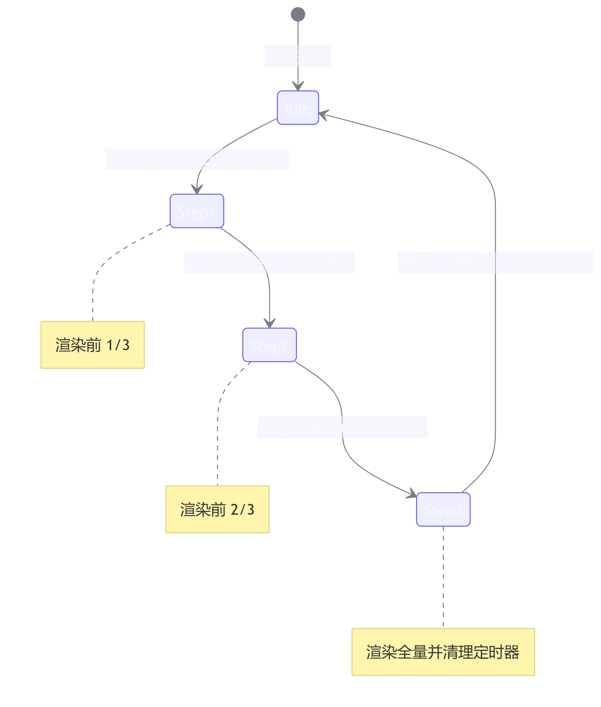
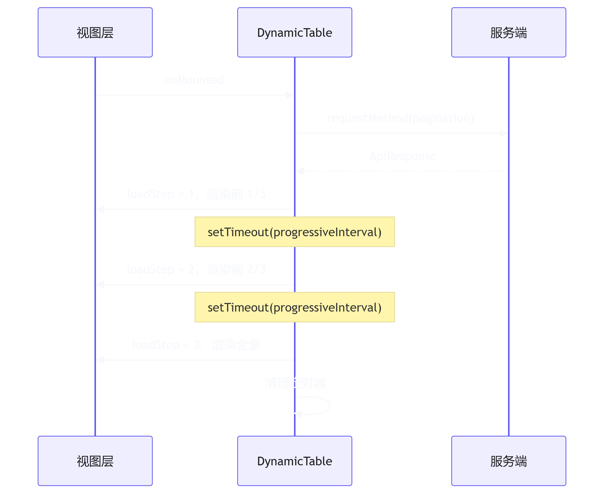

# Vue3 + Element Plus 企业级动态表格组件 (DynamicTable) 设计与实践

## 概述

在企业级后台管理系统中，数据表格是承载复杂业务逻辑的核心载体。随着业务场景的深化，原生的 UI 组件库（如 `Element Plus`）在应对动态列渲染、复杂单元格合并、多选联动以及实时数据刷新等需求时，往往需要编写大量重复的模板代码与状态管理逻辑。

本文档旨在阐述基于 `Vue 3 (Composition API)` 与 `TypeScript` 封装的 `DynamicTable` 组件的设计思路、核心实现机制及工程化实践。该组件通过配置化驱动与泛型支持，在保障类型安全的前提下，实现了业务逻辑与视图渲染的解耦，提升了复杂表格场景的开发效率与可维护性。

## 核心架构与封装特性

`DynamicTable` 并非对 `el-table` 的简单包裹，而是针对企业级业务场景进行了系统性重构。其核心特性如下：

| 特性分类 | 功能描述                                        | 工程价值                                                 |
| -------- | ----------------------------------------------- | -------------------------------------------------------- |
| 类型安全 | 支持 Vue 3.3+ `generic` 泛型约束                | 实现列配置、行数据及插槽的完整类型推导，降低运行时错误率 |
| 配置驱动 | 基于 `JSON Schema` 动态渲染列，支持插槽与格式化 | 适应多变的列表需求，支持配置化开发模式                   |
| 状态管理 | 内置分页状态、`Loading` 控制与请求方法注入      | 减少父组件约 80% 的模板代码，实现数据请求与视图解耦      |
| 高阶合并 | 支持基于字段值的自动单元格合并及多选框联动      | 解决合并单元格后，多选框操作逻辑与 UI 不一致的问题       |
| 实时刷新 | 内置定时轮询机制，兼容 `keep-alive` 路由缓存    | 适用于监控大屏、实时状态更新场景，防止定时器内存泄漏     |

## 高阶特性实现原理

1. 动态单元格合并算法

    传统的单元格合并通常需要开发者手动计算 `rowspan` 与 `colspan`。本组件通过配置 `merge: true`，在内部通过计算属性自动推导合并规则。
    
    算法逻辑：

    遍历当前页数据，识别连续相同字段值的行。记录起始行的合并行数（`rowspan`），并将后续被合并行的 `rowspan` 设为 0（在<word text="Element Plus" />中代表隐藏该单元格）。

    ```typescript
    const mergeInfoMap = computed(() => {
      const map = new Map<string, number[]>()
      const data = tableData.value
      if (!data.length) return map

      visibleColumns.value.forEach((col) => {
        if (!col.merge || !col.prop) return
        const mergeRows: number[] = new Array(data.length).fill(1)
        let i = 0
        while (i < data.length) {
          let j = i + 1
          while (j < data.length && data[j][col.prop!] === data[i][col.prop!]) {
            j++
          }
          mergeRows[i] = j - i
          for (let k = i + 1; k < j; k++) mergeRows[k] = 0
          i = j
        }
        map.set(col.prop, mergeRows)
      })
      return map
    })
    ```

2. 多选框合并与联动防死循环机制

    当业务要求“按任务名称合并单元格，且多选框跟随合并，点击多选框选中整个任务”时，会引发两个技术挑战：
    
    - UI 割裂：原生 `selection` 列无法自动跟随业务列合并。
    - 事件死循环：在 `@select` 事件中调用 `toggleRowSelection` 会再次触发 `@select`，导致逻辑死循环或父组件接收到的 `selection-change` 数据错乱。

    解决方案：

    - UI 合并：在 `handleSpanMethod` 中拦截 `selection` 列，复用首个配置了 merge: true 的业务列的合并行数。
    - 防死循环与数据一致性：引入状态锁 (`isBatchSelecting`) 与状态预判机制，并结合防抖策略 (`debounce`) 确保父组件仅接收最终准确的选中数据。

    

    ```typescript
    const handleSelect = (selection: T[], row: T) => {
      if (!props.mergeSelection || isBatchSelecting.value) return

      const groupCol = visibleColumns.value.find((c) => c.merge && c.prop)
      if (!groupCol || !groupCol.prop) return

      const groupValue = row[groupCol.prop]
      const groupRows = tableData.value.filter((r) => r[groupCol.prop!] === groupValue)
      const isSelected = selection.includes(row)

      // 状态预判：若同组数据已处于目标状态，说明为联动触发，直接中断
      if (isSelected && groupRows.every((r) => selection.includes(r))) return
      if (!isSelected && groupRows.every((r) => !selection.includes(r))) return

      isBatchSelecting.value = true
      groupRows.forEach((r) => {
        if (r !== row) tableRef.value?.toggleRowSelection(r, isSelected)
      })

      setTimeout(() => { isBatchSelecting.value = false }, 100)
    }
    ```

3. 兼容 `Keep-Alive` 的轮询机制

    对于需要实时刷新的监控类页面，组件内置了 `pollingInterval` 属性。为避免路由切换或组件缓存导致的定时器泄漏，组件通过监听 <word text="Vue" /> 的生命周期钩子进行精确控制。

    ```typescript
    // 监听组件激活/失活状态，解决 keep-alive 缓存导致的定时器泄漏
    onDeactivated(() => { isComponentAlive = false; stopPolling() })
    onActivated(() => { 
      isComponentAlive = true
      if (props.pollingInterval > 0) startPolling() 
    })
    ```

## 三段式渐进刷新机制

### 设计背景

在审核工作台、监控大屏类场景中，表格组件在 <word text="Promise"/> 响应返回后将整页数据一次性渲染至 <word text="DOM"/>。当单页数据量较大且叠加行合并计算时，该渲染方式存在两个工程层面的问题：

1. 感知层：表格由空态跳变为满态仅发生在一帧之内，用户视线缺乏落点，无法形成「数据持续到达」的阅读节奏；
2. 性能层：大批量行节点的集中插入会触发整表 <word text="Reflow"/>，叠加合并算法的重复推导，首屏渲染耗时显著上升。

为此，组件在 <word text="Composition API"/> 的 `setup` 作用域内引入 `progressiveLoad` 与 `progressiveInterval` 两个 Props，将「整量渲染」拆分为 `1/3 → 2/3 → 全量` 三个时间片，由有限 <word text="State Machine"/> 驱动分批渲染，实现 <word text="Progressive Rendering"/>。

### 状态机模型

渐进过程由单一响应式变量 `loadStep` 驱动，状态定义与迁移规则如下：

| loadStep | 语义   | displayData 切片范围 | 迁移触发条件                     |
| -------- | ------ | -------------------- | -------------------------------- |
| 0        | 未开始 | `[]`                 | 刷新、翻页、改变 pageSize 时重置 |
| 1        | 第一批 | `[0, batchSize)`     | 接口响应写入后                   |
| 2        | 第二批 | `[0, batchSize × 2)` | 定时器到达 progressiveInterval   |
| 3        | 完成   | 全量                 | 定时器到达 / 功能未开启          |

其中 `batchSize = max(1, floor(total / 3))`。下限取 1 保证数据总量不足 3 条时三段语义仍然成立；第三批直接取全量，规避整除取整造成的尾部残留。

状态迁移图如下：



### 数据切片实现

切片逻辑完全由 <word text="Computed Property"/> 承载。基于 <word text="Proxy"/> 的依赖收集机制，`displayData` 仅在 `loadStep` 或 `tableData` 变更时重新求值，且不修改源数据，保证 `getTableData`、合并算法等外部消费方始终读取一致视图：

```ts
/** 每批渲染条数，下限 1，避免小数据量下批次为空 */
const progressiveBatchSize = computed(() => {
  const total = tableData.value.length
  if (!total) return 0
  return Math.max(1, Math.floor(total / PROGRESSIVE_TOTAL_STEP))
})

/** 当前批次的渲染切片 */
const displayData = computed<T[]>(() => {
  const data = tableData.value

  // 功能未开启时直接旁路，零额外开销
  if (!props.progressiveLoad) return data
  if (!data.length) return []

  // 起始空窗期返回空数组，阻断接口回写至状态机启动之间的整量闪现
  if (loadStep.value <= 0) return []
  if (loadStep.value >= PROGRESSIVE_TOTAL_STEP) return data

  const count = Math.min(data.length, progressiveBatchSize.value * loadStep.value)
  return data.slice(0, count)
})
```

### 定时器调度

批次推进采用递归 `setTimeout` 而非 `setInterval`：每一阶段均可被独立中断，且间隔时长在每次调度时读取最新的 `progressiveInterval`，支持运行时动态调整。

```ts
/** 递归调度下一批次，直至 loadStep 到达 3 后自清理 */
const scheduleNextProgressiveStep = () => {
  progressiveTimer = setTimeout(() => {
    if (!isComponentAlive || !props.progressiveLoad) return
    if (loadStep.value >= PROGRESSIVE_TOTAL_STEP) {
      progressiveTimer = null
      return
    }

    loadStep.value += 1

    // 切片变更后经 NextTick 等待 DOM 更新完成，再重算表格布局以修正合并行高
    nextTick(() => tableRef.value?.doLayout())

    if (loadStep.value < PROGRESSIVE_TOTAL_STEP) {
      scheduleNextProgressiveStep()
    } else {
      progressiveTimer = null
    }
  }, progressiveDelay.value)
}

/**
 * 启动渐进渲染
 * @param resetStep 是否重置至第一批。keep-alive 恢复续播时传 false，从中断批次继续
 */
const startProgressiveLoad = (resetStep = true) => {
  stopProgressiveLoad()

  if (!props.progressiveLoad) {
    loadStep.value = PROGRESSIVE_TOTAL_STEP
    return
  }
  if (!tableData.value.length) {
    loadStep.value = 0
    return
  }
  if (resetStep || loadStep.value <= 0) loadStep.value = 1
  if (loadStep.value >= PROGRESSIVE_TOTAL_STEP) return

  scheduleNextProgressiveStep()
}
```

### 请求竞态防护

快速翻页场景下，多次请求的响应顺序与发起顺序无法保证一致，旧响应回写将导致新页切片被旧页数据覆盖，构成典型的 <word text="Race Condition"/>。组件引入单调递增的请求序号 `requestSeq` 进行防护，序号不匹配的响应直接丢弃：

```ts
const initTableData = async () => {
  const seq = ++requestSeq

  try {
    internalLoading.value = true
    stopProgressiveLoad()
    loadStep.value = 0

    if (props.requestMethod) {
      const response = await props.requestMethod(pagination)
      // 序号过期或组件已卸载，丢弃响应
      if (!isComponentAlive || seq !== requestSeq) return
      requestData.value = response
    }

    await nextTick()
    if (!isComponentAlive || seq !== requestSeq) return

    startProgressiveLoad(true)
  } catch (error) {
    console.error('[DynamicTable] Data fetch failed:', error)
    // 失败时终止状态机，避免停留在空窗期
    if (seq === requestSeq) loadStep.value = PROGRESSIVE_TOTAL_STEP
  } finally {
    if (seq === requestSeq) internalLoading.value = false
  }
}
```

### 批次进入动效

为使批次边界在视觉上可感知，`rowClassName` 对「属于当前批次新增切片」的行追加 `progressive-enter-row` 类名。动画属性仅选用 `opacity` 与 `background-color`，二者只触发 <word text="Repaint"/>，不引起 <word text="Reflow"/>，动画开销可控：

```ts
/** 上一批次已渲染的行数，用于界定当前批次的新增行区间 */
const progressivePreviousCount = computed(() => {
  const total = tableData.value.length
  if (!props.progressiveLoad || !total) return 0
  if (loadStep.value <= 1) return 0
  if (loadStep.value === 2) return Math.min(total, progressiveBatchSize.value)
  return Math.min(total, progressiveBatchSize.value * 2)
})

/** 行类名生成器，叠加树形层级样式与批次进入动画样式 */
const rowClassName = ({ row, rowIndex }: { row: T; rowIndex: number }) => {
  const classNames: string[] = []

  if (isTreeTable.value) {
    const level = getRowLevel(row, tableData.value)
    if (level !== -1) classNames.push(`tree-level-${level}`)
  }

  if (
    props.progressiveLoad &&
    loadStep.value > 0 &&
    rowIndex >= progressivePreviousCount.value &&
    rowIndex < displayData.value.length
  ) {
    classNames.push('progressive-enter-row')
  }

  return classNames.join(' ')
}
```

```less
/* 当前批次新增行淡入 */
:deep(.progressive-enter-row) {
  animation: progressive-row-fade 0.8s ease both;
}

/* 新增行背景高亮，在一个间隔周期内渐隐归位 */
:deep(.progressive-enter-row td.el-table__cell) {
  animation: progressive-row-bg 2s ease both;
}

@keyframes progressive-row-fade {
  from { opacity: 0; }
  to { opacity: 1; }
}

@keyframes progressive-row-bg {
  from { background-color: #ecf5ff; }
  to { background-color: transparent; }
}
```

### 生命周期治理与轮询协同

渐进定时器与轮询定时器遵循同一治理策略：在 `onUnmounted` 与 `onDeactivated` 中统一清理，杜绝 <word text="Keep-Alive"/> 缓存场景下 <word text="Lifecycle Hooks"/> 失活后定时器继续运行造成的 <word text="Memory Leak"/>；`onActivated` 中以 `resetStep = false` 恢复状态机，用户返回页面时续播剩余批次，而非从头重播。

轮询与渐进刷新并发时，若当前三段流程尚未完成，则本轮轮询顺延，避免动画被高频刷新反复重置：

```ts
const tick = async () => {
  if (!isPollingActive || !isComponentAlive) return

  // 渐进未完成时顺延本轮轮询，保证三段动画完整性
  if (props.progressiveLoad && loadStep.value > 0 && loadStep.value < PROGRESSIVE_TOTAL_STEP) {
    pollingTimer = setTimeout(tick, props.pollingInterval)
    return
  }

  await initTableData()
  if (!isPollingActive || !isComponentAlive) return

  pollingTimer = setTimeout(tick, props.pollingInterval)
}
```

完整时序如下：




### 边界场景处理

| 边界场景                 | 处理策略                                                              |
| ------------------------ | --------------------------------------------------------------------- |
| 数据总量不足 3 条        | `batchSize` 下限取 1，第三批直接取全量                                |
| 快速翻页 / 改变 pageSize | `requestSeq` 自增使旧响应失效，`loadStep` 重置为 0                    |
| 请求失败                 | 当前序号下 `loadStep` 直接置 3，终止状态机                            |
| `keep-alive` 失活 / 恢复 | `onDeactivated` 清理定时器；`onActivated` 以 `resetStep = false` 续播 |
| 轮询与渐进并发           | 渐进未完成时顺延本轮轮询                                              |
| 未开启 `progressiveLoad` | `loadStep` 置 3，`displayData` 返回全量，逻辑旁路                     |

### API 增量

Props 表新增：

| 参数                  | 说明                       | 类型      | 默认值  |
| --------------------- | -------------------------- | --------- | ------- |
| `progressiveLoad`     | 是否开启三段式渐进刷新     | `boolean` | `false` |
| `progressiveInterval` | 相邻批次的渲染间隔（毫秒） | `number`  | 2000    |

Expose 表新增：

| 方法名                   | 说明                         | 参数 |
| ------------------------ | ---------------------------- | ---- |
| `restartProgressiveLoad` | 手动重播三段式刷新           | -    |
| `progressiveStep`        | 当前所处批次，只读响应式引用 | -    |

### 使用实例

```vue
<template>
  <DynamicTable
    :request-method="reviewApi.getReviewList"
    :columns="columns"
    row-key="inventoryCheckId"
    progressive-load
    :progressive-interval="2000"
  />
</template>
```

## API 参考

### Props

| 参数              | 说明                                         | 类型                                              | 默认值  |
| ----------------- | -------------------------------------------- | ------------------------------------------------- | ------- |
| `requestMethod`   | 数据请求方法，接收分页参数                   | `(params: Pagination) => Promise<ApiResponse<T>>` | -       |
| `columns`         | 列配置数组                                   | `TableColumn<T>[]`                                | -       |
| `rowKey`          | 行数据的唯一标识，用于优化渲染与多选联动     | `string`                                          | `'id'`  |
| `showSelection`   | 是否显示多选框列                             | `boolean`                                         | `false` |
| `mergeSelection`  | 是否合并多选框列（需配合列的 `merge: true`） | `boolean`                                         | `false` |
| `pollingInterval` | 轮询间隔（毫秒），大于 0 时开启定时刷新      | `number`                                          | 0       |
| `treeProps`       | 树形表格配置项                               | `{ children?: string; hasChildren?: string }`     | -       |

### Events

|       事件名       |                    说明                    |               回调参数                |
| :----------------: | :----------------------------------------: | :-----------------------------------: |
| `selection-change` | 多选框选中项发生变化时触发（已做防抖处理） |          `(selection: T[])`           |
|    `row-click`     |                 行点击事件                 | `(row: T, column: any, event: Event)` |
|   `size-change`    |                分页大小改变                |      `(pagination: Pagination)`       |
|  `current-change`  |                当前页码改变                |      `(pagination: Pagination)`       |

### Expose Methods (通过 ref 调用)

| 方法名               | 说明                     | 参数                            |
| -------------------- | ------------------------ | ------------------------------- |
| `initTableData`      | 手动刷新表格数据         | -                               |
| `clearSelection`     | 清空多选框选中状态       | -                               |
| `toggleRowSelection` | 手动切换指定行的选中状态 | `(row: T, selected?: boolean)`  |
| `setPagination`      | 手动设置分页参数         | `(params: Partial<Pagination>)` |

## 使用实例

### 基础用法

通过注入请求方法与列配置，即可快速渲染标准分页表格。

```vue
<template>
  <DynamicTable
    :request-method="fetchUserList"
    :columns="columns"
    row-key="id"
    @selection-change="handleSelectionChange"
  />
</template>

<script setup lang="ts">
import type { TableColumn } from '@/components/DynamicTable/index.vue'

interface User { id: number; name: string; role: string }

const columns: TableColumn<User>[] = [
  { label: '姓名', prop: 'name', minWidth: 120 },
  { label: '角色', prop: 'role', width: 150, align: 'center' }
]

const fetchUserList = (params: any) => {
  return api.getUsers(params)
}
</script>
```

### 进阶用法：合并单元格与多选联动

实现“按任务名称合并单元格，多选框跟随合并，且点击多选框联动选中同组数据”的业务需求。

```vue
<template>
  <DynamicTable
    ref="tableRef"
    :request-method="reviewApi.getReviewList"
    :columns="columns"
    row-key="inventoryCheckId"
    show-selection
    :merge-selection="true" 
    @selection-change="handleSelectionChange"
  />
</template>

<script setup lang="ts">
// 在需要合并的列配置中添加 merge: true
const columns: TableColumn<ReviewItem>[] = [
  { label: '任务名称', prop: 'taskName', minWidth: 180, merge: true }, 
  { label: '任务编码', prop: 'taskCode', width: 180 },
  { label: '物资名称', prop: 'goodsName', width: 150 }
]
</script>
```

### 可扩展性设计
`DynamicTable` 在设计之初预留了多个扩展点，以应对未来更复杂的业务场景：

1. 列设置（Column Setting）：

    通过 `TableColumn` 接口中的 `hidden` 属性，可轻松结合外部弹窗组件，实现表格列的动态显示与隐藏，并支持将配置持久化至本地存储或后端。

2. 自定义表头与单元格：

    支持通过 `slotName` 或默认的 `cell-{prop}` 命名约定，在父组件中通过具名插槽深度定制单元格的渲染逻辑（如嵌入复杂表单、图表或操作按钮）。

3. 多列联合合并：

    当前的 `mergeInfoMap` 算法支持多列独立计算。若需实现“仅当 A 列和 B 列同时相同时才合并”，可通过扩展 `merge` 属性为数组或对象，并在计算属性中调整比对逻辑来实现。

4. 虚拟滚动（Virtual Scroll）：

    若面临万级数据渲染性能瓶颈，可基于现有的 `tableData` 计算属性，无缝替换为 Element Plus 的虚拟表格组件 (`el-table-v2`)，而无需修改父组件的业务逻辑。


