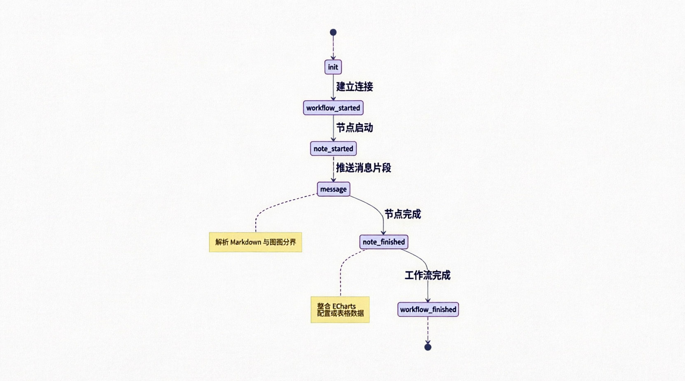
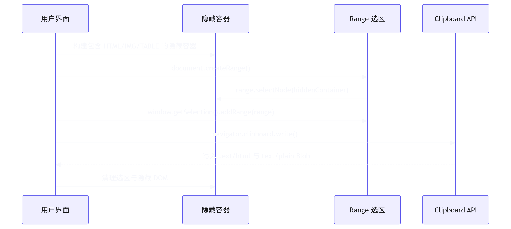

# AI 问答模块流式交互与富文本复制方案

## 概述

AI 问答模块是数说项目的核心交互链路，涉及 <word text="SSE" />（Server-Sent Events）流式数据接收、复杂工作流状态机解析以及富文本结果的跨格式复制。本文档详细拆解基于 <word text="Ant Design X Vue" /> 的流式对话架构与底层 <word text="DOM" /> 选区复制方案。

## SSE 流式请求方案选型

在实现流式响应时，对比了主流的网络请求方案：

| 方案                        | 适用场景                                                         | 优势                                                                             | 劣势                                                   |
| --------------------------- | ---------------------------------------------------------------- | -------------------------------------------------------------------------------- | ------------------------------------------------------ |
| `fetch`                     | 标准 <word text="Web" /> <word text="API" />，现代浏览器原生支持 | 零依赖，完美支持自定义 <word text="HTTP" /> Header 与 <word text="SSE" /> 流解析 | 默认不支持取消，需结合 <word text="AbortController" /> |
| `axios`                     | 复杂请求场景（拦截器、全局配置）                                 | 功能全面，支持请求/响应拦截                                                      | 增加包体积，对 <word text="SSE" /> 流式解析支持较弱    |
| <word text="EventSource" /> | 简单 <word text="SSE" /> 场景                                    | 原生 <word text="SSE" /> 支持，自动重连                                          | 无法自定义 `Authorization` 头，仅支持 `GET` 请求       |
| <word text="WebSocket" />   | 双向实时通信（如聊天室）                                         | 全双工通信，延迟极低                                                             | 协议复杂度高，不适合单向流式问答场景                   |

**结论：**选择原生 `fetch` 结合 <word text="AbortController" />，兼顾轻量化与 <word text="SSE" /> 流的灵活解析。

## 核心链路实现

1. 请求初始化与模型调度

   使用 <word text="Ant Design X Vue" /> 提供的 `XRequest` 与 `useXAgent` 构建流式请求管道。

   ```typescript
   import { XRequest, useXAgent } from 'ant-design-x-vue'

   // 1. 初始化 SSE 请求实例
   const AIRequest = XRequest({
     baseURL: '/api/ai/chat',
     fetch: async (url, options) => {
       return fetch(url, {
         ...options,
         headers: { Authorization: `Bearer ${token}`, ...options.headers },
       })
     },
   })

   // 2. 模型调度配置
   const [agent] = useXAgent({
     request: async (info, callbacks) => {
       const { message } = info
       const { onUpdate, onSuccess, onError, onStream } = callbacks

       await AIRequest.create(
         { message },
         {
           onStream: (ctrl) => onStream?.(ctrl), // 绑定 AbortController
           onUpdate: (data) => parseMessage(data, onUpdate),
           onSuccess: () => onSuccess(lastMessage.value),
           onError: (err) => onError(err),
         },
       )
     },
   })
   ```

2. 工作流消息转换状态机

   后端返回的 <word text="SSE" /> 数据包含多种工作流事件（`init`、`node_started`、`message` 等）。通过 `useXChat` 的 `transformMessage` 钩子，将流式数据块转换为结构化的前端渲染模型。

   

## 智能滚动与富文本复制

1. 基于 <word text="VueUse" /> 的智能滚动

   利用 `useScroll` 监听容器滚动状态，实现"用户阅读时暂停滚动，触底时恢复自动滚动"的交互逻辑。

   ```typescript
   import { useScroll } from '@vueuse/core'

   const { arrivedState, directions } = useScroll(containerRef, {
     offset: { bottom: 20 }, // 距离底部 20px 视为触底
   })

   watchEffect(() => {
     if (directions.top) shouldAutoScroll.value = false
     else if (arrivedState.bottom) shouldAutoScroll.value = true
   })
   ```

2. 富文本跨格式复制方案

   AI 生成的结果包含 Markdown 文本、<word text="ECharts" /> 图表及数据表格。为实现"一键复制至 Word/飞书"且保留富文本格式，采用 `Range` 选区与 `ClipboardItem` 方案。

## 执行流程



## 核心代码实现

```typescript
async function copyRichText(htmlContent: string) {
  // 1. 构建隐藏容器
  const hiddenContainer = document.createElement('div')
  hiddenContainer.style.cssText = 'position: fixed; top: -9999px; opacity: 0;'
  hiddenContainer.innerHTML = htmlContent
  document.body.appendChild(hiddenContainer)

  // 2. 创建选区
  const range = document.createRange()
  range.selectNode(hiddenContainer)
  const selection = window.getSelection()
  selection?.removeAllRanges()
  selection?.addRange(range)

  // 3. 写入剪贴板 (支持富文本与纯文本双格式)
  try {
    const htmlBlob = new <word text="Blob" />([htmlContent], { type: 'text/html' })
    const textBlob = new <word text="Blob" />([hiddenContainer.textContent || ''], { type: 'text/plain' })

    await navigator.clipboard.write([
      new <word text="ClipboardItem" />({
        'text/html': htmlBlob,
        'text/plain': textBlob,
      }),
    ])
  } catch {
    document.execCommand('copy') // 降级方案
  }

  // 4. 清理资源
  selection?.removeAllRanges()
  document.body.removeChild(hiddenContainer)
}
```

> 技术亮点：通过 `ClipboardItem` 同时写入 `text/html` 与 `text/plain` 的 `Blob` 数据，确保目标应用（如 Word、邮件客户端）能根据上下文自动选择最佳格式进行粘贴，完美保留图表截图与表格结构。
