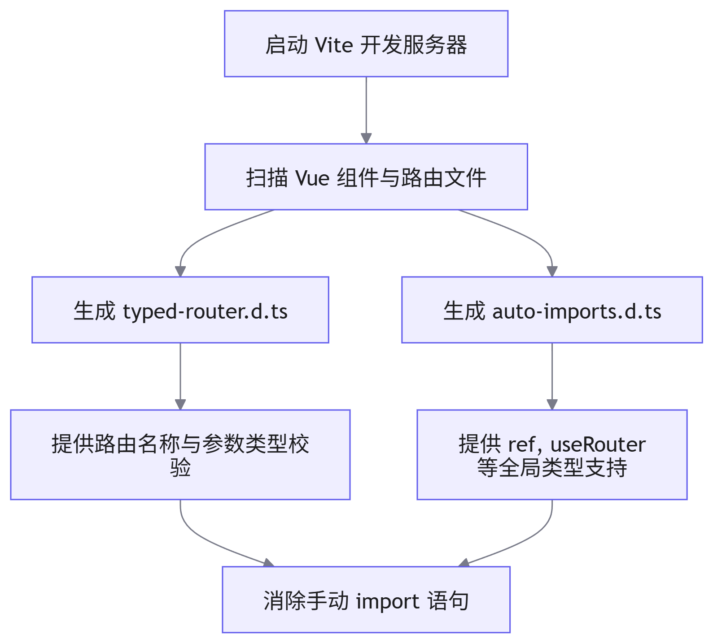

# 自动化路由配置指南

## 概述

在基于 <word text="Vue3" /> 与 <word text="TypeScript" /> 构建的企业级中后台项目中，路由配置的维护成本往往随业务规模的扩张而急剧增加。为提升开发效率并保障类型安全，本项目引入了 <word text="UnpluginVueRouter" /> 插件，实现基于文件系统的自动化路由生成与全局类型推导。本文档详细阐述其配置方案与底层运行机制。

## 核心依赖与配置

### 依赖安装

通过包管理器安装核心插件及路由基础库：

```bash
npm install unplugin-vue-router vue-router @vitejs/plugin-vue
```

### Vite 构建配置

在 `vite.config.ts` 中集成 <word text="UnpluginVueRouter" /> 与 <word text="AutoImport" /> 插件，并配置类型声明文件的生成路径。

```typescript
import Vue from '@vitejs/plugin-vue'
import VueRouter from 'unplugin-vue-router/vite'
import { VueRouterAutoImports } from 'unplugin-vue-router'
import AutoImport from 'unplugin-auto-import/vite'

export default defineConfig(({ mode }) => {
  return {
    plugins: [
      VueRouter({
        extensions: ['.vue', '.md'], // 支持的文件扩展名
        dts: 'src/typed-router.d.ts', // 路由类型声明文件生成路径
      }),
      Vue({
        include: [/\.vue$/, /\.md$/],
      }),
      AutoImport({
        imports: [
          'vue',
          VueRouterAutoImports,
          {
            'vue-router/auto': ['createWebHistory', 'createRouter'],
          },
        ],
        dts: 'src/auto-imports.d.ts', // 自动导入类型声明文件路径
      }),
    ],
  }
})
```

## 目录结构与路由映射

插件会扫描指定目录（默认为 `src/pages`）下的文件结构，并自动将其转换为路由配置。映射规则如下表所示：

| 文件路径                        | 生成路由路径      | 路由名称 (编程式导航) | 参数类型推导            |
| ------------------------------- | ----------------- | --------------------- | ----------------------- |
| `src/pages/index.vue`           | `/`               | `/`                   | 无参数                  |
| `src/pages/about.vue`           | `/about`          | `/about`              | 无参数                  |
| `src/pages/users/index.vue`     | `/users`          | `/users`              | 无参数                  |
| `src/pages/users/[id].vue`      | `/users/:id`      | `/users/[id]`         | `{ id: string }` (必填) |
| `src/pages/users/edit-[id].vue` | `/users/edit/:id` | `/users/edit-[id]`    | `{ id: string }` (必填) |

> [!warning] 注意
> 开发者仅需维护 `.vue` 文件，无需手动编写 `router/index.ts` 中的路由数组。

## 类型声明与自动导入机制

### 路由类型推导

首次启动开发服务器或文件发生变动时，插件会自动生成 `src/typed-router.d.ts` 文件。该文件定义了路由名称到路由信息的精确映射，为 `router.push` 等编程式导航提供严格的类型校验。

```typescript
declare module 'vue-router/auto-routes' {
  import type { RouteRecordInfo } from 'unplugin-vue-router/types'
  export interface RouteNamedMap {
    '/': RouteRecordInfo<'/', '/', Record<never, never>, Record<never, never>>
    '/users/[id]': RouteRecordInfo<
      '/users/[id]',
      '/users/:id',
      { id: string },
      { id?: string }
    >
  }
}
```

### 全局自动导入

结合 <word text="AutoImport" /> 插件，项目会生成 `src/auto-imports.d.ts`，将 <word text="Vue" /> 与 <word text="Vue Router" /> 的核心 <word text="API" /> 注入全局作用域。



**核心优势：**

1. 工程化提效：消除冗余的 `import` 语句与手动路由配置。
2. 类型安全：在 <word text="TypeScript" /> 环境下，路由跳转参数与 <word text="Vue" /> 组合式 <word text="API" /> 均具备完整的类型推导。
3. 低耦合：若需替换底层工具库，仅需调整声明文件配置。