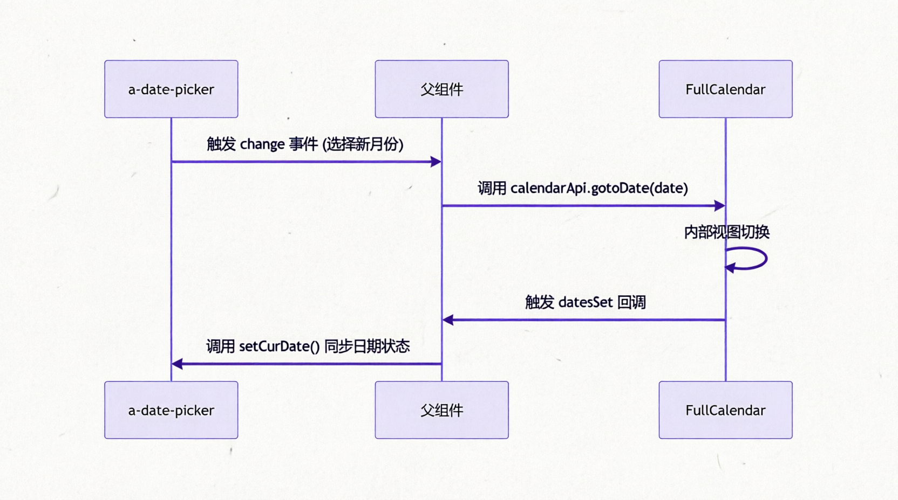

# 基于 FullCalendar 的日程表组件封装与实践

## 概述

在企业级任务管理系统中，日程表是核心交互模块之一。为满足查看当月每日日程、定制化日程样式及日期联动等需求，本项目引入了 <word text="FullCalendar" /> 组件库。本文详细阐述基于 `@fullcalendar/vue3` 的日程表组件封装方案，涵盖插槽定制、数据驱动配置及跨组件联动机制。

## 核心依赖与初始化

### 依赖安装

<word text="FullCalendar" /> 采用模块化设计，需按需引入核心库、视图插件及交互插件。

```bash
pnpm i @fullcalendar/core @fullcalendar/daygrid @fullcalendar/interaction @fullcalendar/vue3
```

### 组件挂载与插槽定制

通过 <word text="FullCalendar" /> 提供的具名插槽，可深度定制"更多日程"提示及单个日程卡片的渲染逻辑。

```vue
<template>
  <FullCalendar
    ref="calendarRef"
    class="demo-app-calendar flex-1 h-0"
    :options="calendarOptions"
  >
    <!-- 定制"还有 X 个日程"的展示 -->
    <template #moreLinkContent="arg">
      <span class="text-major text-12px font-400">
        还有{{ arg.num }}个日程
      </span>
    </template>

    <!-- 定制单个日程卡片的展示 -->
    <template #eventContent="arg">
      <div
        class="event-title flex items-center px-6px truncate hover:opacity-70"
        :style="getEventTitleStyle(arg)"
      >
        <span
          class="border-dot hidden shrink-0 mr-4px"
          :style="{ backgroundColor: arg.event.textColor }"
        />
        <span class="event-label">{{ arg.event.title }}</span>
      </div>
    </template>
  </FullCalendar>
</template>

<script lang="ts" setup>
import FullCalendar from '@fullcalendar/vue3'
// ... 逻辑代码
</script>
```

## 数据驱动与参数配置

日程表的核心在于 `calendarOptions` 的配置。通过 `datesSet` 回调，可实现视图切换时的数据自动拉取与渲染。

### 核心参数矩阵

|     参数名      |        类型        |                           说明                            |
| :-------------: | :----------------: | :-------------------------------------------------------: |
|    `plugins`    |      `Array`       | 启用的插件列表（如 `dayGridPlugin`、`interactionPlugin`） |
|  `initialView`  |      `String`      |        初始视图模式，如 `'dayGridMonth'`（月视图）        |
| `headerToolbar` |      `Object`      |        顶部工具栏配置，设为空对象可隐藏默认工具栏         |
|    `locale`     |      `Object`      |               国际化语言包，如 `zhCnLocale`               |
| `dayMaxEvents`  | `Boolean`/`Number` |           限制单日最大显示事件数，超出部分折叠            |
|   `datesSet`    |     `Function`     |   视图渲染或日期范围变更时触发的回调，用于异步获取数据    |

### 数据获取与事件源注入

在 `datesSet` 中获取当前视图的起止时间，调用接口获取数据后，通过 `addEventSource` 注入事件源。

```typescript
import dayGridPlugin from '@fullcalendar/daygrid'
import interactionPlugin from '@fullcalendar/interaction'
import zhCnLocale from '@fullcalendar/core/locales/zh-cn'
import dayjs from 'dayjs'

const eventColors = ['#158cf5', '#746bec', '#f27e57', '#38c5b4', '#ef4c6c']

const calendarOptions = {
  plugins: [dayGridPlugin, interactionPlugin],
  headerToolbar: { right: '', left: '', center: '' }, // 隐藏默认工具栏
  locale: zhCnLocale,
  initialView: 'dayGridMonth',
  editable: false,
  selectable: false,
  dayMaxEvents: true,
  weekends: true,

  // 自定义事件排序（按时间从新到旧）
  eventOrder(eventA: any, eventB: any) {
    return dayjs(eventB.time).isAfter(dayjs(eventA.time)) ? 1 : -1
  },

  // 视图变更时拉取数据
  async datesSet(info: any) {
    const res = await fetchTaskCalendar({
      startTime: dayjs(info.startStr).format('YYYY-MM-DD'),
      endTime: dayjs(info.endStr).format('YYYY-MM-DD'),
    })

    // 映射数据并分配循环颜色
    const source = res.rows.map((item: any, index: number) => {
      const color = eventColors[index % eventColors.length]
      return {
        ...item,
        textColor: color,
        backgroundColor: `${color}33`,
        borderColor: `${color}33`,
      }
    })

    // 清除旧事件源并注入新数据
    info.view.calendar.getEventSources().forEach((eventSource: any) => {
      eventSource.remove()
    })
    info.view.calendar?.addEventSource(source)

    // 同步外部日期选择器状态
    setCurDate()
  },
}
```

### 跨组件联动：日期选择器

为实现外部 `a-date-picker` 与日程表的双向联动，需通过 `ref` 获取 <word text="FullCalendar" /> 实例并调用其暴露的 <word text="API" />。



### 联动代码实现

```typescript
const calendarRef = ref()
const calendarApi = computed(() => calendarRef.value?.getApi())
const curDate = ref()

// 外部日期选择器变更
function handleDatePickerChange(date: Dayjs) {
  calendarApi.value?.gotoDate(date.toDate())
}

// 内部视图变更同步至外部
function setCurDate() {
  curDate.value = dayjs(calendarApi.value?.getDate())
}
```
