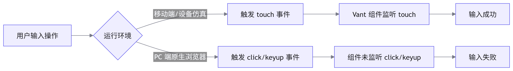

# Vant 数字键盘组件在 PC 端与移动端的兼容性适配

## 概述

在移动端 H5 项目中，验证码输入模块集成了 `Vant` 数字键盘组件。在 PC 端测试环境下，暴露出物理键盘输入失效及虚拟键盘点击无响应的兼容性问题。本文档详述该问题的排查思路与多端适配方案。

## 问题复现

1. 物理键盘失效：在 PC 端使用自带物理键盘输入数字，验证码输入框无响应。
2. 虚拟键盘失效：在 PC 端未开启设备仿真（Device Mode）的情况下，点击 `Vant` 数字键盘的虚拟按键，无法触发输入事件。

## 根因分析



1. 物理键盘失效：验证码输入框仅绑定了 `Vant` 组件的内部事件，未监听原生的 `keyup` 或 `keydown` 事件，导致物理键盘输入无法被捕获。
2. 虚拟键盘失效：`Vant` 数字键盘组件底层依赖 `touchstart`、`touchend` 等移动端触摸事件。在 PC 端未开启设备仿真时，鼠标点击触发的是 `click` 事件，组件未能正确响应。

## 解决方案

1. 物理键盘适配

    为输入框绑定 `keyup` 事件，并过滤非数字字符（`keyCode` 48-57 及小键盘 96-105）。

    ```javascript
    function handlePhysicalKeyboard(event) {
      const { keyCode, key } = event
      // 仅允许数字输入
      if ((keyCode >= 48 && keyCode <= 57) || (keyCode >= 96 && keyCode <= 105)) {
        appendCode(key)
      }
    }
    ```

2. 虚拟键盘兼容

    在 `Vant` 数字键盘的按键元素上，同时绑定 `click` 事件以兼容 PC 端鼠标点击。

    ```vue
    <template>
      <div 
        class="keyboard-key" 
        @touchend.prevent="handleKeyTouch" 
        @click="handleKeyClick"
      >
        {{ key }}
      </div>
    </template>
    ```

## 知识拓展：PC 端与移动端事件映射

| 事件类型                                                                                                                                  | 移动端触发源   | PC 端触发源 | 浏览器映射机制                          |
| :---------------------------------------------------------------------------------------------------------------------------------------- | :------------- | :---------- | :-------------------------------------- |
| `touchstart`                                                                                                                              | 手指触摸屏幕   | 鼠标点击    | 无                                      |
| `touchend`                                                                                                                                | 手指触摸后抬起 | 鼠标点击    | 移动端浏览器会将 `touch` 映射为 `click` |
| `pointerdown`                                                                                                                             | 手指触摸屏幕   | 鼠标点击    | 无                                      |
| `pointerup`                                                                                                                               | 手指触摸后抬起 | 鼠标点击    | click                                   |
| 在跨端组件开发中，建议采用 `pointerdown` / `pointerup` 等 Pointer Events 统一处理交互，或显式绑定 `touch` 与 `click` 事件以保障全平台兼容 |                |             |