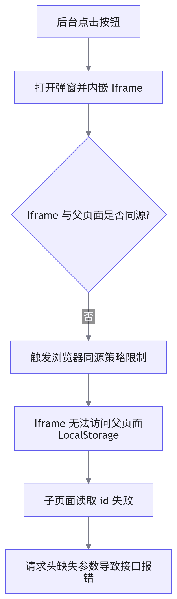

# 移动端跨域 Iframe 本地存储失效问题排查与解决

## 概述

在移动端 H5 项目中，常通过 `Iframe` 嵌入第三方页面或子应用以实现功能解耦。本文档记录在特定跳转场景下，子页面无法读取父页面 `LocalStorage` 数据的异常排查过程及最终解决方案。

## 问题复现

项目支持多种入口跳转（如后台链接直开、小程序跳转、后台弹窗内嵌）。测试反馈：通过后台点击按钮打开弹窗（内嵌 `Iframe`）进入项目时，`URL` 中携带的 `id` 参数正常，但请求头中的 `id` 为空，导致接口请求失败。

## 根因分析



经排查，代码中为支持空间切换，将 `id` 存储于 `LocalStorage` 并在请求拦截器中读取。由于弹窗内的 `Iframe` 与父页面域名不同，触发了浏览器的同源策略（`Same-Origin Policy`），导致跨域 `Iframe` 无法直接操作父页面的 `LocalStorage`。

## 解决方案

废弃通过 `LocalStorage` 传递核心业务参数的方案，改用全局状态管理（如 `Pinia`）或内存变量进行状态同步。

```javascript
// 使用内存变量或 Pinia 存储 id
import { ref } from 'vue'

export const currentId = ref('')

// 请求拦截器中直接读取内存变量
axiosInstance.interceptors.request.use((config) => {
  config.headers['X-Resource-Id'] = currentId.value
  return config
})
```

## 知识拓展：同源策略与隐私保护

| 限制维度                                                                                                                                                                                                                 | 说明                                          |
| ------------------------------------------------------------------------------------------------------------------------------------------------------------------------------------------------------------------------ | --------------------------------------------- |
| 协议                                                                                                                                                                                                                     | `http` 与 `https` 视为不同源                  |
| 域名                                                                                                                                                                                                                     | `a.example.com` 与 `b.example.com` 视为不同源 |
| 端口                                                                                                                                                                                                                     | `80` 与 `8080` 视为不同源                     |
| 现代浏览器出于隐私保护（如防止第三方追踪），对跨域 <word text="LocalStorage" />、Cookie 的读写实施了更严格的隔离（如 `Safari` 的 ITP 机制）。在跨域 `Iframe` 场景中，应优先采用 `postMessage` 或全局状态管理进行数据通信 |                                               |