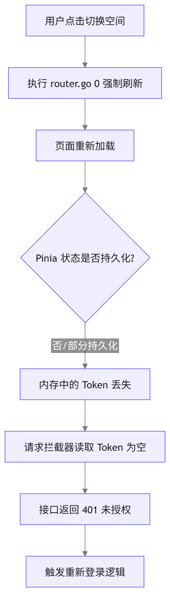

# 移动端空间切换导致 Token 丢失问题排查

## 概述

在移动端 H5 项目中，用户勾选"15天免登录"后，在切换业务空间时偶发 <word text="Token" /> 丢失并要求重新登录的缺陷。本文档剖析该问题的触发机制，并提供基于组件级重载的无刷新解决方案。

## 问题复现

用户登录时勾选免登录，<word text="Token" /> 持久化存储于 <word text="Pinia" /> 及 <word text="LocalStorage" /> 中。当用户在应用内切换空间时，系统触发强制刷新，随后接口请求因缺失 <word text="Token" /> 被拦截，重定向至登录页。

## 根因分析



原代码在切换空间时，采用 `router.go(0)` 强制刷新整个页面以重新初始化数据。由于 <word text="Pinia" /> 中的部分状态（如 <word text="Token" />）仅保存在内存中，未做完整的持久化同步，强制刷新导致内存状态清空，进而引发鉴权失败。

## 解决方案

废弃全局刷新方案，改为通过动态绑定 `:key` 触发目标子组件的销毁与重建，实现局部数据重载。

### 优化前（强制刷新）

```javascript
function switchSpace(spaceId) {
  // 更新全局状态
  store.setSpaceId(spaceId)
  // 强制刷新页面，导致内存状态丢失
  router.go(0)
}
```

### 优化后（组件级重载）

```vue
<template>
  <!-- 绑定动态 key，当 spaceId 变化时触发组件重新挂载 -->
  <WorkspaceContent :key="currentSpaceId" />
</template>

<script setup>
import { computed } from 'vue'
import { useSpaceStore } from '@/store/space'

const store = useSpaceStore()
const currentSpaceId = computed(() => store.spaceId)

function switchSpace(spaceId) {
  // 仅更新状态，不刷新页面
  store.setSpaceId(spaceId)
  // 子组件 WorkspaceContent 监听到 key 变化，自动重新执行 onMounted 拉取新数据
}
</script>
```

## 方案优势

1. 状态保持：避免页面级刷新，<word text="Pinia" /> 内存中的 <word text="Token" /> 等全局状态得以保留。
2. 体验提升：消除白屏等待时间，组件级重载速度远快于整页刷新。
3. 精准控制：通过 `:key` 机制，确保目标组件的生命周期钩子（如 `onMounted`）被准确触发，完成新空间数据的拉取。
