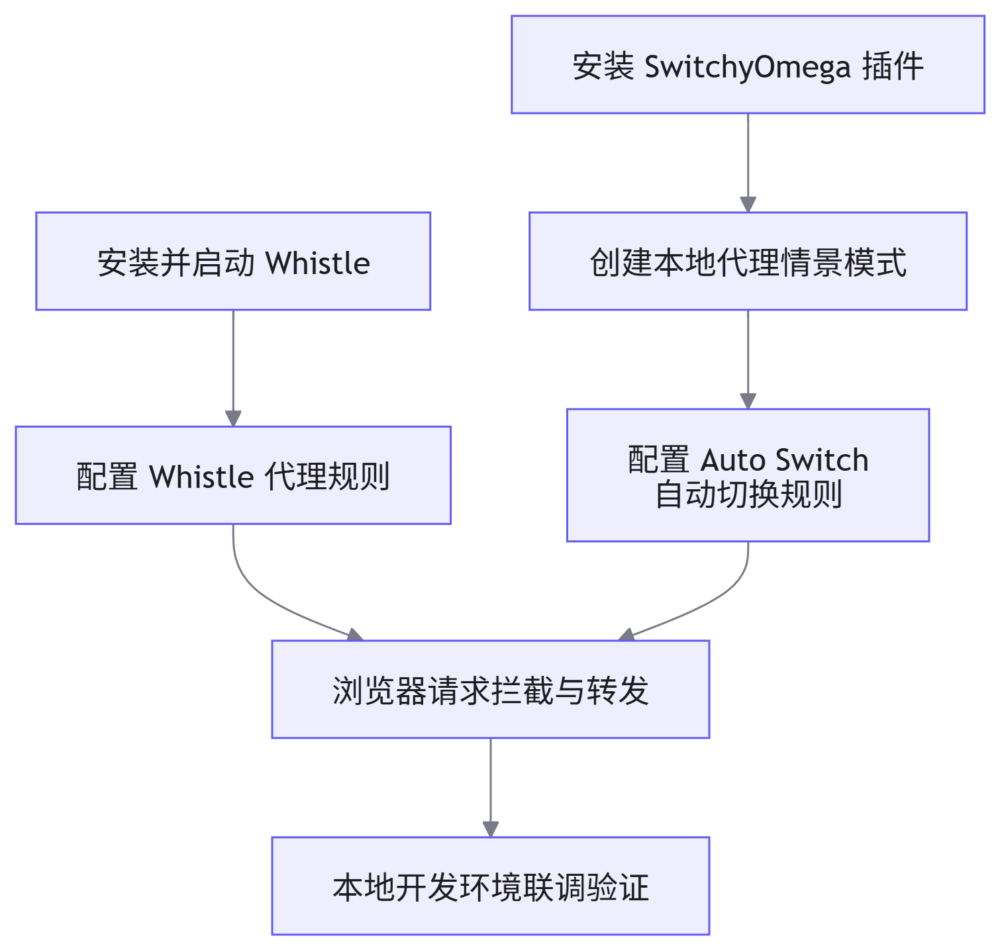

# 代理配置指南

## 概述

在数说项目的实际开发中，通常面临“一套代码，多套环境”的部署需求。例如，项目需同时适配公司内网环境（`xxx.datastory.com`）与客户私有化环境（`yyy.changan.com`）。为提升本地联调效率，需通过本地代理工具将线上域名请求拦截并转发至本地开发服务器（`127.0.0.1`）。本文档详细阐述基于 <word text="Whistle" /> 与 <word text="SwitchyOmega" /> 构建的完整代理配置方案。

## 核心工具介绍

| 工具名称                     | 功能定位                               | 适用场景                                                             |
| :--------------------------- | :------------------------------------- | :------------------------------------------------------------------- |
| <word text="Whistle" />      | 基于 Node.js 的跨平台 Web 调试代理工具 | 配置底层网络请求转发、Mock 数据、修改 <word text="HTTP" /> Header 等 |
| <word text="SwitchyOmega" /> | 浏览器代理管理扩展插件                 | 灵活切换浏览器代理配置，实现特定域名走代理，其余走直连               |

## 代理配置流程




### 步骤一：Whistle 代理规则配置

1. 安装与启动

    通过 <word text="NPM" /> 全局安装并启动 <word text="Whistle" /> 服务。

    ```bash
    # 全局安装 whistle
    npm i -g whistle

    # 启动 whistle 服务
    whistle start
    ```

    启动成功后，访问 `http://127.0.0.1:8899` 即可进入 <word text="Whistle" /> 可视化配置面板。

2. 配置路由转发规则

    在 <word text="Whistle" /> 面板左侧菜单栏选择 `Rules`，配置域名到本地端口的映射规则。假设本地开发服务端口为 `8080`，配置如下：

    ```text
    xxx.datastory.com 127.0.0.1:8080
    yyy.changan.com 127.0.0.1:8080
    ```

> [!warning] 注意
> 若本地项目端口为 `5173` 或其他端口，需同步修改上述规则中的端口号。配置完成后使用 `Ctrl + S` 保存生效。

### 步骤二：SwitchyOmega 浏览器代理配置

1. 安装插件

    前往 Edge/Chrome 浏览器应用商店搜索并安装 `Proxy SwitchyOmega` 扩展。

2. 创建代理情景模式

    1. 点击插件图标进入【选项】页面。
    2. 点击左侧【新建情景模式】，选择【代理服务器】，命名为 `LocalProxy`（或 `127.0.0.1`）。
    3. 配置代理协议为 `http`，代理服务器为 `127.0.0.1`，代理端口为 `8899`（<word text="Whistle" /> 默认端口）。
    4. 点击左侧【应用选项】保存。

3. 配置自动切换规则（Auto Switch）

    1. 选择【auto switch】情景模式。
    2. 点击【添加条件】，条件类型选择【域名通配符】。
    3. 填入需要代理的域名：`xxx.datastory.com` 与 `yyy.changan.com`。
    4. 情景模式选择上一步创建的 `LocalProxy`。
    5. 点击【应用选项】并启用该情景模式。

## 验证与测试

配置完成后，打开浏览器开发者工具的 `Network` 面板，访问目标域名。若请求成功拦截并返回本地开发服务器的响应数据，则证明代理链路配置成功。