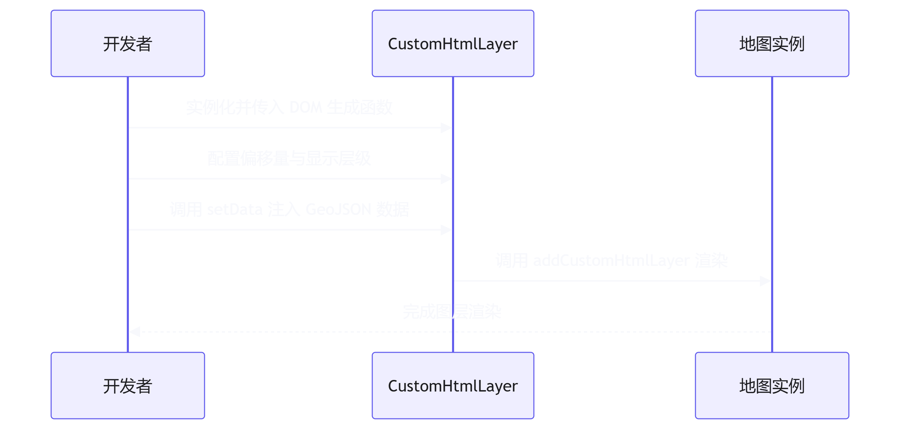

# 大屏覆盖物

## 概述

在百度二维地图（<word text="BMapGL" />）中，扎点、折线、文本等地图元素统称为覆盖物（Overlay）。本文档详细阐述在佛开项目大屏端中，如何高效使用 `Polyline`、`Label` 以及 <word text="CustomHtmlLayer" /> 实现复杂的地图覆盖物渲染。

## 折线覆盖物 (Polyline)

**实现原理**

使用 `Polyline` 类绘制折线，需传入坐标点数组与样式配置对象。

**核心代码**

```javascript
import { onMounted } from 'vue'
import { storeToRefs } from 'pinia'
import useMapStore from '@/store/index.js'

const { map } = storeToRefs(useMapStore())

onMounted(() => {
  const pathData = [
    [[116.404, 39.915], [116.405, 39.916]],
    // 更多路径数据...
  ]

  pathData.forEach((path, index) => {
    // 将二维数组转换为 Point 实例数组
    const points = path.map((coord) => new BMapGL.Point(coord[0], coord[1]))
    
    const polyline = new BMapGL.Polyline(points, {
      strokeColor: 'rgba(134, 255, 0, 0.98)', // 线条颜色
      strokeWeight: 8,                         // 线条宽度
      strokeOpacity: 0.7,                      // 线条透明度
    })
    
    map.value.addOverlay(polyline)
  })
})
```

> [!warning] 注意
> 在遍历数组生成坐标点时，必须使用 map 或 filter 等返回新数组的方法。若使用 forEach，将无法正确传递坐标数组导致报错。

## 文本标注 (Label)

**实现原理**

通过 `Label` 类创建文本标注，支持自定义位置、偏移量及丰富的 <word text="CSS" /> 样式（如内边距、背景色等）。

**核心代码**

```javascript
const point = new BMapGL.Point(116.404, 39.915)
const label = new BMapGL.Label('文本内容', {
  position: point,
  offset: new BMapGL.Size(25, -30), // 偏移量
})

// 设置文本样式
label.setStyle({
  color: '#fff',
  fontSize: '20px',
  backgroundColor: 'rgba(0, 0, 0, 0.6)',
  padding: '4px 8px',
  borderRadius: '4px',
})

map.value.addOverlay(label)
```

## 自定义 HTML 图层

**类方法对比**

百度二维地图提供两种自定义覆盖物方案，其适用场景对比如下：

| 类名                            | 功能描述                         | 适用场景                                                            |
| ------------------------------- | -------------------------------- | ------------------------------------------------------------------- |
| <word text="CustomOverlay" />   | 自定义单个覆盖物                 | 需要高度定制化交互逻辑的单一元素                                    |
| <word text="CustomHtmlLayer" /> | 自定义 <word text="HTML" /> 图层 | 需要批量渲染大量 <word text="DOM" /> 元素（如图标、标签），性能更优 |

**实现流程**



**核心代码**

```javascript
// 1. 实例化自定义图层
const cusLayer = new BMapGL.CustomHtmlLayer(
  () => {
    // 返回需要渲染的 DOM 元素
    const img = document.createElement('img')
    img.style.height = '68px'
    img.style.width = '60px'
    img.src = 'icon_url.png'
    img.draggable = false
    return img
  },
  {
    offsetX: 0,
    offsetY: 0,
    minZoom: 1,
    maxZoom: 100,
    enablePick: true, // 启用拾取（点击事件）
  }
)

// 2. 构造 GeoJSON 数据
const geoData = {
  type: 'FeatureCollection',
  features: [
    {
      type: 'Feature',
      geometry: {
        type: 'Point',
        coordinates: [116.404, 39.915],
      },
      properties: { id: 1 },
    },
  ],
}

// 3. 设置数据并添加到地图
cusLayer.setData(geoData)
map.value.addCustomHtmlLayer(cusLayer)
```
