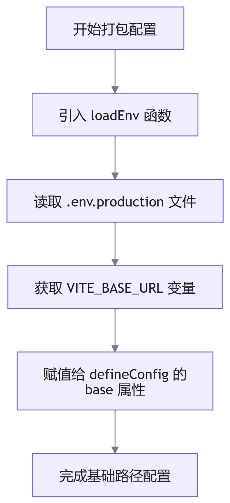

# 项目大屏打包

## 概述

在项目部署阶段，需对构建产物进行打包处理。针对百度地图佛开项目大屏端，路由配置与基础路径（Base URL）的定义是打包流程中的核心环节。本文档详细说明如何通过环境变量与 <word text="Vite" /> 配置实现灵活的路由管理。

## 路由与基础路径配置

### 环境变量定义

为便于后续开发与生产环境的统一维护，将路由基础路径定义在环境变量文件 `.env.production` 中。

```env
# .env.production
VITE_BASE_URL = /output
```
### Vite 配置加载

<word text="Vue3" /> 项目基于 <word text="Vite" /> 构建。在 `vite.config.js` 中，无法直接通过 `import.meta.env` 获取环境变量，需使用 <word text="Vite" /> 提供的 `loadEnv` 函数进行加载。

**配置流程**



**核心代码实现**

```javascript
import { defineConfig, loadEnv } from 'vite'

export default defineConfig(({ mode }) => {
  // 加载当前模式下的环境变量
  const env = loadEnv(mode, process.cwd())
  
  return {
    // 设置应用的基础路径
    base: env.VITE_BASE_URL,
    // 其他配置...
  }
})
```

## 环境变量与配置说明

| 变量/配置名     | 作用域                    | 说明                                                                          |
| :-------------- | :------------------------ | :---------------------------------------------------------------------------- |
| `VITE_BASE_URL` | 客户端/服务端             | 定义应用部署时的基础路由路径，必须以 `VITE_` 开头方可在客户端代码中暴露。     |
| `loadEnv`       | 服务端 (Node.js)          | <word text="Vite" /> 提供的辅助函数，用于解析并加载指定目录下的 `.env` 文件。 |
| `base`          | <word text="Vite" /> 配置 | 指定打包后静态资源与路由的基础公共路径。                                      |