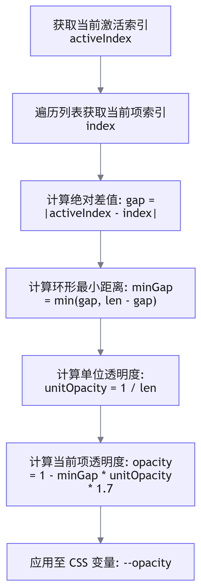

# 3D 路由跳转

## 概述

在百度地图佛开项目大屏端的初期设计中，路由切换采用的是 `element-ui` 的 `tab` 组件。为满足 UI 设计对科幻风格与视觉冲击力的要求，需将传统的平面切换重构为具备 3D 空间旋转与透明度渐变的路由跳转效果。本文档详细阐述基于 <word text="CSS" /> 3D 变换实现该效果的数学模型与代码封装。


## 核心原理分析

实现 3D 路由切换效果，需解决三个核心技术点：激活状态的判定、不透明度的梯度计算、以及 3D 空间旋转角度的映射。

1. 激活状态判定

    通过比对当前路由路径（`router.path`）与配置数组中的 `url` 字段，确定当前处于激活状态的索引（`activeIndex`）。

2. 不透明度梯度计算
    
    激活项保持完全可见（透明度为 1），其余项根据与激活项的索引差值，透明度呈线性递减。

    

3. 3D 旋转角度计算

    利用 <word text="CSS" /> 的 `transform-style: preserve-3d` 属性构建 3D 渲染上下文，通过 `rotateY` 控制各元素在 Y 轴上的旋转角度。角度计算需考虑元素相对于激活项的方位（左侧、右侧、中心），以实现平滑的扇形展开效果。

    | 方位判定  |     计算逻辑      |                         说明                         |
    | :-------: | :---------------: | :--------------------------------------------------: |
    | 中心/远端 | 直接返回基础角度  | 当元素位于正对面或距离激活项过远时，保持基础旋转角度 |
    |   左侧    | 基础角度 + 偏移量 |    根据与激活项的距离，动态增加 Y 轴正向旋转角度     |
    |   右侧    | 基础角度 - 偏移量 |    根据与激活项的距离，动态增加 Y 轴负向旋转角度     |

## 完整代码实现

以下为基于 <word text="Vue3" /> `<script setup>` 语法的完整实现代码，包含模板、逻辑与样式。

```vue
<template>
  <div class="system-entry-box">
    <!-- 3D 透视容器 -->
    <div class="perspective-box">
      <div
        v-for="(el, i) in systemList"
        :key="el.name"
        class="item"
        :class="{ active: el.url && isActive(el) }"
        :style="{
          '--ry': `${getRotateY(i)}Deg`,
          '--opacity': 1 - Math.abs(getGap(activeIndex, i)) * unitOpacity * 1.7,
        }"
      >
        <a
          :href="isActive(el) ? 'javascript:void(0)' : el.url"
          :style="{ transform: `rotateY(${-getRotateY(i) - rotationY}Deg)` }"
        >
          <span>{{ el.name }}</span>
        </a>
      </div>
    </div>
  </div>
</template>

<script setup>
import { ref, computed, watch } from 'vue'
import { useRoute } from 'vue-router'

const props = defineProps({
  systemList: {
    type: Array,
    default: () => [],
  },
})

const route = useRoute()

// 计算单位角度与单位透明度
const unitDeg = computed(() => 360 / (props.systemList.length || 1))
const unitOpacity = computed(() => 1 / (props.systemList.length || 1))

// 计算当前激活项索引
const activeIndex = computed(() => 
  props.systemList?.findIndex?.((el) => el.url && isActive(el)) ?? 0
)

// 整体容器旋转角度
const rotationY = ref(0)
const rotationComputed = computed(() => rotationY.value + 'deg')

// 计算环形最小距离
const getGap = (l, r) => {
  const len = props.systemList.length
  const gap = Math.abs(l - r)
  return Math.min(len - gap, gap)
}

// 判定元素相对激活项的方位
const leftOrRightOrCenter = (activeIdx, idx) => {
  const len = props.systemList.length
  if (Math.abs(getGap(activeIdx, idx)) === len / 2) return 'center'
  if (activeIdx < idx) {
    if (idx - activeIdx < len / 2) return 'right'
  } else if (idx < activeIdx) {
    if (idx + len - activeIdx < len / 2) return 'right'
  }
  return 'left'
}

// 计算单个元素的 Y 轴旋转角度
function getRotateY(i) {
  const len = props.systemList.length
  const l = (len / 2) | 0
  let baseRotation = unitDeg.value * i - 1
  const gap = getGap(activeIndex.value, i)
  const position = leftOrRightOrCenter(activeIndex.value, i)
  const threshold = Math.ceil(l / 2)

  if (position === 'center' || gap === 0 || gap > threshold) {
    return baseRotation
  } else if (position === 'left') {
    const unit = unitDeg.value / (gap + 1)
    return baseRotation + gap * unit
  }
  
  const unit = unitDeg.value / (gap + 1)
  return baseRotation - gap * unit
}

// 判断是否为激活项
function isActive(el) {
  return route.path === el.realUrl || route.path === el.url
}

// 监听激活索引变化，计算整体容器的旋转补偿角度
watch(
  activeIndex,
  (newVal, oldVal = 0) => {
    const len = props.systemList.length
    const gap = getGap(newVal, oldVal)
    const sign = (oldVal + gap) % len === newVal ? -1 : 1
    rotationY.value += sign * unitDeg.value * gap
  },
  { immediate: true }
)
</script>

<style lang="less" scoped>
.system-entry-box {
  width: 966px;
  height: 276px;
  background: url('@/assets/images/entry/bg.png') no-repeat;
  background-size: 100% 149%;
  perspective: 1200px;
  perspective-origin: 48% 0%;
  position: relative;

  .perspective-box {
    width: 100%;
    height: 100%;
    position: absolute;
    left: 0%;
    top: -20%;
    transform-style: preserve-3d;
    transition: transform 1s;
    transform: translateZ(0) rotateY(v-bind(rotationComputed));
  }

  .item {
    position: absolute;
    left: calc(50% - 50px);
    top: 40%;
    display: flex;
    width: 100px;
    height: 100px;
    border-radius: 50%;
    transform-style: preserve-3d;
    transform: rotateY(var(--ry)) translateZ(400px);

    &:hover {
      a {
        opacity: 1;
        margin-top: -50px;
      }
    }

    a {
      width: 100%;
      height: 100%;
      color: #fff;
      display: flex;
      align-items: center;
      justify-content: center;
      font-size: 20px;
      background: url('@/assets/images/entry/sys-bg.png') no-repeat;
      background-size: 100% 100%;
      transition: transform 1s, opacity 1s, margin-top 0.5s;
      opacity: var(--opacity);

      span {
        max-width: 3em;
        max-height: 56px;
        line-height: 24px;