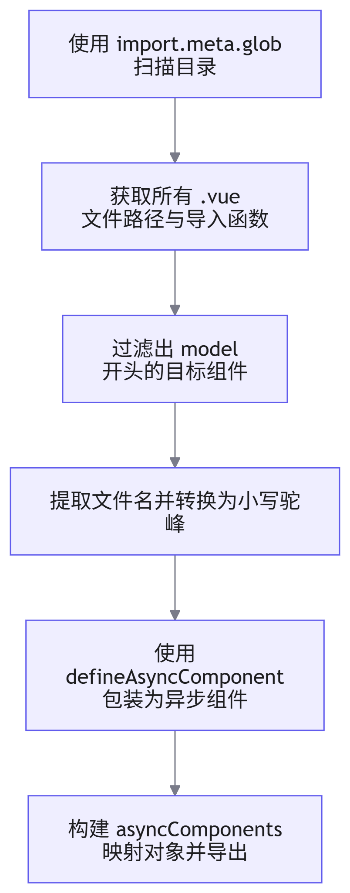
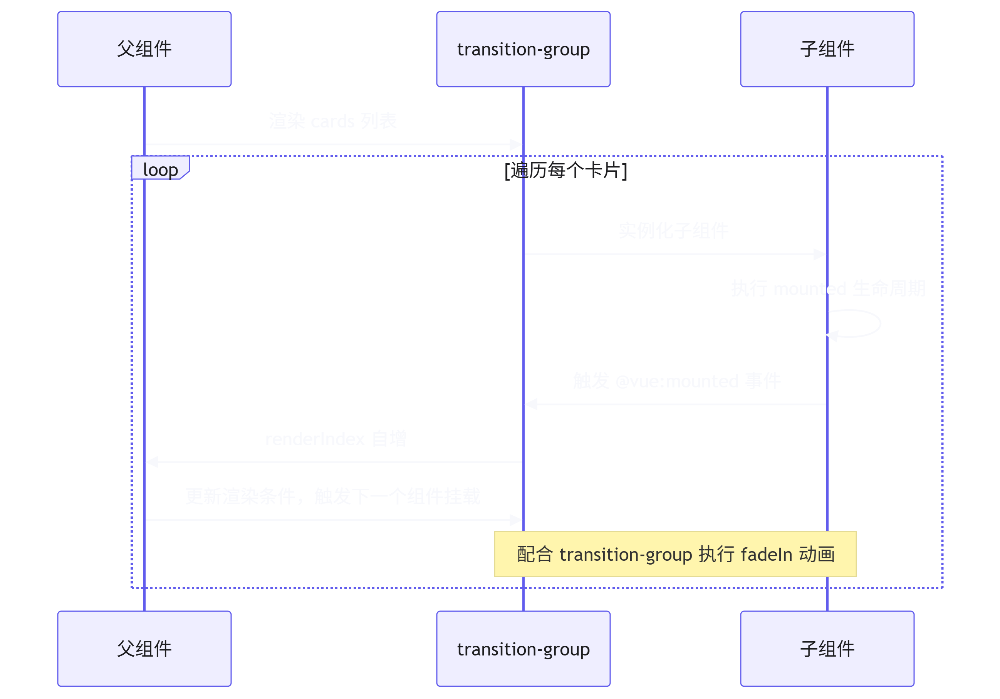

# 子组件动态挂载

## 概述

在复杂的大屏布局中，左右两侧通常包含大量的数据卡片组件。若采用传统的逐个 `import` 导入方式，不仅代码冗余，且不利于后续维护。本文档阐述如何利用 <word text="Vite" /> 的 `import.meta.glob` 与 `defineAsyncComponent` 实现组件的批量导入、字典驱动过滤及动态挂载，并结合生命周期钩子实现优雅的入场动画。

## 批量导入与统一导出

### 实现原理

通过 <word text="Vite" /> 提供的 `import.meta.glob` API 批量获取指定目录下的 `.vue` 文件模块，结合 `defineAsyncComponent` 将其注册为异步组件，最终导出一个以组件名为键的映射对象。



### 核心代码

```javascript
import { defineAsyncComponent } from 'vue'

// 1. 批量导入当前目录下所有 .vue 文件
const routeFiles = import.meta.glob(['./*/*.vue', './*.vue'])
const asyncComponents = {}

// 2. 辅助函数：首字母转小写
const toLowerCase = (s) => s[0].toLowerCase() + s.slice(1)

// 3. 过滤并处理组件
Object.entries(routeFiles)
  .filter(([path]) => path.startsWith('./model'))
  .forEach(([path, component]) => {
    const name = getCardNameByPath(path)
    // 使用 defineAsyncComponent 实现按需加载
    asyncComponents[name] = defineAsyncComponent(component)
  })

// 4. 解析组件名称
function getCardNameByPath(path) {
  const upperName = path.replaceAll(/^\.\/model([^\/]*)(\/.*|\.vue)$/g, '$1')
  return toLowerCase(upperName)
}

export default asyncComponents
```

## 字典驱动与组件过滤

### 配置字典

页面所需组件的布局与顺序由后端接口返回的字典配置决定（此处以本地配置为例）。字典中定义了组件名称、占用网格尺寸及标题等信息。

```javascript
const dict = {
  emquity: {
    left: [
      { component: 'home', size: { x: 1, y: 1 }, name: '索引' },
      { component: 'about', size: { x: 1, y: 1 }, name: '关于' },
      { component: 'info', size: { x: 1, y: 2 }, name: '详情' },
    ],
    right: [
      // 右侧组件配置...
    ],
  },
}
```

### 提取组件数组
通过 `reduce` 方法解析字典路径，获取当前页面特定侧位的组件配置数组，并将其与异步组件映射表结合，生成最终用于渲染的数据源。

```javascript
import asyncComponents from './asyncComponents.js'

// 解析字典路径
function getSys(configKey) {
  return configKey.split('.').reduce((p, c) => p?.[c], dict)
}

const leftCard = getSys('emquity.left')

// 组装渲染数据
const cards = computed(() => {
  return leftCard.map((item) => ({
    ...item,
    asyncComponent: asyncComponents[item.component],
  }))
})
```

## 动态挂载与动画控制

### 动态组件渲染

使用 <word text="Vue3" /> 的 `<component :is="...">` 动态组件标签，结合 `v-for` 遍历渲染卡片列表。

### 逐个挂载动画

为实现组件依次入场的动画效果，利用 `transition-group` 包裹动态组件，并通过监听 `@vue:mounted` 生命周期钩子，控制组件的渲染索引，配合 `Animate.css` 实现淡入效果。



### 核心代码

```vue
<template>
  <transition-group enter-active-class="animate__animated animate__fadeIn">
    <component
      :is="el.asyncComponent"
      v-for="(el, index) in cards"
      :key="el.component"
      v-bind="el"
      v-show="index < renderIndex"
      @vue:mounted="handleMounted"
    />
  </transition-group>
</template>

<script setup>
import { ref, computed } from 'vue'
import useCard from './useCard'

const { cards } = useCard('left')
const renderIndex = ref(0)

// 组件挂载完成后，索引自增，触发下一个组件的渲染
const handleMounted = () => {
  renderIndex.value++
}
</script>
```

## 核心优势总结

1. 工程化与可维护性：通过 `import.meta.glob` 实现组件的自动发现与注册，新增卡片组件无需手动修改导入逻辑。
2. 性能优化：结合 `defineAsyncComponent` 实现组件级别的代码分割与按需加载，降低首屏渲染压力。
3. 数据驱动：组件的布局与显隐完全由字典数据驱动，具备极高的灵活性与可扩展性。
4. 交互体验：通过生命周期钩子精准控制渲染时序，实现平滑的逐个入场动画，提升大屏视觉表现力。