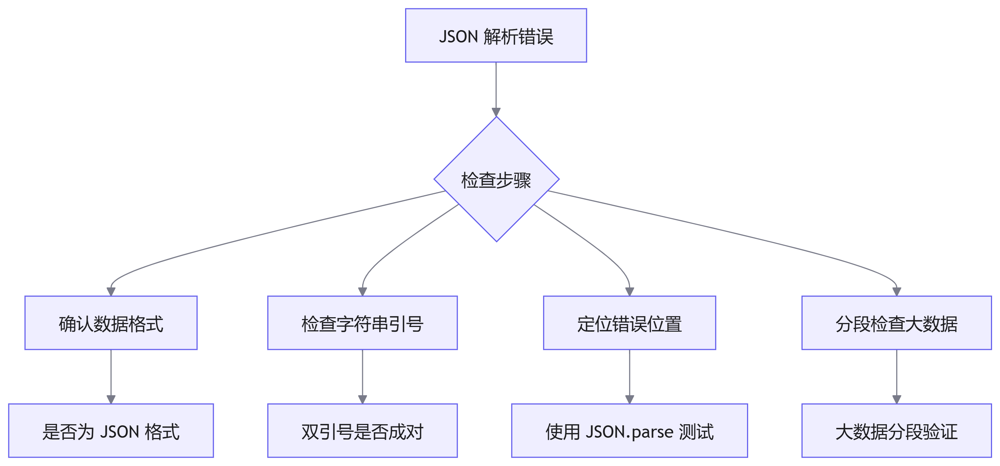
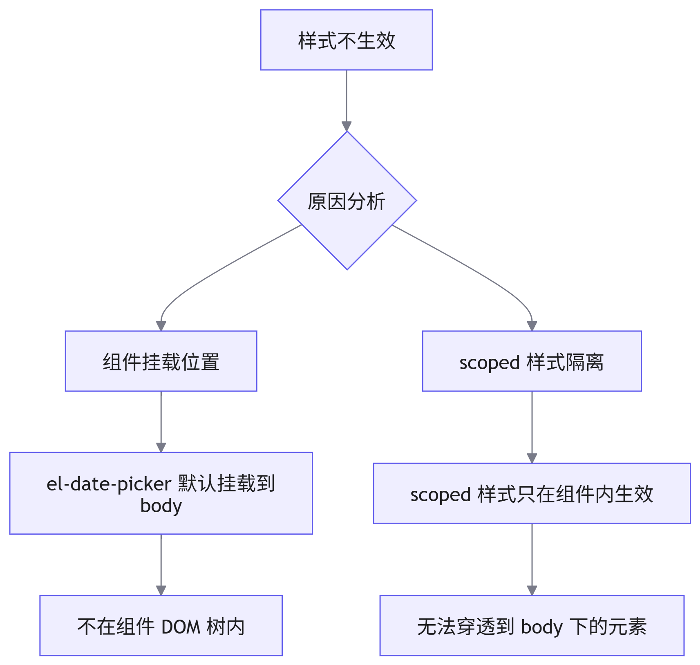
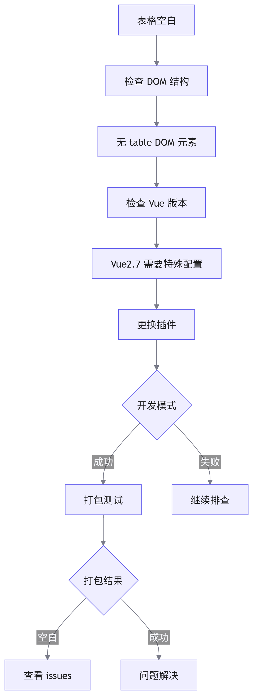
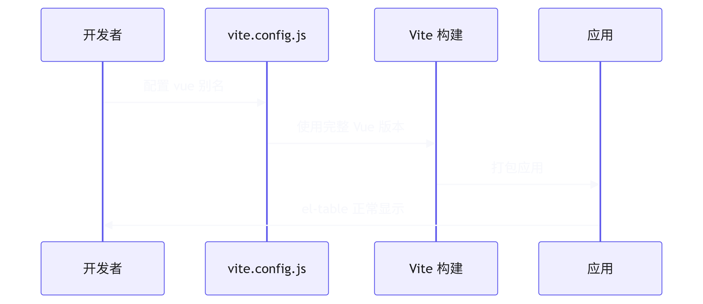
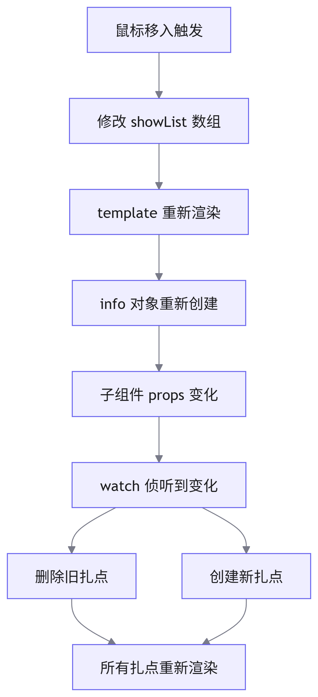
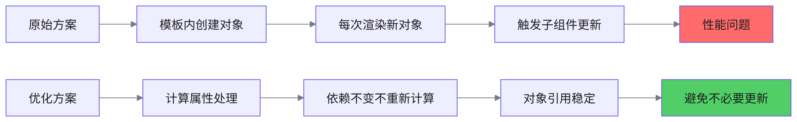

# BUG 修改与记录

## JSON 相关错误

### 错误信息

```
Uncaught (in promise) SyntaxError: Unterminated string in JSON at position 204800 (line 1 column 204801)
```

### 错误原因分析

这个错误通常表示在解析 <word text="JSON" /> 数据时出现了语法错误。具体来说：

- 错误类型：未结束的字符串（`Unterminated string`）
- 错误位置：第 1 行第 204801 列（`position 204800`）



### 排查步骤

1. 确认数据格式

    首先需要确定你正在处理的是 <word text="JSON" /> 格式的数据。

2. 检查字符串引号

    检查 <word text="JSON" /> 字符串是否正确格式化，确保所有双引号都有成对出现。

    常见问题：

         - 字符串中包含未转义的双引号
         - 字符串中包含了非法字符
         - 字符串末尾缺少结束引号

3. 使用控制台调试

    ```javascript
    // 1. 打开浏览器的开发者工具，切换到"控制台"选项卡

    // 2. 复制出现错误的JSON字符串
    const yourJsonString = '...' // 粘贴你的JSON字符串

    // 3. 在控制台中尝试解析
    try {
      JSON.parse(yourJsonString)
      console.log('JSON 格式正确')
    } catch (error) {
      console.error('JSON 解析错误:', error.message)
      console.error('错误位置:', error.message.match(/position (\d+)/)?.[1])
    }
    ```

4. 定位错误位置

    根据错误信息提供的位置，检查 <word text="JSON" /> 字符串中的该位置：

    ```javascript
    // 获取错误位置附近的字符串
    const errorPosition = 204800
    const contextLength = 100

    const start = Math.max(0, errorPosition - contextLength)
    const end = Math.min(yourJsonString.length, errorPosition + contextLength)

    console.log('错误位置附近的字符串:')
    console.log(yourJsonString.substring(start, end))
    ```

5. 分段检查大数据

    如果 <word text="JSON" /> 数据太大，可能需要分段检查：

    ```javascript
    // 分段检查函数
    const checkJsonInChunks = (jsonString, chunkSize = 10000) => {
      for (let i = 0; i < jsonString.length; i += chunkSize) {
        const chunk = jsonString.substring(i, i + chunkSize)
        try {
          // 尝试解析片段（注意：这只是语法检查）
          JSON.parse(`[${chunk}]`)
          console.log(`片段 ${i}-${i + chunkSize} 正常`)
        } catch (error) {
          console.error(`片段 ${i}-${i + chunkSize} 错误:`, error.message)
          return i
        }
      }
      return -1
    }
    ```

### 最终解决方案

问题根源：后端返回的数据是数组转 <word text="JSON" /> 格式时出现了错误

解决方案：

1. 等待后端修复，返回正确的 <word text="JSON" /> 格式数据
2. 在前端增加数据验证机制
3. 添加错误处理和降级方案

```javascript
// 前端增加数据验证
const validateAndParseJSON = (data) => {
  try {
    const parsed = JSON.parse(data)
    return { success: true, data: parsed }
  } catch (error) {
    console.error('JSON 解析失败:', error.message)
    
    // 尝试修复常见错误
    const fixedData = attemptFixJSON(data)
    if (fixedData) {
      try {
        return { success: true, data: JSON.parse(fixedData), warning: '已自动修复' }
      } catch (e) {
        return { success: false, error: '无法修复 JSON 错误' }
      }
    }
    
    return { success: false, error: error.message }
  }
}

// 尝试修复常见 JSON 错误
const attemptFixJSON = (data) => {
  // 修复未转义的双引号
  // 修复缺失的逗号
  // 修复尾部逗号
  return data
    .replace(/,\s*}/g, '}')  // 删除对象尾部逗号
    .replace(/,\s*]/g, ']')  // 删除数组尾部逗号
}
```

## 组件库相关问题

### 问题一：时间筛选组件样式修改不生效

**问题描述**

在开发时，引用了 <word text="element-ui" /> 的时间筛选组件 `el-date-picker`，在给下面的时间筛选部分通过 `deep` 穿透设置样式时未生效。

**问题原因**



**核心原因：**

1. `el-date-picker` 组件默认是设置在 `body` 下，而非组件内
2. 组件样式做了 `scoped` 防污染后，样式只在该组件内生效
3. 因此无论怎么使用 `deep` 调试都不生效

**官方文档说明**

<word text="element-ui" /> 官方文档明确指出：日期选择器的下拉面板默认会被追加到 `body` 元素下。

**解决方案**

1. 设置 `append-to-body` 为 `false`

    ```vue
    <template>
      <el-date-picker
        v-model="value"
        :append-to-body="false"
        type="date"
        placeholder="选择日期"
      >
      </el-date-picker>
    </template>

    <style scoped>
    /* 现在样式可以生效了 */
    ::v-deep .el-date-picker__panel {
      background-color: #f0f0f0;
    }
    </style>
    ```

2. 使用全局样式

    ```vue
    <template>
      <el-date-picker
        v-model="value"
        type="date"
        placeholder="选择日期"
      >
      </el-date-picker>
    </template>

    <style>
    /* 不使用 scoped，全局样式可以生效 */
    .el-date-picker__panel {
      background-color: #f0f0f0;
    }
    </style>
    ```

3. 使用自定义类名

    ```vue
    <template>
      <el-date-picker
        v-model="value"
        popper-class="custom-date-picker"
        type="date"
        placeholder="选择日期"
      >
      </el-date-picker>
    </template>

    <style>
    /* 通过 popper-class 设置自定义类名 */
    .custom-date-picker {
      background-color: #f0f0f0;
    }
    </style>
    ```

**对比说明**

| 方法                     | 优点         | 缺点             | 适用场景       |
| ------------------------ | ------------ | ---------------- | -------------- |
| `append-to-body="false"` | 样式容易控制 | 可能被父元素裁剪 | 父容器空间充足 |
| 全局样式                 | 全局统一样式 | 可能影响其他组件 | 简单直接       |
| 自定义类名               | 精准控制     | 需要额外类名     | 推荐方案       |

### 问题二：vite-plugin-vue2 导致 el-table 等组件不生效

**问题描述**

在开发时发现表格位置空白，无表格 <word text="DOM" /> 组件。

技术栈：

- <word text="Vite" />
- <word text="Vue2.7" />
- `element-ui 2.15.10`
- `vite-plugin-vue2`

**问题排查**



**第一次尝试：更换插件**

查看 <word text="Vite" /> 官网发现 <word text="Vue2.7" /> 有单独的支持包。

官方文档：[Vite Vue 插件](https://cn.vitejs.dev/guide/features?spm=a2ty_o01.29997173.0.0.793e55fb4j5jJ1#vue)

- 修改前：

    ```javascript
    // vite.config.js
    import { createVuePlugin } from 'vite-plugin-vue2'

    export default {
      plugins: [
        createVuePlugin(),
      ],
    }
    ```

- 修改后：

    ```javascript
    // vite.config.js
    import vue from '@vitejs/plugin-vue2'

    export default {
      plugins: [
        vue(),
      ],
    }
    ```

**结果：**开发模式有效果了，但是打包后还是空白。

第二次尝试查看 `issues`，查看 `vite-plugin-vue2` 的 `issues` 发现有相关问题 [vite-plugin-vue2 does not support some components of ElementUI](https://github.com/vitejs/vite-plugin-vue2/issues/16?spm=a2ty_o01.29997173.0.0.793e55fb4j5jJ1)

问题原因：某些 <word text="Element UI" /> 组件需要完整的 <word text="Vue" /> 运行时版本，而不是仅包含编译器的版本。

**最终解决方案**

在 `vite.config.js` 中配置别名，使用完整的 <word text="Vue" /> 版本：

```javascript
// vite.config.js
import { defineConfig } from 'vite'
import vue from '@vitejs/plugin-vue2'
import { fileURLToPath } from 'url'

export default defineConfig({
  plugins: [vue()],
  
  resolve: {
    alias: {
      // 使用完整的 Vue 运行时版本
      vue: 'vue/dist/vue.esm.js',
      
      // 其他别名配置
      '@': fileURLToPath(new URL('./src', import.meta.url)),
    },
  },
  
  // 其他配置...
})
```

**配置说明**

|配置项|说明|
|`vue: 'vue/dist/vue.esm.js'`|使用包含编译器和运行时的完整版本|
|`@vitejs/plugin-vue2`|Vue2.7 专用的 Vite 插件|

**验证步骤**



## Vue 相关问题

### 问题：变量修改导致的组件更新导致了扎点重新渲染

**场景描述**

一个父组件引用了公共扎点子组件，在地图上渲染扎点。

**原始代码**

```vue
<template>
  <marker-dom
    v-for="(item, index) in list"
    :key="item.id"
    :info="{
      ...item,
      position: [item.lng, item.lat],
      name: item.name,
      onClickCallback: () => clickCallbackFn(item),
      onMouseenterCallback: () => mouseenterCallbackFn(index),
      onMouseleaveCallback: () => mouseleaveCallbackFn(index),
    }"
  >
    <div v-show="showList[index]"> ... </div>
  </marker-dom>
</template>

<script>
export default {
  setup() {
    const showList = ref([])
    
    const mouseenterCallbackFn = (index) => {
      set(showList.value, index, true)
    }
    
    const mouseleaveCallbackFn = (index) => {
      set(showList.value, index, false)
    }
    
    return {
      showList,
      mouseleaveCallbackFn,
      mouseenterCallbackFn,
    }
  },
}
</script>
```

**问题分析**



**现象**：

1. 鼠标移入展示了卡片
2. 页面上的扎点全部都重新渲染了一遍
3. 不触发鼠标移出方法

**排查过程**：

1. 检查子组件渲染触发点

    - `onMounted`：生命周期只触发一次，排除
    - `watch`：侦听 `props.info`，发现被触发

2. 查看 `watch` 代码

    ```javascript
    watch(
      () => props.info,
      (_, { name }) => {
        removeIcon(name)  // 删除旧扎点
        addIcon()         // 新建新扎点
      },
      { deep: true }
    )
    ```

3. 打印 `props.info`

    - 控制台有相关打印
    - 判断是子组件侦听到数据发生改变，因此重新渲染扎点图标

4. 核心问题

    - 父组件并没有修改 `list` 数组
    - `info` 内的数据不应该被变动
    - 但每次模板重新渲染，都会创建一个新的对象

**根本原因：**

> 修改了组件内的变量会让 `template` 重新加载一次。由于 `info` 变量是在 `template` 内直接设置的对象字面量，因此每次重新加载，都会赋一个新的对象过去。子组件侦听到是新对象（引用变化）就会触发。

**解决方案**

使用计算属性格式化数据，这样数据不变动就不会触发子组件的侦听器。

**优化后的代码：**

```vue
<template>
  <marker-dom
    v-for="(item, index) in markerList"
    :key="item.id"
    :info="item"
  >
    <div v-show="showList[index]">...</div>
  </marker-dom>
</template>

<script>
import { ref, computed } from 'vue'

export default {
  setup() {
    const list = ref([...])  // 原始数据
    const showList = ref([])
    
    // 使用计算属性缓存处理后的数据
    const markerList = computed(() => {
      return list.value.map((item, index) => ({
        ...item,
        position: [item.lng, item.lat],
        name: item.name,
        onClickCallback: () => clickCallbackFn(item),
        onMouseenterCallback: () => mouseenterCallbackFn(index),
        onMouseleaveCallback: () => mouseleaveCallbackFn(index),
      }))
    })
    
    const clickCallbackFn = (item) => {
      // 处理点击
    }
    
    const mouseenterCallbackFn = (index) => {
      set(showList.value, index, true)
    }
    
    const mouseleaveCallbackFn = (index) => {
      set(showList.value, index, false)
    }
    
    return {
      showList,
      markerList,
      mouseleaveCallbackFn,
      mouseenterCallbackFn,
    }
  },
}
</script>
```

**优化对比**



| 方案     | 对象创建时机 | 引用稳定性       | 性能影响       |
| -------- | ------------ | ---------------- | -------------- |
| 原始方案 | 每次模板渲染 | 不稳定（新对象） | 高（频繁更新） |
| 优化方案 | 依赖变化时   | 稳定（缓存）     | 低（按需更新） |

**关键知识点**

1. 计算属性的缓存特性

    - 计算属性会基于响应式依赖进行缓存
    - 只有在相关依赖发生改变时才会重新求值
    - 这意味只要 `list` 没有变化，`markerList` 就会返回之前的执行结果

2. 对象引用稳定性

    - 模板内直接创建对象字面量，每次渲染都会创建新对象
    - 计算属性返回的对象在依赖不变时保持引用稳定

3. 子组件更新触发条件

    - 浅层比较：对象引用变化
    - 深层比较：对象内部属性变化（需要 `deep: true`）

**最佳实践建议**

```javascript
// ✅ 推荐：使用计算属性
const processedData = computed(() => {
  return rawData.value.map(item => ({
    ...item,
    computedField: item.a + item.b,
  }))
})

// ❌ 不推荐：在模板中直接处理
// <child :data="rawData.map(item => ({ ...item }))" />

// ✅ 推荐：复杂处理使用方法
const processItem = (item) => {
  // 复杂逻辑
  return processedItem
}

const markerList = computed(() => {
  return list.value.map(processItem)
})
```
