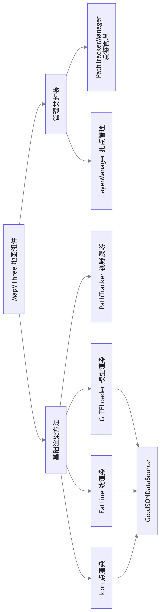
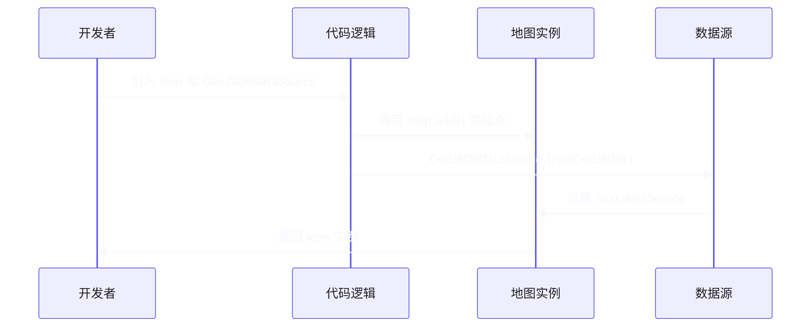
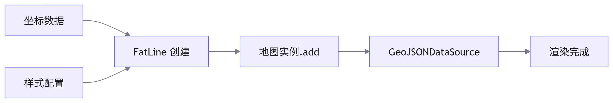
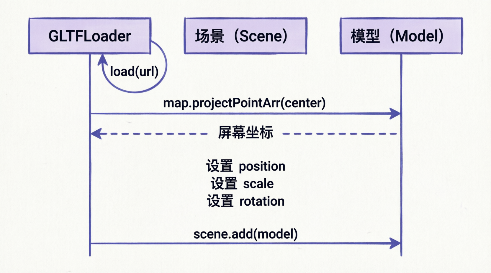
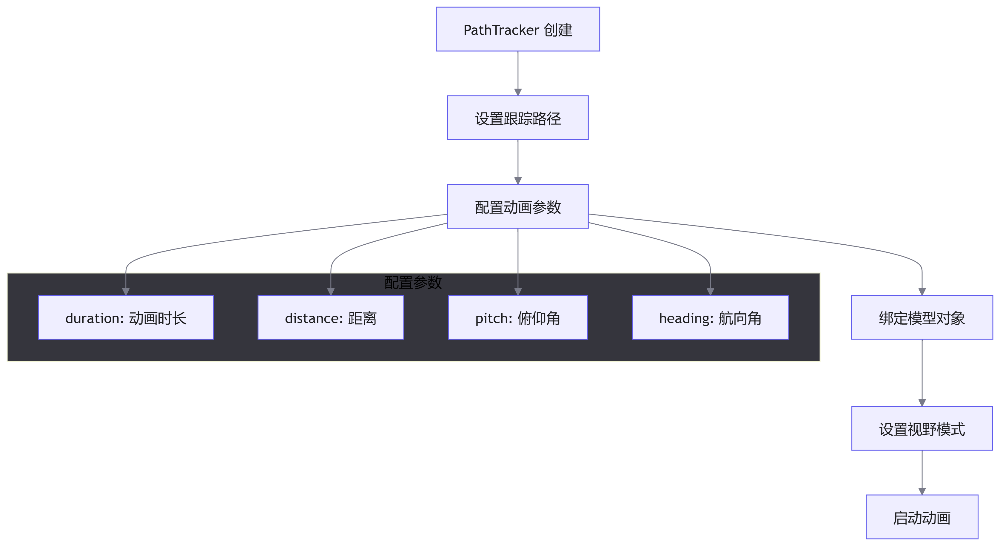
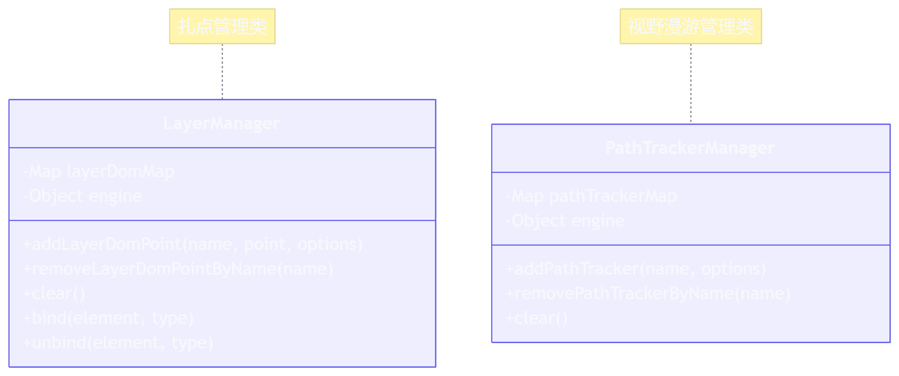
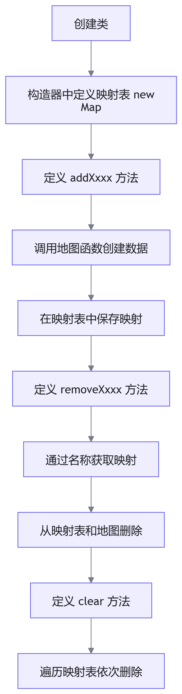
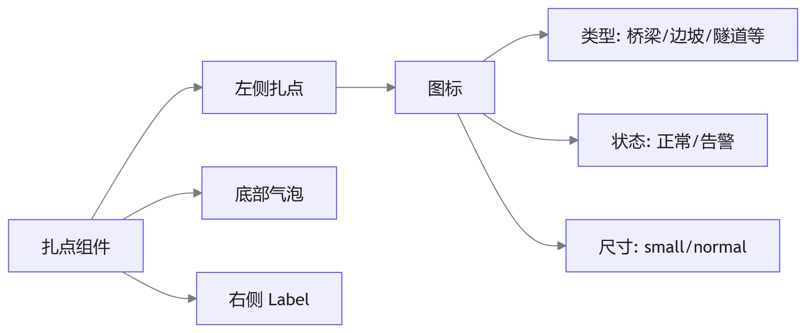
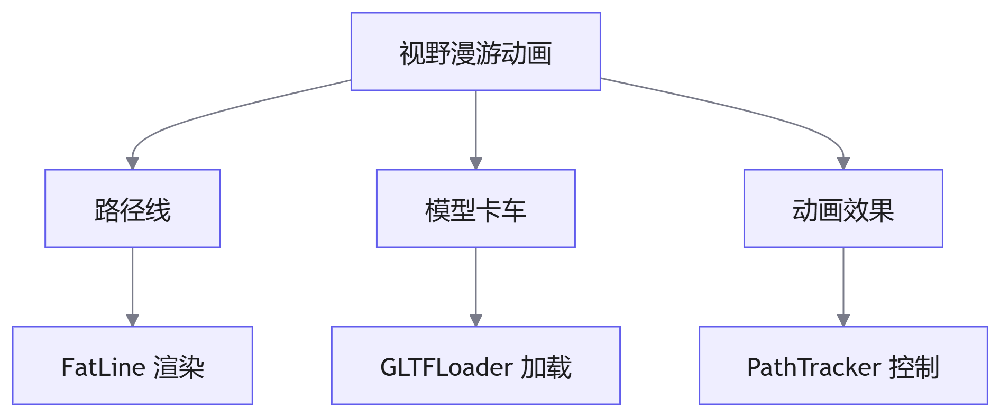
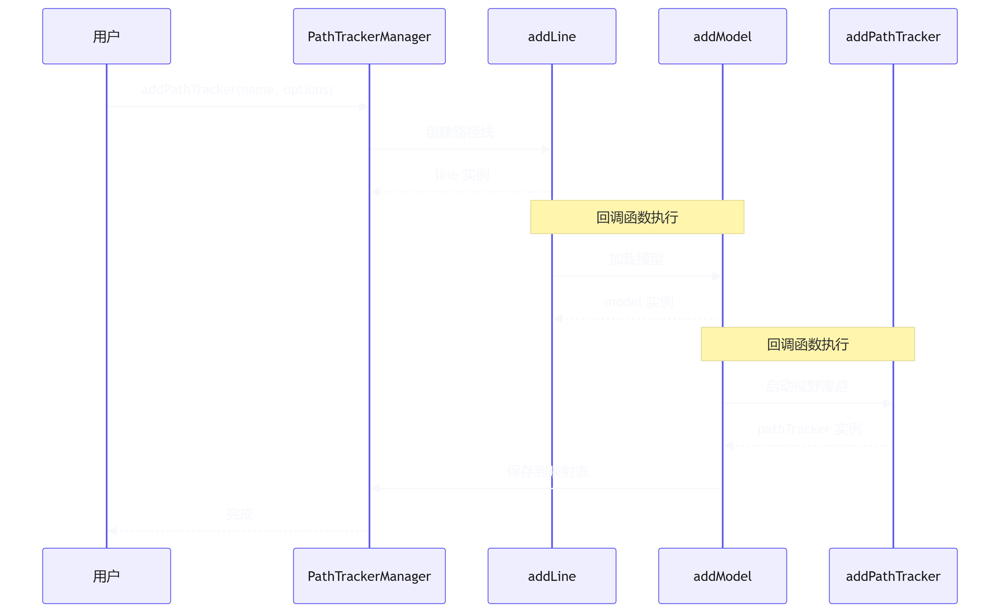

# MapVThree 地图组件

## MapVThree 简介

<word text="MapVThree" /> 是百度地图官方的三维可视化库，用于在百度地图上实现三维数据可视化。

官方文档：[Mapvthree 开发文档](https://lbsyun.baidu.com/docs/jsapi?title=jsapithree/index)

由于地图方法在每个图层都要使用，因此需要统一封装成公共方法，通过传值的形式设置不同的属性。

### 技术架构图



### 地图方法封装

#### 点的封装

**实现原理**

根据官方文档，渲染点需要完成以下步骤：



**核心步骤**

1. 引入必要方法

    - `Icon`：用于创建点标记
    - `GeoJSONDataSource`：将数据转换为渲染所需的数据源

2. 添加点到地图

    - 调用地图实例的 `add()` 方法
    - 传参：宽度、高度、偏移量等

3. 获取数据源

    - 调用 `GeoJSONDataSource` 方法
    - 入参可通过 F12 打开网络控制台查看

4. 删除点

    - 调用地图实例的 `remove()` 方法

**数据结构示例**

```javascript
// GeoJSON 数据结构
const geoData = [
  {
    type: 'Feature',
    geometry: {
      type: 'Point',
      coordinates: [lng, lat, altitude], // 坐标
    },
    properties: {
      icon: url,        // 图标图片路径
      size: 40,         // 尺寸大小
    },
  },
]
```

**代码实现**

```javascript
/**
 * 添加图标点
 * @param {Array} coordinates - 坐标数组 [lng, lat, altitude]
 * @param {String} url - 图标图片路径
 * @param {Object} info - 配置信息
 * @returns {Object} { icon, _engine }
 */
export const addIcon = (coordinates, url, info) => {
  // 确保坐标数组完整性
  coordinates = [coordinates?.[0], coordinates?.[1], coordinates?.[2] || 0]
  
  const {
    width = 92,
    height = 118,
    offset = [0, -50],
    geoData = [
      {
        type: 'Feature',
        geometry: {
          type: 'Point',
          coordinates: coordinates,
        },
        properties: {
          icon: url,
          size: 40,
        },
      },
    ],
    _engine = engine.value,
  } = info || {}
  
  // 创建 Icon 实例
  const icon = _engine.add(
    new Icon({
      width,
      height,
      vertexSizes: true,
      vertexIcons: true,
      transparent: true,
      offset,
      depthTest: false, // 深度检测
    })
  )
  
  // 加载数据源
  GeoJSONDataSource.fromGeoJSON(geoData).then((data) => {
    data.setAttribute('size').setAttribute('icon')
    icon.dataSource = data
  })
  
  return {
    icon,
    _engine,
  }
}

/**
 * 删除图标点
 * @param {Object} icon - 图标实例
 * @param {Object} _engine - 地图引擎实例
 */
export const removeIcon = (icon, _engine = engine.value) => {
  icon && _engine.remove(icon)
}
```

**参数说明表**

| 参数名        | 类型    | 默认值   | 说明             |
| ------------- | ------- | -------- | ---------------- |
| `width`       | Number  | 92       | 图标宽度（像素） |
| `height`      | Number  | 118      | 图标高度（像素） |
| `offset`      | Array   | [0, -50] | 偏移量           |
| `vertexSizes` | Boolean | true     | 顶点大小         |
| `vertexIcons` | Boolean | true     | 顶点图标         |
| `transparent` | Boolean | true     | 是否透明         |
| `depthTest`   | Boolean | false    | 深度检测         |

#### 线的封装

**实现原理**

渲染线的流程与点类似，但使用的是 `FatLine` 方法。



**核心步骤**

1. 引入必要方法

    - `FatLine`：用于创建线
    - `GeoJSONDataSource`：转换数据源

2. 添加线到地图

    - 调用地图实例的 `add()` 方法
    - 传参：线宽、线的颜色、线的坐标等

3. 获取数据源

    - 调用 `GeoJSONDataSource` 方法

4. 删除线

    - 调用地图实例的 `remove()` 方法

**代码实现**

```javascript
/**
 * 添加线
 * @param {Array} coordinates - 坐标二维数组
 * @param {Object} info - 配置信息
 * @param {Object} _engine - 地图引擎实例
 * @param {Function} callback - 回调函数
 * @returns {Object} { line, _engine }
 */
export const addLine = (coordinates, info, _engine, callback) => {
  if (!_engine) _engine = engine.value
  
  const { lineWidth, color, opacity } = info || {}
  
  // 创建 FatLine 实例
  const line = _engine.add(
    new FatLine({
      vertexColors: true,
      lineWidth,
      opacity,
      keepSize: true,
      lineJoin: 'round',
    })
  )
  
  // 构建 GeoJSON 数据
  const geojson = {
    type: 'Feature',
    geometry: {
      type: 'LineString',
      coordinates,
    },
    properties: {
      color: color,
    },
  }
  
  // 加载数据源
  GeoJSONDataSource.fromGeoJSON(geojson).then((geoData) => {
    geoData.setAttribute('color')
    line.dataSource = geoData
    callback && callback(geojson)
  })
  
  return { line, _engine }
}

/**
 * 删除线
 * @param {Object} line - 线实例
 * @param {Object} _engine - 地图引擎实例
 */
export const removeLine = (line, _engine = engine.value) => {
  line && _engine.remove(line)
}
```

**配置参数**

```javascript
// 线的配置示例
const lineConfig = {
  lineWidth: 15,          // 线宽
  color: '#d0a63c',       // 线的颜色
  opacity: 1,             // 透明度
  vertexColors: true,     // 顶点颜色
  keepSize: true,         // 保持大小
  lineJoin: 'round',      // 线条连接方式
}
```

#### 模型的封装

**实现原理**

使用 `GLTFLoader` 加载三维模型，并通过地图实例添加到场景中。



**核心步骤**

1. 加载模型

    - 使用 `GLTFLoader` 进行模型加载

2. 添加到场景

    - 通过地图实例的 `add()` 方法添加到场景

3. 设置位置

    - 使用 `map.projectPointArr(center)` 获取屏幕中心点坐标
    - 设置模型的 `position`

4. load 回调

    - 获取模型数据
    - 设置坐标和大小

5. 删除模型

    - 使用地图实例的 `remove()` 方法移除

**代码实现**

```javascript
/**
 * 添加模型
 * @param {String} url - 模型文件路径
 * @param {Array} position - 位置坐标 [lng, lat]
 * @param {Number} scale - 缩放比例
 * @param {Function} callback - 加载完成回调
 */
export const addModel = (
  url = 'maplayer/assets/models/car-impact.glb',
  position,
  scale = 7,
  callback
) => {
  const loader = new GLTFLoader()
  
  // 将经纬度转换为屏幕坐标
  const point = engine.value.map.projectPointArr(position)
  
  let model = null
  
  loader.load(url, (gltf) => {
    model = gltf.scene
    
    // 设置模型位置
    model.position.set(point[0], point[1], 0)
    
    // 设置模型缩放
    model.scale.setScalar(scale)
    
    // 设置模型旋转（X轴旋转90度）
    model.rotation.x = Math.PI / 2
    
    // 添加到场景
    engine.value.add(model)
    
    callback && callback(model)
  })
}

/**
 * 删除模型
 * @param {Object} model - 模型实例
 */
export const removeModel = (model) => {
  model && engine.value.remove(model)
}
```

**模型变换说明**

| 变换类型 |               方法               |               说明                |
| :------: | :------------------------------: | :-------------------------------: |
|   位置   |  `model.position.set(x, y, z)`   |      设置模型在场景中的位置       |
|   缩放   |  `model.scale.setScalar(value)`  |           统一缩放模型            |
|   旋转   | `model.rotation.x = Math.PI / 2` | 绕X轴旋转90度（GLTF模型通常需要） |

#### 视野漫游动画封装

**实现原理**

使用 `PathTracker` 实现相机沿路径移动的动画效果。



**核心步骤**

1. 引入方法

    - `PathTracker`：实现视野漫游动画

2. 添加到地图

    - 调用地图实例的 `add()` 方法

3. 配置参数

    - 设置方向插值的距离点阈值
    - 赋值跟踪的路线和模型
    - 设置视野漫游类型
    - 开启动画

4. 删除动画

    - 调用地图实例的 `remove()` 方法

**代码实现**

```javascript
/**
 * 添加视野漫游动画
 * @param {Object} options - 配置选项
 * @returns {Object} { pathTracker, _engine }
 */
export const addPathTracker = (options) => {
  const {
    viewMode = 'unlock',      // 视野模式
    positions,                // 路径坐标数组
    model,                    // 跟踪的模型
    duration = 10000,         // 动画时长（毫秒）
    distance = 50,            // 距离
    pitch = 70,               // 俯仰角
    _engine = engine.value,
  } = options
  
  // 创建 PathTracker 实例
  const pathTracker = _engine.add(new PathTracker())
  
  // 设置方向插值阈值
  pathTracker.interpolateDirectThreshold = 50
  
  // 设置跟踪路径（坐标数组或 LineString 类型的 geojson 数据）
  pathTracker.track = positions
  
  // 启动动画
  pathTracker.start({
    duration,
    distance,
    pitch,
    heading: 10,
  })
  
  // 绑定跟踪对象
  pathTracker.object = model
  
  // 设置视野模式
  pathTracker.viewMode = viewMode
  
  return {
    pathTracker,
    _engine,
  }
}

/**
 * 删除视野漫游动画
 * @param {Object} name - 动画实例
 * @param {Object} _engine - 地图引擎实例
 */
export const removePathTracker = (name, _engine = engine.value) => {
  name && _engine.remove(name)
}
```

**参数详解**

|            参数名            |  类型  |  默认值  |           说明            |
| :--------------------------: | :----: | :------: | :-----------------------: |
|          `viewMode`          | String | 'unlock' | 视野模式（unlock/follow） |
|         `positions`          | Array  |    -     |       路径坐标数组        |
|           `model`            | Object |    -     |      跟踪的模型对象       |
|          `duration`          | Number |  10000   |     动画时长（毫秒）      |
|          `distance`          | Number |    50    |     相机与模型的距离      |
|           `pitch`            | Number |    70    |        相机俯仰角         |
|          `heading`           | Number |    10    |        相机航向角         |
| `interpolateDirectThreshold` | Number |    50    |     方向插值距离阈值      |

### 地图方法使用

#### 封装策略

直接使用函数调用虽然可行，但存在以下问题：

1. 无法直观知道当前渲染的地图数据来源和名称
2. 无法轻松删除对应位置的地图数据
3. 缺乏统一的管理机制

**解决方案：**封装管理类



#### 管理类封装步骤



#### 扎点组件

**需求分析**

根据 UI 图，扎点效果包含三个部分：



**扎点类型说明**

扎点具有多种维度的区别：

|   维度   |          类型          |       说明       |
| :------: | :--------------------: | :--------------: |
| 扎点类型 |   桥梁、隧道、路面等   | 不同的结构物类型 |
| 扎点状态 |    正常、告警病害等    |  不同的业务状态  |
| 扎点尺寸 | 小尺寸、中尺寸、大尺寸 |  不同的显示大小  |

**图片资源管理**

命名规范：`扎点类型_扎点大小_扎点状态`

```javascript
// 命名示例
// qiaoliang_normal_normal.png   - 桥梁_正常尺寸_正常状态
// bianpo_small_red.png          - 边坡_小尺寸_告警状态
// suidao_normal_warning.png     - 隧道_正常尺寸_警告状态
```

**类型映射表：**

```javascript
// 对象映射表：扎点类型中文转拼音
const nameMap = {
  桥梁: 'qiaoliang',
  边坡: 'bianpo',
  隧道: 'suidao',
  路面: 'lumiàn',
  // ... 更多类型
}
```

**偏移量计算**

```javascript
/**
 * 计算 label 的偏移量
 * @param {HTMLElement} labelDom - label DOM 元素
 * @param {String} size - 尺寸大小
 * @returns {Array} [offsetLeft, offsetTop]
 */
const getLabelOffset = (labelDom, size) => {
  if (!labelDom) {
    return [0, 0]
  }
  
  const { width, height } = labelDom.getBoundingClientRect()
  
  // 图标尺寸配置
  const iconWidth = size === 'normal' ? 48 : 32
  const iconHeight = size === 'normal' ? 83 : 55
  
  // 间距配置
  const gapLeft = size === 'normal' ? 10 : 5
  const gapTop = size === 'normal' ? 42 : 28
  
  // 计算偏移量
  const offsetLeft = width / 2 + iconWidth / 2 + gapLeft
  const offsetTop = -(height / 2 - (iconWidth + gapTop) / 2) - iconHeight
  
  return [offsetLeft, offsetTop]
}
```

**图片路径生成**

```javascript
/**
 * 获取 icon 图片路径
 * @param {String} type - 扎点类型
 * @param {String} size - 尺寸大小
 * @param {String} status - 状态
 * @param {String} iconUrl - 自定义图标路径
 * @returns {String} 图片路径
 */
const getIconUrl = (type, size = 'normal', status = 'normal', iconUrl) => {
  // 如果有自定义图标，直接使用
  if (iconUrl) {
    return iconUrl
  }
  
  // 状态处理
  const getIconStatus = (status) => {
    return `_${status}`
  }
  
  // 尺寸处理
  size = size === 'normal' ? '_normal' : '_small'
  
  // 状态处理
  status = getIconStatus(status)
  
  // 类型转换（中文转拼音）
  type = nameMap[type] || type
  
  // 返回完整路径
  return `maplayer/assets/image/${type}${size}${status}.png`
}
```

**事件绑定**

```javascript
// 支持绑定的事件映射
const eventNameEnum = {
  click: 'clickCallback',
  mouseenter: 'onMouseenter',
  mouseleave: 'onMouseleave',
}

/**
 * 绑定事件
 * @param {Object} element - 地图元素
 * @param {String} type - 事件类型
 */
bind(element, type) {
  const addEventListener = (type) => {
    const eventName = eventNameEnum[type]
    const callback = this.options[eventName]
    
    if (callback && typeof callback === 'function') {
      element.receiveRaycast = true
      element[type] = callback
      element.engine.event.bind(element, type, callback)
    }
  }
  
  if (type) {
    addEventListener(type)
    return
  }
  
  // 绑定所有事件
  Object.keys(eventNameEnum).forEach((eventType) => {
    addEventListener(eventType)
  })
}

/**
 * 移除事件
 * @param {Object} element - 地图元素
 * @param {String} type - 事件类型
 */
unbind(element, type) {
  const removeEventListener = (type) => {
    element.engine.event.unbind(element, type, element[type])
    element[type] = null
  }
  
  if (type) {
    removeEventListener(type)
    return
  }
  
  // 移除所有事件
  Object.keys(eventNameEnum).forEach((eventType) => {
    removeEventListener(eventType)
  })
}
```

**LayerManager 完整实现**

```js
import {
  addBubble,
  removeBubble,
  addIcon,
  removeIcon,
  addDOMOverlay,
  removeDOMOverlay,
} from '../xxx.js'

/**
 * 扎点管理类
 */
class LayerManager {
  constructor(engine) {
    this.layerDomMap = new Map()
    this.engine = engine
    this.options = {}
  }
  
  /**
   * 添加扎点
   * @param {String} name - 扎点名称（唯一标识）
   * @param {Array} point - 坐标 [lng, lat]
   * @param {Object} options - 配置选项
   */
  addLayerDomPoint(name, point, options) {
    // 如果已存在，先删除
    if (this.layerDomMap.has(name)) {
      this.removeLayerDomPointByName(name)
    }
    
    this.options = options
    
    const {
      labelDom,
      type = '桥梁',
      iconUrl,
      customData,
      bubbleColor,
      clickCallback,
      size = 'normal',
      status = 'normal',
    } = options || {}
    
    // 1. 创建气泡点
    let { bubble } = addBubble(point, {
      size: size === 'normal' ? 60 : 40,
      color: bubbleColor,
      type: 'Wave',
      _engine: this.engine,
    })
    
    // 2. 创建右侧 label DOM
    let { domOverlay } = addDOMOverlay(point, labelDom, {
      _engine: this.engine,
      offset: getLabelOffset(labelDom, size),
    })
    
    // 3. 创建图标
    let { icon, _engine } = addIcon(
      point,
      getIconUrl(type, size, status, iconUrl),
      {
        width: size === 'normal' ? 48 : 32,
        height: size === 'normal' ? 83 : 55,
        offset: size === 'normal' ? [0, -42] : [0, -28],
        customData,
        _engine: this.engine,
      }
    )
    
    // 4. 绑定事件
    this.bind(options, icon)
    
    // 5. 保存到映射表
    this.layerDomMap.set(name, {
      Bubble: bubble,        // 气泡点
      Label: domOverlay,     // 文字 label
      Icon: icon,            // 图标
    })
  }
  
  /**
   * 根据名称删除扎点
   * @param {String} name - 扎点名称
   */
  removeLayerDomPointByName(name) {
    const warning = this.layerDomMap.get(name)
    if (!warning) return
    
    // 解绑事件
    this.unbind(warning.Icon)
    
    // 删除各个元素
    Object.keys(warning).forEach((key) => {
      const remove = removeMap[key]
      remove(warning[key], this.engine)
    })
    
    // 从映射表删除
    this.layerDomMap.delete(name)
  }
  
  /**
   * 清空所有扎点
   */
  clear() {
    ;[...this.layerDomMap.keys()].forEach((macro) => {
      this.removeLayerDomPointByName(macro)
    })
    this.layerDomMap.clear()
  }
}

export { LayerManager }
```

**使用示例**

```js
// 1. 创建管理器实例
const layerManager = new LayerManager(engine.value)

// 2. 添加扎点
layerManager.addLayerDomPoint('point-1', [116.404, 39.915], {
  type: '桥梁',
  size: 'normal',
  status: 'normal',
  bubbleColor: '#00ff00',
  labelDom: document.getElementById('label-1'),
  clickCallback: () => {
    console.log('点击了扎点')
  },
  onMouseenter: () => {
    console.log('鼠标移入')
  },
  onMouseleave: () => {
    console.log('鼠标移出')
  },
})

// 3. 删除指定扎点
layerManager.removeLayerDomPointByName('point-1')

// 4. 清空所有扎点
layerManager.clear()
```

#### 视野漫游动画组件

**组件构成**

视野漫游动画由三部分组成：



**PathTrackerManager 实现**

```javascript
import {
  addPathTracker,
  addLine,
  addModel,
  removePathTracker,
  removeModel,
  removeLine,
} from '../xxx.js'

/**
 * 视野漫游动画管理类
 */
class PathTrackerManager {
  constructor(engine) {
    this.pathTrackerMap = new Map()
    this.engine = engine
  }
  
  /**
   * 添加视野漫游动画
   * @param {String} name - 动画名称（唯一标识）
   * @param {Object} options - 配置选项
   */
  addPathTracker(name, options) {
    // 如果已存在，先删除
    if (this.pathTrackerMap.has(name)) {
      this.removePathTrackerByName(name)
    }
    
    const { position, positions } = options || {}
    
    // 1. 添加路径线
    let { line } = addLine(
      positions,
      {
        lineWidth: 15,
        color: '#d0a63c',
        opacity: 1,
      },
      null,
      (geoData) => {
        // 2. 线加载完成后，添加模型
        addModel('maplayer/assets/models/kache.glb', position, 150, (model) => {
          // 3. 模型加载完成后，启动视野漫游动画
          addPathTracker({
            positions: geoData,
            position,
            model,
          })
          
          // 4. 保存到映射表
          this.pathTrackerMap.set(name, {
            line: line,
            model: model,
          })
        })
      }
    )
  }
  
  /**
   * 根据名称删除视野漫游动画
   * @param {String} name - 动画名称
   */
  removePathTrackerByName(name) {
    const pathTracker = this.pathTrackerMap.get(name)
    
    if (!pathTracker) return
    
    // 删除模型
    removeModel(pathTracker.model, this.engine)
    
    // 删除线
    removeLine(pathTracker.line, this.engine)
    
    // 从映射表删除
    this.pathTrackerMap.delete(name)
  }
  
  /**
   * 清空所有视野漫游动画
   */
  clear() {
    ;[...this.pathTrackerMap.keys()].forEach((pathTracker) => {
      this.removePathTrackerByName(pathTracker)
    })
    this.pathTrackerMap.clear()
  }
}

export { PathTrackerManager }
```

**使用示例**

```javascript
// 1. 创建管理器实例
const pathTrackerManager = new PathTrackerManager(engine.value)

// 2. 准备路径数据
const positions = [
  [116.404, 39.915],
  [116.405, 39.916],
  [116.406, 39.917],
  [116.407, 39.918],
]

// 3. 添加视野漫游动画
pathTrackerManager.addPathTracker('route-1', {
  position: [116.404, 39.915],  // 模型起始位置
  positions: positions,           // 路径坐标数组
})

// 4. 删除指定动画
pathTrackerManager.removePathTrackerByName('route-1')

// 5. 清空所有动画
pathTrackerManager.clear()
```

**执行流程图**


